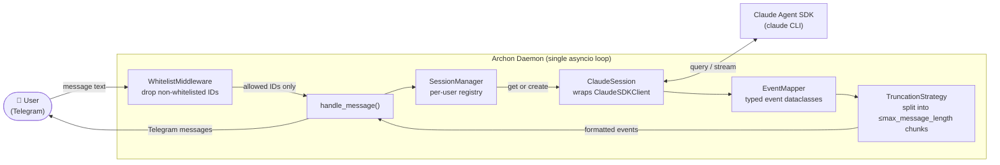
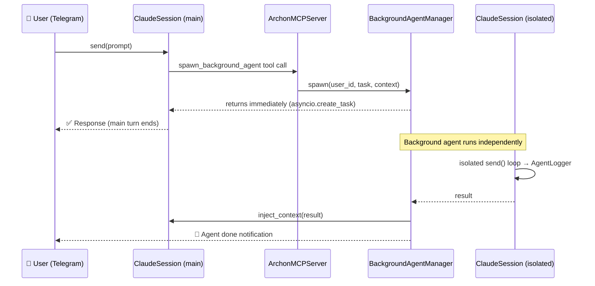

**Purpose**: Establishes the vision, philosophy, and guiding principles of the Archon Assistant project.
**Audience**: All contributors and stakeholders
**Status**: Stable
**Last reviewed**: 2026-02-26
**Next review**: 2026-05-26

# Introduction and Guiding Principles

## Guiding Principles

Five rules shape every design and implementation decision in Archon:

1. **Stream every state change immediately.** Every Claude transition — thinking complete, tool started, tool result, final response — produces an immediate Telegram notification. Nothing is batched or deferred.

2. **One persistent session per user.** Each whitelisted Telegram user owns exactly one Claude session that persists across messages, preserving full conversation context via SDK session resume.

3. **Sub-agents never block the main conversation.** The SDK `Task` tool is always disabled. Background agents run as independent asyncio tasks via the `spawn_background_agent` MCP tool, keeping the main session fully interactive while long work continues in the background.

4. **Fail fast on startup.** Missing or invalid configuration raises `ConfigError` immediately during `load_config()`. The daemon never starts in a silently degraded state.

5. **Message content is never logged.** Handlers log only `(N chars)` on receipt. Error handlers log the exception type only. Chat privacy is preserved in all log files.

---

## Vision

Archon is an AI assistant that can do almost anything on your computer. It bridges Claude Code with Telegram so you can send natural language instructions from your phone and watch Claude work in real-time — thinking blocks, tool calls, and final responses each delivered the moment they happen, exactly as if you were watching the terminal.

The system runs as a local daemon on your machine. There is no cloud component, no third-party data routing, and no persistent external state beyond your local filesystem. Your conversations stay on your hardware.

---

## Users and Access

| Actor | Description |
|---|---|
| Owner / operator | The person running the daemon on their machine |
| Whitelisted user | Telegram user IDs listed in `config.toml [access] allowed_user_ids`; the only people who can interact with the bot |

**Phase 1 scope:** single operator, small whitelist (typically just the owner).

Non-whitelisted users receive a silent ignore — `WhitelistMiddleware` drops their messages before any handler runs, logs only the user ID, and sends no reply. The daemon refuses to start if `allowed_user_ids` is empty.

---

## Architecture Overview

Archon consists of four core modules plus a CLI, wired together by a gateway, all running in a single asyncio event loop:

**`archon/chat/`** — aiogram 3.x bot. `WhitelistMiddleware` drops all non-whitelisted user IDs before any handler runs, covering both `Message` and `CallbackQuery` routers.

**`archon/ai/`** — AI and execution layer. `ClaudeSession` wraps `ClaudeSDKClient` and exposes `send(prompt)` as an async generator of typed event dataclasses. `EventMapper` translates raw SDK messages into `ThinkingResult`, `ToolStarted`, `ToolResult`, `Response`, `ErrorEvent`, `SubagentStarted`, and `SubagentStopped`. `SessionManager` maintains a per-user session registry with inactivity eviction. `TruncationStrategy` chunks long content into sequentially-numbered Telegram messages.

**`archon/gateway/`** — single orchestrator. Initialises config and logging, starts every subsystem in order, routes events bidirectionally between the chat and AI layers, and handles `SIGTERM`/`SIGINT` graceful shutdown with a 5-second SLO.

### Background agent flow

When Claude needs to run long tasks in parallel, it calls the built-in `spawn_background_agent` MCP tool. The main conversation stays fully interactive throughout:

### Output event reference

Every state transition maps to a Telegram message with a fixed prefix:

| Event dataclass | Telegram prefix | Visibility |
|---|---|---|
| `ThinkingResult` | 💭 Thinking: | verbose / debug |
| `ToolStarted` | 🔧 Tool [id]: `<name>` | normal / verbose / debug |
| `ToolResult` | 📤 [id] `<brief summary>` | normal / verbose / debug |
| `Response` | ✅ Response: | always |
| `ErrorEvent` | ❌ Error: | always |
| `SubagentStarted` | 🤖 Agent **Name** started | always |
| `SubagentStopped` | 🤖 Agent **Name** done | always |

Agent lifecycle events (`SubagentStarted`, `SubagentStopped`) and `Response` are never suppressed regardless of notification mode — this is a design invariant, not a configuration option.

---

## Goals

- Deliver every Claude state transition as an immediate, structured Telegram notification.
- Maintain full conversation context across multiple messages for each whitelisted user.
- Run as an always-on local daemon with automatic restart on machine boot (launchd on macOS, systemd on Linux).
- Support background agent execution without blocking the main conversation.
- Persist conversation history to daily Markdown files compatible with Search semantic search (optional `archon/search/` integration).
- Stay simple enough that a single contributor can understand the entire codebase.

---

## Non-Functional Requirements

| Requirement | Target |
|---|---|
| Latency (first chunk to Telegram) | < 2 seconds after Claude starts outputting |
| Reliability | Auto-reconnect Telegram bot on network drop (aiogram long-polling) |
| Security | Whitelist enforced before any message reaches Claude |
| Logging | Daily-rotating file log; INFO level by default, DEBUG configurable via `config.toml` |
| Test coverage | ≥ 85% (`--cov-fail-under=85`, enforced by pytest-cov) |
| Type safety | mypy strict — all code passes `uv run mypy archon/` without errors |

For detailed implementation of each requirement see [`010_engineering_principles_and_constraints.md`](010_engineering_principles_and_constraints.md) (coverage, type safety, logging standard) and [`160_operational_readiness_monitoring_and_reliability.md`](160_operational_readiness_monitoring_and_reliability.md) (reliability, latency, daemon restart).

---

## Success Criteria

The system is considered correct when all of the following hold:

- Sending a message in Telegram → Claude Code receives and processes it.
- All output events (tool calls, thinking, response) arrive in Telegram in real-time with correct labels.
- Session context persists across multiple messages (conversational continuity maintained).
- Daemon survives machine restart (launchd / systemd auto-restart).
- Only whitelisted Telegram users can interact with the bot.
- `/stop` cleanly terminates the active Claude session.
- Background agents run concurrently without blocking the main conversation.
- Conversation history is persisted to daily Markdown files in `~/.archon/history/sessions/`.
- Skills, plugins, and agents are auto-loaded from `~/.claude/`.

---

## Non-Goals

- **Multi-AI support** — GPT, Gemini, and other AI providers are out of scope.
- **Web dashboard or external API** — no HTTP interface is exposed to external clients beyond local MCP servers.
- **Cloud deployment or multi-tenant operation** — Archon runs on a single machine for a small, fixed whitelist.

---

## Related documents

- [`010_engineering_principles_and_constraints.md`](010_engineering_principles_and_constraints.md) — technical constraints every contributor must follow
- [`100_system_architecture_overview.md`](100_system_architecture_overview.md) — detailed C4 diagrams and component breakdown
- [`140_error_handling_strategy.md`](140_error_handling_strategy.md) — error handling patterns across all layers
