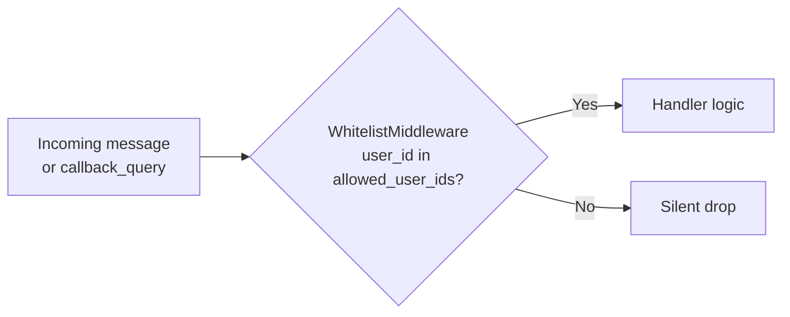
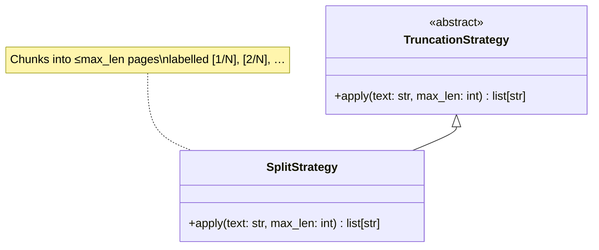

**Purpose**: Defines the technical constraints and standards every contributor must follow when working on the Archon codebase.
**Audience**: All contributors
**Status**: Stable
**Last reviewed**: 2026-02-26
**Next review**: 2026-05-26

# Engineering Principles and Constraints

## Principles

Five principles govern every implementation decision:

1. **TDD mandatory.** Write tests before writing implementation code. The suite must be green before merging any change.

2. **KISS first.** Use the simplest implementation that correctly solves the problem. Add complexity only when requirements demand it — never as a speculative abstraction.

3. **Active logging, never print.** All modules use `logging.getLogger("archon")`. `print()` is forbidden throughout the codebase.

4. **Verify before stating.** Every implementation decision, comment, and documentation statement must be based on verified facts. Making assumptions is not permitted.

5. **Enforce constraints with tooling.** Coverage floor, type checking, and shutdown SLO are all verified automatically — not by convention or code review alone.

---

## Test-Driven Development

TDD is mandatory — write tests before implementation (from `CLAUDE.md`).

### Coverage

Coverage is enforced by pytest-cov in `pyproject.toml`:

```toml
addopts = "--cov=archon --cov-report=term-missing --cov-fail-under=85 -m 'not live'"
```

- **Minimum coverage**: ≥85% (`--cov-fail-under=85`). A run below this threshold fails CI.
- All tests must pass before merging. A failing test is never acceptable on the main branch.

### Test markers

| Marker | Meaning | Run by default |
|---|---|---|
| *(none)* | Unit / integration tests, no external dependencies | ✅ Yes |
| `@pytest.mark.live` | Requires real external resources (filesystem, `claude` binary, Telegram API) | ❌ No |
| `@pytest.mark.requires_telegram` | Requires `TELEGRAM_BOT_TOKEN` and `TELEGRAM_LIVE_CHAT_ID` in env | ❌ No |

Live tests are excluded from default runs via `-m 'not live'`. Run them explicitly when testing against real credentials:

```bash
uv run pytest -m live --no-cov -v
```

### Commands

```bash
# Run all default tests
uv run pytest

# Run a single test file
uv run pytest tests/ai/test_event_mapper.py

# Run a specific test by name
uv run pytest -k "test_split_strategy_labels"
```

---

## Type Safety

mypy strict mode is mandatory, declared in `pyproject.toml`:

```toml
[tool.mypy]
python_version = "3.12"
strict = true
```

All new code must pass without errors:

```bash
uv run mypy archon/
```

---

## Logging Standard

- **Logger name**: `logging.getLogger("archon")` — every module in the `archon/` package uses exactly this name.
- **`print()` is forbidden** throughout the codebase, in both production and test code.
- **Message content is never logged.** Handlers log only `(N chars)` on receipt. Error handlers log the exception type only — never the message text or user data.

### Rationale

Using a single named logger (`"archon"`) means log level and output can be controlled from a single configuration point. Logging message content would create a privacy risk; users interact with the bot under the expectation that their messages are not persisted in log files.

---

## Graceful Shutdown SLO

`stop_all()` must complete within **5 seconds** (from `CLAUDE.md`).

This constraint is enforced in `gateway.py`:

```python
_SHUTDOWN_TIMEOUT: float = 5.0  # gateway.py line 27

await asyncio.wait_for(session_manager.stop_all(), timeout=_SHUTDOWN_TIMEOUT)
```

If the timeout is exceeded, the gateway logs a warning and continues shutdown — it does not hang indefinitely. Shutdown order is: `CronScheduler.stop()` → `BackgroundAgentManager.stop_all()` → `ArchonMCPServer.stop()` → `SessionManager.stop_all()` → `bot.session.close()`.

---

## Simplicity (KISS)

KISS applies to code implementation, not to required functionality (from `CLAUDE.md`):

- Increase complexity step by step; never add layers speculatively.
- Use best practices and Clean Code principles only when they simplify rather than complicate.
- Clever abstractions that reduce clarity are rejected even if they reduce line count.

---

## Technology Stack

All versions are declared in `pyproject.toml` and verified at install time by uv.

### Runtime dependencies

| Concern | Package | Constraint |
|---|---|---|
| Language | Python | `>=3.12` |
| Package manager / runner | uv | any |
| Telegram bot framework | aiogram | `>=3.0` |
| Claude Code integration | claude-agent-sdk | `>=0.1` |
| Background agent HTTP server | aiohttp | `>=3.9` |
| Cron expressions | croniter | `>=6.0.0` |
| Config write-back | tomlkit | `>=0.12` |
| Secrets loading (`.env`) | python-dotenv | `>=1.0` |

### Dev dependencies

| Tool | Constraint |
|---|---|
| pytest | `>=8.0` |
| pytest-asyncio | `>=0.23` |
| pytest-cov | `>=5.0` |
| mypy | `>=1.10` |

---

## Architectural Constraints

### Whitelist enforcement

`WhitelistMiddleware` is registered on both the `message` and `callback_query` routers in `Gateway._setup_dp()`. No handler may replicate or bypass this check. Non-whitelisted user IDs are silently ignored before any application logic runs.



### SDK tool restrictions

`ClaudeSession.start()` always disallows three tools:

```python
disallowed: list[str] = ["EnterPlanMode", "ExitPlanMode", "Task"]
```

- **`Task`** is disabled because it would run a sub-agent synchronously inside the main `send()` turn, blocking the user from sending new messages for the entire sub-agent duration. Background agents always use the `spawn_background_agent` MCP tool instead.
- **`EnterPlanMode` / `ExitPlanMode`** require an interactive TTY dialog that cannot be shown in a headless SDK session.

### Session permission mode

Every `ClaudeSession` is created with `permission_mode="bypassPermissions"` in `ClaudeAgentOptions`. This prevents interactive permission prompts that would block the headless daemon process.

### Truncation extensibility

Adding a new truncation strategy requires only a new class in `archon/ai/truncation.py` that implements `TruncationStrategy.apply(text, max_len) -> list[str]`. No changes to `archon/gateway/` or `archon/chat/` are needed. This is a design invariant, not a guideline.



### Session concurrency guard

`ClaudeSession` uses `asyncio.Lock` to prevent two concurrent `send()` calls from corrupting the SDK response stream. A second `send()` call that arrives while the first is in-flight waits until the lock is released — it is never rejected or silently dropped.

### Background agent MCP server

The `ArchonMCPServer` starts unconditionally on daemon boot. There is no `enabled` flag that disables it. This ensures the `spawn_background_agent` tool is always available to Claude, regardless of configuration.

> **Note:** `config.toml` contains a `[background_agents]` section with an `enabled` key. This key is intentionally not read by `loader.py` or `gateway.py`. Do not wire it up — the MCP server must always start unconditionally.

---

## Configuration Standards

- **Secrets** live exclusively in `.env` (`TELEGRAM_BOT_TOKEN` only).
- **All other settings** live in `config.toml` as typed dataclasses, loaded at startup via `load_config()`.
- `load_config()` raises `ConfigError` on any missing required field — the daemon never starts with invalid config.
- `tomlkit` is used for all runtime config write-backs (e.g., notification mode changes) to preserve comments and structure.
- Config writes use a write-to-temp-then-rename (`_atomic_write`) pattern, preventing `config.toml` corruption if the process is killed mid-write.
- `load_config()` creates `config.toml.bak` on every successful parse as an automatic backup. If `config.toml` is corrupt on startup, the loader automatically restores from `config.toml.bak`.

---

## Related Documents

- [`000_introduction_and_guiding_principles.md`](000_introduction_and_guiding_principles.md) — project vision and guiding principles
- [`100_system_architecture_overview.md`](100_system_architecture_overview.md) — C4 diagrams and component breakdown
- [`200_testing_strategy.md`](200_testing_strategy.md) — test pyramid, automation, and coverage strategy

---

## Related Decisions

- [ADR-07: Pluggable Truncation Strategy via ABC](../ADRs/07_pluggable_truncation_abc.md) — why `TruncationStrategy` uses an abstract base class so new truncation modes require no changes outside `archon/ai/truncation.py`
