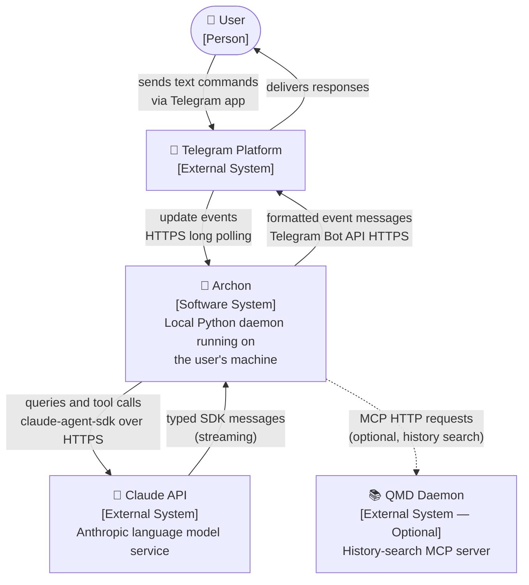
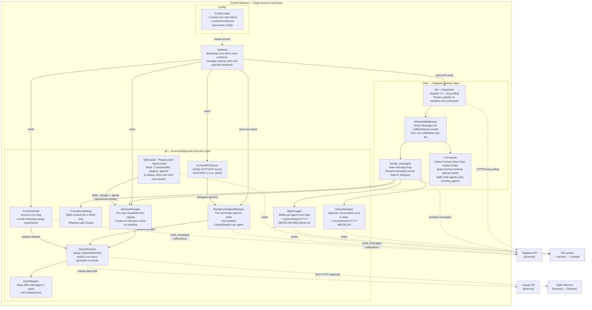
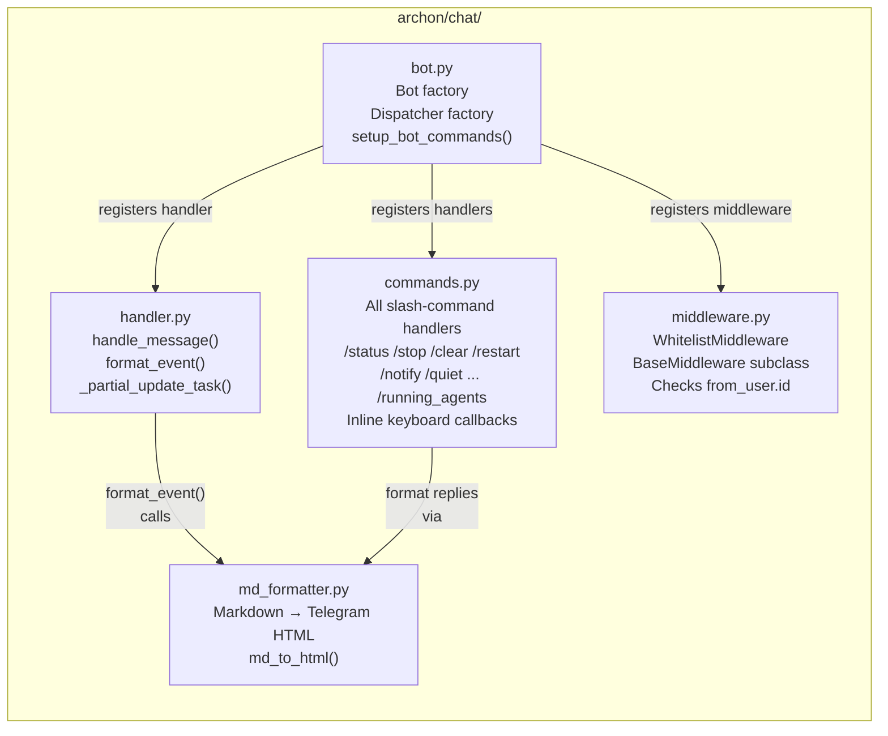
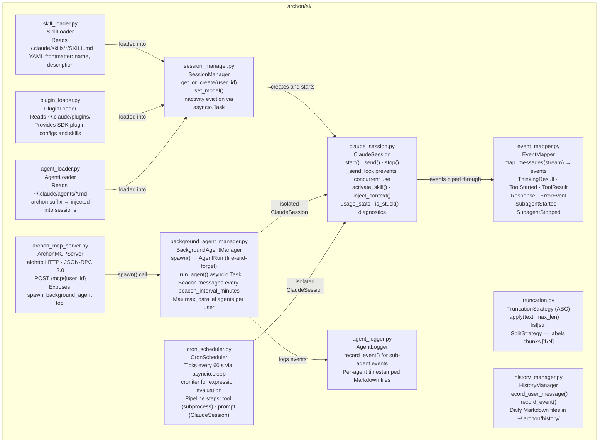
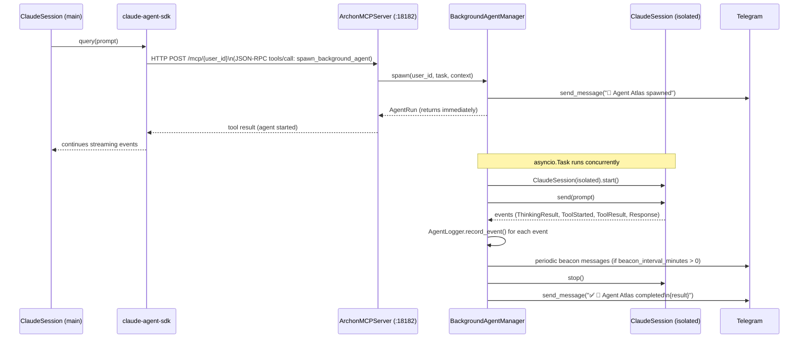
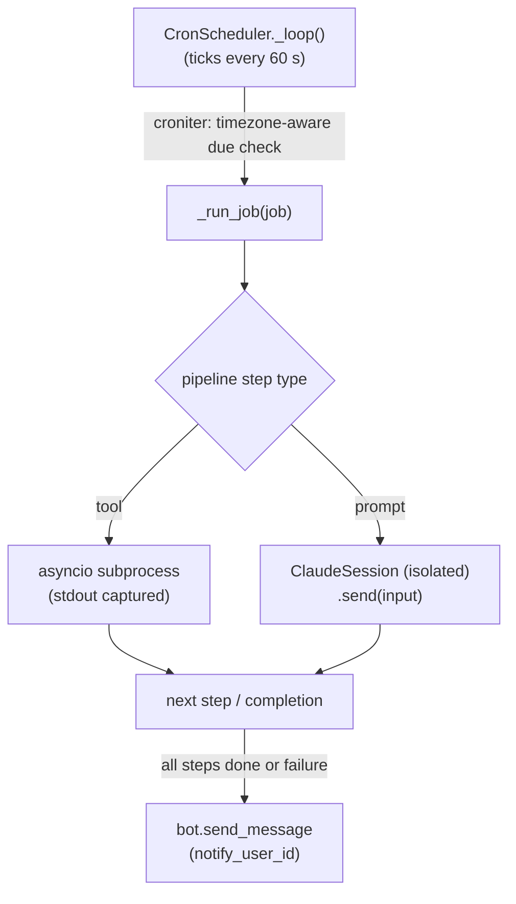

**Purpose**: Describes Archon's runtime architecture using C4-style context, container, and component diagrams.
**Audience**: All developers contributing to or operating Archon
**Status**: Stable
**Last reviewed**: 2026-02-26
**Next review**: 2026-05-26

# System Architecture Overview

## Principles

Five rules govern every design decision in Archon:

1. **Event-driven streaming** — every SDK state change (thinking block, tool call, tool result, final response) emits a typed event that flows immediately to Telegram. There is no batching, buffering, or polling of Claude's output.

2. **One persistent session per user** — each whitelisted Telegram user owns exactly one `ClaudeSession` that persists across messages, preserving full conversation context. The SDK manages session continuity; `SessionManager` evicts sessions after a configurable inactivity period.

3. **Sub-agents never block the main session** — the SDK `Task` tool is unconditionally disabled. All background work runs as independent asyncio tasks via `BackgroundAgentManager`. The main session's send lock releases as soon as Claude's response is complete; new user messages queue and are accepted while sub-agents run concurrently.

4. **Local daemon, no cloud relay** — Archon runs as a launchd (macOS) or systemd (Linux) daemon on the user's own machine. The bot polls Telegram directly over HTTPS. No third-party relay service handles message routing.

5. **Telegram errors never abort AI work** — delivery failures (network flaps, rate limits) are caught, logged as warnings, and swallowed. Claude processing continues to completion regardless of transient Telegram errors.

---

## Context diagram

> C4 Level 1 — who interacts with Archon and via which channels.

---

## Container diagram

> C4 Level 2 — the major runtime containers inside the Archon daemon.
>
> All containers run inside a **single asyncio event loop** started by `Gateway.start()`.

---

## Component diagrams

### Chat layer internals

> `archon/chat/` — Telegram bot, access control, message formatting.

### AI layer internals

> `archon/ai/` — Claude integration, session lifecycle, background agents, cron, and logging.

---

## Module layering

Archon has four layers. Each layer depends only on layers below it.

| Layer | Package | Responsibility |
|---|---|---|
| **Chat** | `archon/chat/` | Telegram bot lifecycle, whitelist enforcement, message formatting, command routing. The only layer that touches the Telegram API. |
| **Gateway** | `archon/gateway/` | Single orchestrator that wires all components, manages startup order, routes events bidirectionally, and handles graceful shutdown on SIGTERM/SIGINT. |
| **AI** | `archon/ai/` | Claude session lifecycle, event mapping, truncation, background agents, cron scheduling, history and agent logging, skill/plugin/agent loading. No Telegram knowledge. |
| **Config** | `archon/config/` | Loads `~/.archon/.env` (bot token) and `~/.archon/config.toml` (all structured settings) into typed dataclasses. Raises `ConfigError` on missing required fields. |

The dependency rule: `chat/` and `gateway/` import from `ai/` and `config/`; `ai/` imports from `config/` only; `config/` imports nothing internal.

---

## Data flow

### Main conversation flow

A text message travels through seven stages from the user's Telegram app to Claude and back.

**Stage 1 — Telegram delivery**
The user sends a message in the Telegram app. The aiogram `Dispatcher` receives the update object via HTTPS long polling from the Telegram Bot API.

**Stage 2 — Access control**
`WhitelistMiddleware.__call__()` checks `message.from_user.id` against `allowed_user_ids` (from `config.toml`). Non-whitelisted IDs are silently dropped; no handler runs. This check applies to both `Message` and `CallbackQuery` events.

**Stage 3 — Handler dispatch**
If the message is a slash command (e.g. `/status`), the `Dispatcher` routes to the matching command handler in `commands.py`. Plain text messages route to `handle_message()`.

**Stage 4 — Session acquisition**
`handle_message()` calls `session_manager.get_or_create(user_id)`. If no session exists yet, `SessionManager` builds a new `ClaudeSession` — injecting skills from `SkillLoader`, plugin configs from `PluginLoader`, and agent definitions from `AgentLoader` — then calls `session.start()`, which calls `ClaudeSDKClient.connect()` and launches the Claude subprocess.

**Stage 5 — Prompt dispatch**
`handle_message()` records the incoming message via `HistoryManager.record_user_message()` (if history is enabled) and calls `session.send(message.text)`, which returns an async generator. Inside `send()`, `ClaudeSession` acquires `_send_lock` (queuing any concurrent caller), prepends pending context or skill blocks to the prompt, calls `client.query(full_prompt)`, and begins iterating `client.receive_response()`.

**Stage 6 — Event mapping**
`EventMapper.map_messages()` converts raw SDK messages to typed event dataclasses:

| SDK message | SDK content block | Archon event |
|---|---|---|
| `AssistantMessage` | `ThinkingBlock` | `ThinkingResult` |
| `AssistantMessage` | `ToolUseBlock` | `ToolStarted` |
| `UserMessage` | `ToolResultBlock` | `ToolResult` |
| `ResultMessage` (no error) | — | `Response` |
| `ResultMessage` (is_error) | — | `ErrorEvent` |

Each event is yielded from `session.send()` as it arrives — no buffering.

**Stage 7 — Formatting and delivery**
For each event received in `handle_message()`:

- Sub-agent events (`event.source == "sub-agent"`) go to `AgentLogger.record_event()` only; they are never sent to Telegram.
- `HistoryManager.record_event()` logs orchestrator events (if history is enabled).
- The notification mode (quiet / normal / verbose / debug) filters which events reach the user:
  - **quiet** — `Response`, `ErrorEvent`, `SubagentStarted`, `SubagentStopped` only
  - **normal** — adds tool names and brief tool results; no thinking
  - **verbose** — adds tool arguments and full thinking output
  - **debug** — adds full tool results
- `format_event()` converts the event to Telegram HTML strings.
- `TruncationStrategy.apply()` splits content longer than `max_message_length` into labeled chunks (`[1/N]`, `[2/N]`, …).
- Each chunk is sent via `message.answer(text)`.

### Background agent flow

When Claude decides to offload work, the following sequence runs entirely outside the main session's event loop turn:

Key invariants:
- The main `ClaudeSession` never waits for the background agent; `spawn()` returns immediately.
- Background agent events never reach the user's main Telegram stream; they go to `AgentLogger` only.
- The background agent runs in a fully isolated `ClaudeSession` with no shared state.
- Agent names are drawn from a 30-name pool (`Atlas`, `Sage`, `Orion`, …) shared globally across users.

### Cron flow

`CronScheduler` runs a background asyncio task that ticks every 60 seconds. On each tick, `croniter` evaluates which jobs are due based on their cron expressions (timezone-aware). For each due job, the scheduler executes a pipeline of steps sequentially:

- **tool step** — runs a bash command via `asyncio.create_subprocess_exec`; stdout is captured and passed as `{input}` to the next step.
- **prompt step** — sends the prompt to a freshly created isolated `ClaudeSession`.

On completion or failure, `CronScheduler` sends a Telegram notification to the job's configured `notify_user_id`.

---

## Cross-references

- **Component catalog and layering** — see `110_component_catalog_and_layer_breakdown.md` for a full inventory of all classes and their public interfaces.
- **Integration architecture** — see `120_services_and_integration_architecture.md` for the Telegram Bot API, Claude API, and MCP integration patterns.
- **Error handling strategy** — see `140_error_handling_strategy.md` for the swallow-on-delivery, fail-fast-on-config patterns applied throughout the codebase.
- **Operational readiness** — see `160_operational_readiness_monitoring_and_reliability.md` for log rotation, startup checks, and graceful shutdown details.

---

## Related Decisions

The following ADRs record the architectural decisions that shaped this system:

- [ADR-01: Use Claude Agent SDK](../ADRs/01_use_claude_agent_sdk.md) — why `ClaudeSDKClient` was chosen over PTY/subprocess control
- [ADR-02: Logical Boundary Output Streaming](../ADRs/02_logical_boundary_output_streaming.md) — why each logical event maps to a separate Telegram message
- [ADR-03: One Session per User](../ADRs/03_one_session_per_user.md) — why one persistent `ClaudeSession` per Telegram user is maintained
