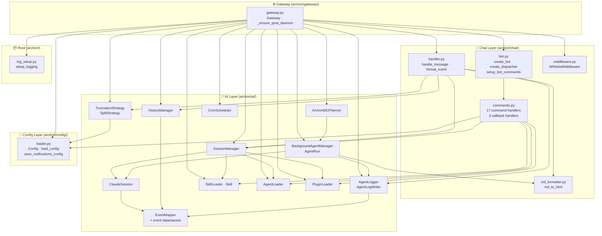

**Purpose**: Catalogs every component in the Archon codebase, assigns it to an architectural layer, and documents its public interface and dependencies.
**Audience**: Backend engineers and contributors working on Archon
**Status**: Stable
**Last reviewed**: 2026-02-26
**Next review**: 2026-05-26

# Component Catalog and Layer Breakdown

## Principles

1. **Dependencies flow downward.** Chat imports AI; AI imports Config. Only the Gateway imports across all layers. No layer imports from a layer above it.
2. **One concern per component.** Each module owns a single responsibility. Splitting or merging concerns requires a deliberate decision, not convenience.
3. **The Gateway is the sole wiring point.** It instantiates every component, injects dependencies, and owns startup/shutdown sequencing. No other module performs construction.
4. **Config is loaded once and passed everywhere.** `load_config()` runs once at startup; the resulting `Config` object is the single source of truth for all runtime settings.
5. **Extend layers, do not create new ones.** New capabilities belong to an existing layer. Adding a fifth layer requires a documented architectural decision.

---

## Layer Overview

---

## Config Layer

### `archon/config/loader.py`

**Responsibility**: Loads `~/.archon/.env` (bot token) and `~/.archon/config.toml` (all settings) into typed dataclasses at startup; persists notification changes atomically.

| Class / Function | Role |
|---|---|
| `Config` | Top-level settings container aggregating all sub-configs |
| `load_config(env_file, config_file)` | Parses both files; raises `ConfigError` on missing required fields; creates a `.toml.bak` backup on each successful load |
| `save_notifications_config(notifications, config_file)` | Persists `NotificationsConfig` to TOML atomically (write-to-temp, rename) |
| `ConfigError` | Raised for missing or invalid configuration; caught by Gateway at startup |
| `AccessConfig` | Holds `allowed_user_ids: list[int]` |
| `SessionConfig` | Holds `working_directory`, `inactivity_timeout_seconds` (default 1800) |
| `OutputConfig` | Holds `max_message_length` (default 4000), `truncation_strategy` (default `"split"`) |
| `LoggingConfig` | Holds `log_file`, `log_level` |
| `HistoryConfig` | Holds `enabled`, `directory` (default `~/.archon/history`) |
| `NotificationsConfig` | Holds `mode` (`quiet`/`normal`/`verbose`/`debug`), `interval_minutes`, `agents: NotificationsAgentsConfig` |
| `ModelsConfig` | Holds `available: list[str]`, `default: str \| None` |
| `PluginsConfig` | Holds `enabled`, `plugins_dir`, `settings_path` |
| `QmdConfig` | Holds `enabled` (default `False`), `host` (default `"localhost"`), `port` (default `8181`), `history_collection` |
| `BackgroundAgentsConfig` | Holds `spawn_rule` (default `"auto"`), `max_parallel` (default `5`), `host`, `port` (default `18182`), `beacon_interval_minutes` (default `2`) |
| `CronConfig` / `CronJobConfig` / `CronPipelineStep` | Cron scheduler configuration loaded from per-job TOML files in `jobs_dir/` |

**Archon dependencies**: None — uses stdlib (`tomllib`, `os`, `pathlib`) and third-party (`python-dotenv`, `tomlkit`) only.

---

## AI Layer

### `archon/ai/claude_session.py` — `ClaudeSession`

**Responsibility**: Manages a single Claude conversation via `ClaudeSDKClient`; streams typed events and guards against concurrent use.

| Interface | Description |
|---|---|
| `start()` | Connects `ClaudeSDKClient`; builds `ClaudeAgentOptions` with `permission_mode="bypassPermissions"`, MCP server configs, and disallowed tools (`Task`, `EnterPlanMode`, `ExitPlanMode`) |
| `send(prompt) -> AsyncGenerator[Event]` | Acquires `asyncio.Lock`, builds full prompt (context blocks + skill blocks + user text), calls `client.query()` then `client.receive_response()`, yields mapped events |
| `stop()` | Disconnects the SDK client |
| `activate_skill(skill)` | Queues a `Skill` for one-shot injection into the next `send()` call |
| `inject_context(text)` | Queues context text (used by `BackgroundAgentManager` to deliver sub-agent results) |
| `diagnostics` (property) | Returns `is_alive`, `is_processing`, `processing_seconds`, `idle_seconds`, `send_count`, `recent_events`, `usage_stats` |
| `usage_stats` (property) | Returns `usage`, `cumulative_cache_creation`, `total_cost_usd`, `num_turns`, `last_duration_ms` |

**Key behaviour**: `_send_lock` prevents concurrent `send()` calls from corrupting the stream. A second caller waits for the first to finish rather than receiving an error.

**Sub-agent name registry**: `ClaudeSession` maintains `_active_agent_names: dict[str, str]` mapping SDK `agent_id` to a human-readable name drawn from `_AGENT_NAMES` (a module-level pool of 30 single-word names). Names are assigned on the `SubagentStart` hook and released on `SubagentStop`; no two concurrently-running sub-agents share a name. When the pool is exhausted, a truncated `agent_id` is used as fallback. The registry is in-memory and scoped to the session lifetime.

**Archon dependencies**: `archon.ai.event_mapper`

---

### `archon/ai/event_mapper.py` — `EventMapper` and event dataclasses

**Responsibility**: Translates raw `claude_agent_sdk` messages into typed Archon event dataclasses.

**Event dataclasses**:

| Dataclass | Fields | Produced when |
|---|---|---|
| `ThinkingResult` | `content`, `source` | SDK emits a `ThinkingBlock` |
| `ToolStarted` | `name`, `input`, `id`, `source` | SDK emits a `ToolUseBlock` |
| `ToolResult` | `content`, `id`, `source` | SDK emits a `ToolResultBlock` |
| `Response` | `content`, `source` | SDK emits a `ResultMessage` with text |
| `ErrorEvent` | `message`, `source` | SDK emits a `ResultMessage` with `is_error=True` |
| `SubagentStarted` | `agent_id`, `agent_type`, `agent_name`, `user_request`, `agent_task`, `source` | Background agent spawns |
| `SubagentStopped` | `agent_id`, `agent_type`, `agent_name`, `final_result`, `source` | Background agent completes |

`Event` is the union type of all seven dataclasses.

| Interface | Description |
|---|---|
| `map_messages(stream) -> AsyncGenerator[Event]` | Public entry point; iterates raw SDK messages and dispatches to `_map()` |
| `_map(message) -> AsyncGenerator[Event]` | Handles `AssistantMessage`, `UserMessage`, and `ResultMessage`; assigns sequential integer IDs to tool calls |

**Archon dependencies**: None (imports `claude_agent_sdk` types only).

---

### `archon/ai/session_manager.py` — `SessionManager`

**Responsibility**: Maintains a per-user `ClaudeSession` registry; creates sessions on demand and evicts them after inactivity.

| Interface | Description |
|---|---|
| `get_or_create(user_id) -> ClaudeSession` | Returns existing session or creates, starts, and registers a new one; resets the inactivity timer |
| `stop(user_id)` | Cancels the timer and stops the session |
| `stop_all()` | Stops all sessions (called at shutdown) |
| `has_session(user_id) -> bool` | Returns True if a live session exists |
| `set_model(model)` | Sets the model override for all future sessions |
| `get_model() -> str \| None` | Returns the current model override |
| `session_diagnostics(user_id) -> dict \| None` | Delegates to `ClaudeSession.diagnostics` |
| `context_stats(user_id) -> dict \| None` | Delegates to `ClaudeSession.usage_stats` |
| `processing_sessions() -> dict[int, float]` | Returns `{user_id: processing_seconds}` for active in-flight sessions |

**Session factory**: The default factory merges skills from `SkillLoader` and `PluginLoader`, loads archon-tagged agents from `AgentLoader`, constructs the per-user MCP URL from `ArchonMCPServer`, and passes everything to `ClaudeSession`.

**Archon dependencies**: `archon.ai.claude_session`; TYPE_CHECKING: `archon.ai.agent_loader`, `archon.ai.plugin_loader`, `archon.ai.skill_loader`

---

### `archon/ai/background_agent_manager.py` — `BackgroundAgentManager` / `AgentRun`

**Responsibility**: Spawns isolated fire-and-forget `ClaudeSession` asyncio tasks; sends Telegram notifications on completion; manages agent name pool and beacon updates.

| Interface | Description |
|---|---|
| `spawn(user_id, task, context, name, user_request) -> AgentRun` | Creates an `AgentRun`, assigns a name from the 30-name pool, starts an asyncio task, sends spawn notification; raises `RuntimeError` if `max_parallel` is reached |
| `cancel(run_id) -> bool` | Cancels an in-progress agent task |
| `stop_all()` | Cancels all running agents; called at daemon shutdown |
| `list_running(user_id) -> list[AgentRun]` | Returns all runs with `status == "running"` for a user |
| `list_all(user_id) -> list[AgentRun]` | Returns all runs regardless of status |
| `get_run(run_id) -> AgentRun \| None` | Looks up a run by UUID |

**`AgentRun`** fields: `run_id` (UUID hex), `name` (from pool), `task`, `context`, `user_id`, `started_at`, `user_request`, `status` (`running`/`completed`/`failed`/`cancelled`), `result`, `error`.

**Beacon design**: A separate asyncio task sleeps `beacon_interval_minutes * 60` seconds before each fire (sleep-first). Short-lived agents produce no beacon. Each beacon sends a new Telegram message (never edits the spawn message).

**Archon dependencies**: `archon.ai.claude_session`, `archon.ai.event_mapper`, `archon.chat.md_formatter`

---

### `archon/ai/archon_mcp_server.py` — `ArchonMCPServer`

**Responsibility**: Exposes the `spawn_background_agent` tool to Claude sessions via a local aiohttp HTTP server implementing MCP JSON-RPC 2.0.

| Interface | Description |
|---|---|
| `start()` | Starts the aiohttp `AppRunner` and `TCPSite` on the configured host/port |
| `stop()` | Gracefully stops the server via `runner.cleanup()` |
| `mcp_url_for(user_id) -> str` | Returns `http://{host}:{port}/mcp/{user_id}` — the per-session MCP endpoint |

**Route**: `POST /mcp/{user_id}` handles all JSON-RPC 2.0 requests.

**MCP methods implemented**:
- `initialize` → server capabilities (`protocolVersion: "2024-11-05"`)
- `tools/list` → descriptor for `spawn_background_agent`
- `tools/call` → delegates to `BackgroundAgentManager.spawn()`

**`spawn_background_agent` parameters**: `task` (required), `context` (optional), `user_request` (optional, for logging).

**Archon dependencies**: TYPE_CHECKING: `archon.ai.background_agent_manager`

---

### `archon/ai/history_manager.py` — `HistoryManager`

**Responsibility**: Appends conversation turns to daily Markdown files in the history directory.

| Interface | Description |
|---|---|
| `record_user_message(user_id, text, cwd)` | Writes a timestamped `## HH:MM:SS · User {id}` section |
| `record_event(user_id, event)` | Renders the event to Markdown and appends to today's file |

**File naming**: `~/.archon/history/YYYY-MM-DD.md`. Creates the file with a date header on the first write of each day. Handles `ThinkingResult`, `ToolStarted`, `ToolResult`, `Response`, `ErrorEvent`; ignores `SubagentStarted`/`SubagentStopped`.

**Archon dependencies**: `archon.ai.event_mapper`

---

### `archon/ai/agent_logger.py` — `AgentLogger` / `AgentLogWriter`

**Responsibility**: Writes per-agent events to dedicated Markdown log files; maintains a stack of active writers for nested agents.

| Class | Interface | Description |
|---|---|---|
| `AgentLogger` | `record_event(event)` | Routes `SubagentStarted` → opens new `AgentLogWriter`; `SubagentStopped` → finalizes matching writer; other events → forwarded to innermost writer |
| `AgentLogWriter` | `record_event(event)` | Appends formatted Markdown immediately (continuous flush) |
| `AgentLogWriter` | `finalize(final_result)` | Writes `### ✅ Final Result` + `## Completed · duration` footer |

**File naming**: `~/.archon/history/YYYY-MM-DD-HH-MM-{agent-name}.md`. Collision suffix (`-2`, `-3`, …) handles two same-name agents starting in the same minute.

**Archon dependencies**: `archon.ai.event_mapper`

---

### `archon/ai/skill_loader.py` — `SkillLoader` / `Skill`

**Responsibility**: Reads and caches Claude Code skills from `~/.claude/skills/*/SKILL.md` YAML frontmatter.

| Interface | Description |
|---|---|
| `load_all() -> list[Skill]` | Returns all valid skills; loads from disk on first call, returns cache thereafter |
| `get(name) -> Skill \| None` | Looks up a skill by name |

**`Skill`** dataclass: `name`, `description`, `content` (SKILL.md body with frontmatter stripped).

**Validation**: Skips files with missing or malformed frontmatter, missing `name`, or missing `description`; logs a warning for each skip.

**Archon dependencies**: None.

---

### `archon/ai/truncation.py` — `TruncationStrategy` / `SplitStrategy`

**Responsibility**: Splits long text into chunks that fit within the Telegram message limit.

| Interface | Description |
|---|---|
| `TruncationStrategy.apply(text, max_len) -> list[str]` | Abstract method: split text into chunks ≤ `max_len` characters each |
| `SplitStrategy.apply(text, max_len) -> list[str]` | Returns `[text]` if it fits; otherwise splits into `[1/N]…`, `[2/N]…` labeled chunks, adjusting label width to avoid exceeding `max_len` |
| `get_truncation_strategy(name) -> TruncationStrategy` | Factory returning a strategy instance by name; raises `ConfigError` for unknown names |

**Currently registered strategy**: `"split"` → `SplitStrategy`.

**Archon dependencies**: `archon.config.loader` (for `ConfigError`).

---

### `archon/ai/agent_loader.py` — `AgentLoader` / `Agent`

**Responsibility**: Reads `~/.claude/agents/*.md` files; agents with names ending in `-archon` are injected into every Claude session.

| Interface | Description |
|---|---|
| `load_all() -> list[Agent]` | Returns all parsed agents from the agents directory |
| `Agent.is_archon` (property) | True when `agent.name` ends with `"-archon"` |

**Archon dependencies**: None (not directly read; described from agents.md and gateway imports).

---

### `archon/ai/plugin_loader.py` — `PluginLoader`

**Responsibility**: Reads `~/.claude/plugins/` and `~/.claude/settings.json`; exposes plugin SDK configs and plugin-bundled skills to sessions.

| Interface | Description |
|---|---|
| `load_all() -> list[PluginInfo]` | Loads all plugins; eager-loaded at startup |
| `get_skills() -> list[Skill]` | Returns all skills contributed by loaded plugins |
| `get_sdk_configs() -> list[dict]` | Returns SDK plugin config dicts for `ClaudeAgentOptions.plugins` |

**Archon dependencies**: None (not directly read; described from agents.md and gateway imports).

---

### `archon/ai/cron_scheduler.py` — `CronScheduler`

**Responsibility**: Runs scheduled cron jobs in an asyncio loop using `croniter`; supports timezone-aware schedules and pipeline-style jobs (bash tool → Claude prompt).

| Interface | Description |
|---|---|
| `start()` | Begins the scheduler loop |
| `stop()` | Cancels the scheduler loop |
| `reload_jobs()` | Re-reads job TOML files from `jobs_dir` |
| `job_statuses` (property) | Returns `{name: JobStatus}` for all configured jobs |
| `next_run_times() -> dict[str, datetime]` | Returns the next scheduled run time per job |

**Archon dependencies**: None (not directly read; described from agents.md and gateway imports).

---

## Chat Layer

### `archon/chat/bot.py`

**Responsibility**: Creates the aiogram `Bot` and `Dispatcher`; registers all command and callback handlers; sets bot commands with Telegram at startup.

| Interface | Description |
|---|---|
| `create_bot(token) -> Bot` | Returns `Bot` with `DefaultBotProperties(parse_mode=ParseMode.HTML)` |
| `create_dispatcher() -> Dispatcher` | Creates `Dispatcher`; registers all 17 message handlers and 3 callback handlers |
| `setup_bot_commands(bot)` | Registers `BOT_COMMANDS` for `BotCommandScopeDefault` and `BotCommandScopeAllPrivateChats` |
| `start_command(message)` | Handles `/start` |

**Registered commands** (17): `/start`, `/status`, `/context`, `/stop`, `/clear`, `/restart`, `/notify`, `/quiet`, `/normal`, `/verbose`, `/debug`, `/settings`, `/skills`, `/skill`, `/model`, `/agents`, `/jobs`, `/running_agents`.

**Registered callbacks** (3): `notify:<mode>`, `model:<name>`, `cancel_agent:<run_id>`.

**Archon dependencies**: `archon.chat.commands`

---

### `archon/chat/commands.py`

**Responsibility**: Implements all Telegram bot command handlers and inline keyboard callback handlers.

| Function | Command | Role |
|---|---|---|
| `status_command` | `/status` | Reports session state, working directory, uptime, processing state |
| `context_command` | `/context` | Shows context window usage with token counts, cost, and a progress bar |
| `stop_command` | `/stop` | Terminates the user's active session |
| `clear_command` | `/clear` | Stops then immediately recreates the session (clears context) |
| `restart_command` | `/restart` | Stops all sessions, sets `ARCHON_RESTART_NOTIFY_CHAT_ID`, calls `os.execv` to replace the process |
| `notify_command` | `/notify` | Sets notification mode; shows inline keyboard when called without arguments |
| `settings_command` | `/settings` | Alias for `/notify` keyboard |
| `quiet_command` | `/quiet [N]` | Sets quiet mode; optional `N` sets beacon interval in minutes |
| `normal_command` | `/normal` | Sets normal mode |
| `verbose_command` | `/verbose` | Sets verbose mode |
| `debug_command` | `/debug` | Sets debug mode |
| `skills_command` | `/skills` | Lists personal and plugin-bundled skills |
| `skill_command` | `/skill <name>` | Activates a skill for the next message in the current session |
| `model_command` | `/model [name]` | Shows or switches the Claude model |
| `agents_command` | `/agents` | Lists archon agents and TUI-only agents |
| `jobs_command` | `/jobs` | Lists scheduled cron jobs with status and next run times |
| `running_agents_command` | `/running_agents` | Lists running background agents with Cancel inline buttons |
| `notify_callback` | `notify:<mode>` | Updates notification mode from inline keyboard tap |
| `model_callback` | `model:<name>` | Updates model from inline keyboard tap |
| `cancel_agent_callback` | `cancel_agent:<id>` | Cancels a background agent run |

**Archon dependencies**: `archon.ai.session_manager`, `archon.ai.skill_loader`, `archon.ai.agent_loader`, `archon.ai.plugin_loader`, `archon.config.loader`

---

### `archon/chat/handler.py`

**Responsibility**: Receives text messages from Telegram, routes them to `ClaudeSession`, and converts each event into one or more Telegram messages.

| Interface | Description |
|---|---|
| `handle_message(message, session_manager, truncation, max_len, notifications, cwd, history_manager, agent_logger)` | Main message handler; sends typing indicators, records history, streams events from session, formats and sends each to Telegram |
| `format_event(event, truncation, max_len, notifications) -> list[str]` | Maps an event to zero or more formatted Telegram strings; applies notification mode filtering |

**Notification modes and visibility**:

| Mode | ThinkingResult | ToolStarted | ToolResult | Response | ErrorEvent | SubagentStarted/Stopped |
|---|---|---|---|---|---|---|
| `quiet` | ❌ | ❌ (counted) | ❌ | ✅ | ✅ | ✅ always |
| `normal` | ❌ | ✅ (name only) | ✅ (brief) | ✅ | ✅ | ✅ always |
| `verbose` | ✅ | ✅ (name + input) | ✅ (brief) | ✅ | ✅ | ✅ always |
| `debug` | ✅ | ✅ (name + input) | ✅ (full) | ✅ | ✅ | ✅ always |

**Quiet beacon**: When `notifications.mode == "quiet"` and `interval_minutes > 0`, a `_partial_update_task` runs in the background, sending periodic status messages with live tool/thinking counts.

**Invariant**: `SubagentStarted`, `SubagentStopped`, `Response`, and `ErrorEvent` are always delivered to the user regardless of notification mode.

**Sub-agent events** (where `event.source == "sub-agent"`): routed to `AgentLogger` only; never sent to Telegram from this handler.

**Archon dependencies**: `archon.ai.event_mapper`, `archon.ai.session_manager`, `archon.ai.truncation`, `archon.chat.md_formatter`; TYPE_CHECKING: `archon.ai.history_manager`, `archon.ai.agent_logger`, `archon.config.loader`

---

### `archon/chat/middleware.py` — `WhitelistMiddleware`

**Responsibility**: Drops all `Message` and `CallbackQuery` events from users not in the whitelist before any handler runs.

| Interface | Description |
|---|---|
| `WhitelistMiddleware(allowed_user_ids)` | Constructs with a `frozenset` of allowed integer user IDs |
| `__call__(handler, event, data)` | Returns `None` (drops event) if `from_user.id` is not in the whitelist; otherwise calls `handler(event, data)` |

**Registration**: Applied to both `dp.message.middleware` and `dp.callback_query.middleware` in `gateway.register_middleware()`.

**Archon dependencies**: None.

---

### `archon/chat/md_formatter.py`

**Responsibility**: Converts Markdown text to Telegram-compatible HTML.

| Interface | Description |
|---|---|
| `md_to_html(text) -> str` | Converts Markdown to HTML for `parse_mode=HTML` messages |

**Archon dependencies**: None.

> **Note**: `BackgroundAgentManager` (AI layer) imports `md_to_html` from this Chat layer module. This is the only cross-layer dependency where AI imports from Chat.

---

## Gateway Layer

### `archon/gateway/gateway.py` — `Gateway`

**Responsibility**: Orchestrates all layers in a single asyncio event loop; owns startup sequencing, QMD daemon management, and graceful shutdown.

| Interface | Description |
|---|---|
| `Gateway.start()` | Synchronous entry point; calls `asyncio.run(Gateway._run())` |
| `Gateway._run()` | Loads config, initializes logging, constructs all components, starts the bot polling loop, handles shutdown |
| `_ensure_qmd_daemon(host, port) -> bool` | Checks `~/.cache/qmd/mcp.pid`; starts `qmd mcp --http --daemon` if needed; returns `False` and logs a warning on failure |
| `register_middleware(dp, allowed_user_ids)` | Attaches `WhitelistMiddleware` to message and callback_query routers |
| `_setup_dp(dp, cfg, ...)` | Wires all dependencies into the dispatcher via `dp["key"] = value` |

**Startup order**:
1. Load config + setup logging
2. Eager-load `SkillLoader`, `PluginLoader`, `AgentLoader`
3. Optionally start QMD daemon
4. Create `ArchonMCPServer` (with `_manager=None` placeholder)
5. Create `SessionManager`
6. Create `BackgroundAgentManager`; patch `bg_mcp_server._manager`
7. Create `CronScheduler`
8. Wire dispatcher, start `ArchonMCPServer`, start `CronScheduler`, start polling

**Shutdown order** (in `finally` block): stop `CronScheduler` → stop all background agents → stop `ArchonMCPServer` → stop all sessions (5s timeout) → close bot session.

**Archon dependencies**: All other modules.

---

## Root

### `archon/log_setup.py`

**Responsibility**: Configures rotating file logging and console logging for the `archon` logger.

| Interface | Description |
|---|---|
| `setup_logging(cfg: LoggingConfig)` | Configures `TimedRotatingFileHandler` (daily rotation) and `StreamHandler` for the `archon` logger |

**Archon dependencies**: `archon.config.loader` (for `LoggingConfig`).

---

## Summary Table

| Component | Layer | Module | Key Class/Function |
|---|---|---|---|
| Config Loader | Config | `config/loader.py` | `Config`, `load_config`, `save_notifications_config` |
| ClaudeSession | AI | `ai/claude_session.py` | `ClaudeSession` |
| EventMapper | AI | `ai/event_mapper.py` | `EventMapper`, 7 event dataclasses |
| SessionManager | AI | `ai/session_manager.py` | `SessionManager` |
| BackgroundAgentManager | AI | `ai/background_agent_manager.py` | `BackgroundAgentManager`, `AgentRun` |
| ArchonMCPServer | AI | `ai/archon_mcp_server.py` | `ArchonMCPServer` |
| HistoryManager | AI | `ai/history_manager.py` | `HistoryManager` |
| AgentLogger | AI | `ai/agent_logger.py` | `AgentLogger`, `AgentLogWriter` |
| SkillLoader | AI | `ai/skill_loader.py` | `SkillLoader`, `Skill` |
| TruncationStrategy | AI | `ai/truncation.py` | `TruncationStrategy`, `SplitStrategy` |
| AgentLoader | AI | `ai/agent_loader.py` | `AgentLoader`, `Agent` |
| PluginLoader | AI | `ai/plugin_loader.py` | `PluginLoader` |
| CronScheduler | AI | `ai/cron_scheduler.py` | `CronScheduler` |
| Bot factory | Chat | `chat/bot.py` | `create_bot`, `create_dispatcher` |
| Command handlers | Chat | `chat/commands.py` | 17 command + 3 callback functions |
| Message handler | Chat | `chat/handler.py` | `handle_message`, `format_event` |
| Whitelist guard | Chat | `chat/middleware.py` | `WhitelistMiddleware` |
| Markdown formatter | Chat | `chat/md_formatter.py` | `md_to_html` |
| Orchestrator | Gateway | `gateway/gateway.py` | `Gateway` |
| Logging setup | Root | `log_setup.py` | `setup_logging` |

---

## Related Documents

- [100 System Architecture Overview](100_system_architecture_overview.md) — C4 context and container diagrams
- [120 Services and Integration Architecture](120_services_and_integration_architecture.md) — External integration details for Telegram, Claude SDK, MCP, QMD, and daemon
- [140 Error Handling Strategy](140_error_handling_strategy.md) — Per-layer error handling patterns

---

## Related Decisions

- [ADR-01: Use Claude Agent SDK](../ADRs/01_use_claude_agent_sdk.md) — why `ClaudeSDKClient` wraps all Claude interactions and why `ClaudeSession` is the session abstraction
