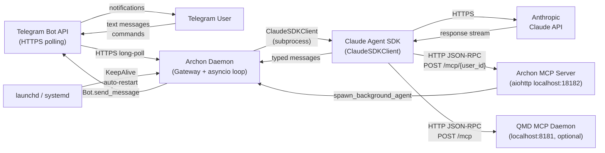
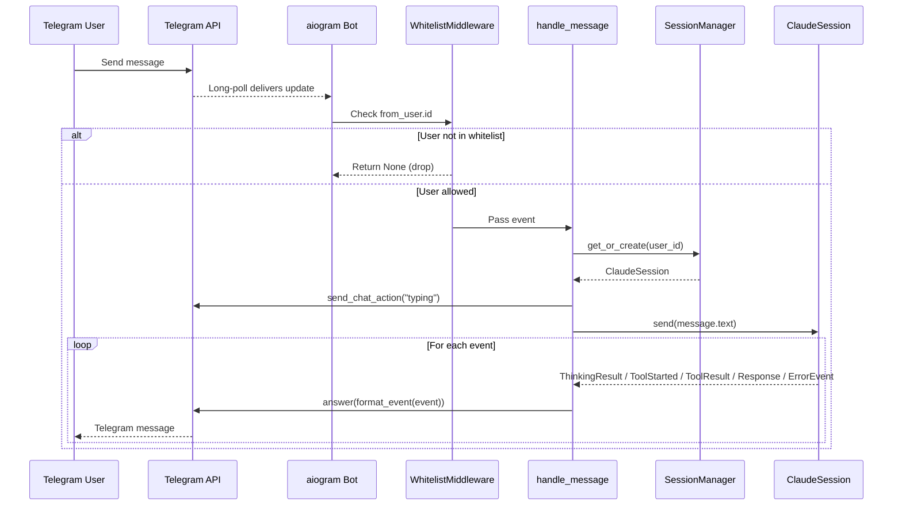
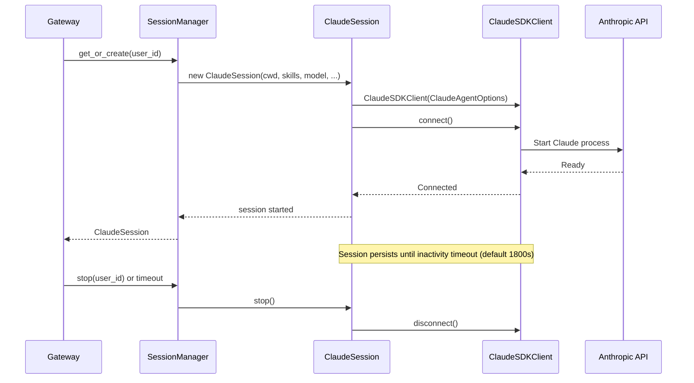
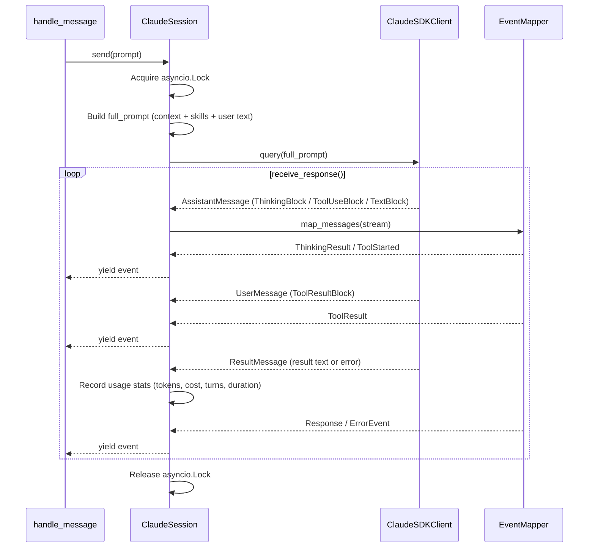
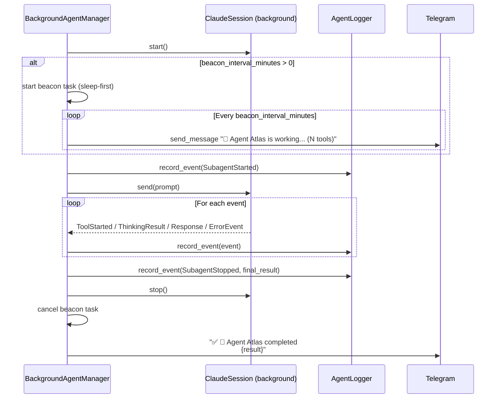

**Purpose**: Documents every external integration in Archon — protocol, direction, authentication, and error handling — with sequence diagrams for each integration path.
**Audience**: Backend engineers integrating, operating, or extending Archon
**Status**: Stable
**Last reviewed**: 2026-02-26
**Next review**: 2026-05-26

# Services and Integration Architecture

## Principles

1. **Credentials live in `.env`, not in `config.toml`.** The bot token is the only secret; all other integration config (hosts, ports, modes) belongs in `config.toml`.
2. **Optional integrations degrade gracefully.** QMD, plugins, and the cron scheduler are disabled by default. When unavailable, Archon logs a warning and continues without them.
3. **The Gateway owns integration lifecycle.** It starts and stops every external connection in a defined order; no other module manages lifecycle.
4. **The main session never blocks on sub-agent work.** All sub-agent execution happens asynchronously via the Archon MCP Server; the SDK's native `Task` tool is always disabled in orchestrator sessions.
5. **All outbound messages use `parse_mode="HTML"`.** The `Bot` instance is created once with `DefaultBotProperties(parse_mode=ParseMode.HTML)`; every send operation inherits this default.

---

## Integration Overview



---

## 1. Telegram Bot API

### Overview

Archon communicates with Telegram exclusively through the `aiogram 3.x` library using long-polling. There is no webhook configuration.

**Direction**: Bidirectional
- **Inbound**: user messages and callback queries arrive via polling
- **Outbound**: events, command responses, and agent notifications sent via `Bot.send_message`

**Protocol**: HTTPS to `api.telegram.org`

**Authentication**: `TELEGRAM_BOT_TOKEN` from `~/.archon/.env` loaded via `python-dotenv`. The token is passed to `create_bot(token)` which constructs `Bot(token=token, default=DefaultBotProperties(parse_mode=ParseMode.HTML))`.

### Whitelist Access Control

`WhitelistMiddleware` runs before every handler and drops all `Message` and `CallbackQuery` events from users not in `config.toml [access] allowed_user_ids`. Non-whitelisted events are silently discarded (no reply, no error).

### Message Flow



### Bot Commands

Commands are registered with Telegram at startup by `setup_bot_commands()` for two scopes simultaneously: `BotCommandScopeDefault` and `BotCommandScopeAllPrivateChats`. Both scopes are kept in sync to prevent stale cached command lists from previous bot versions.

| Command | Handler | Description |
|---|---|---|
| `/start` | `start_command` | Greeting |
| `/status` | `status_command` | Session state, uptime, processing status |
| `/context` | `context_command` | Context window token usage and cost |
| `/stop` | `stop_command` | Terminates the active session |
| `/clear` | `clear_command` | Resets the session (clears context) |
| `/restart` | `restart_command` | Replaces the daemon process via `os.execv` |
| `/notify` | `notify_command` | Sets notification mode (inline keyboard) |
| `/quiet [N]` | `quiet_command` | Quiet mode; optional beacon interval in minutes |
| `/normal` | `normal_command` | Normal notification mode |
| `/verbose` | `verbose_command` | Verbose notification mode |
| `/debug` | `debug_command` | Debug notification mode |
| `/skills` | `skills_command` | Lists available skills |
| `/skill <name>` | `skill_command` | Activates a skill for the next message |
| `/models [name]` (alias: `/model`) | `models_command` | Shows or switches Claude model |
| `/agents` | `agents_command` | Lists configured agent types |
| `/scheduled` (alias: `/jobs`) | `scheduled_command` | Lists scheduled cron jobs |
| `/tasks` (alias: `/running_agents`) | `tasks_command` | Lists running background agents with cancel buttons |

**Inline keyboard callbacks**: `notify:<mode>`, `model:<name>`, `cancel_agent:<run_id>`.

### Notification Modes

The `[notifications]` config section controls how much detail is forwarded to Telegram. Modes can be changed at runtime via `/quiet`, `/normal`, `/verbose`, `/debug` without restarting the daemon.

| Mode | Tool events | Thinking | Tool results | Quiet beacon |
|---|---|---|---|---|
| `quiet` | Suppressed (counted) | Suppressed (counted) | Suppressed | Optional (`interval_minutes > 0`) |
| `normal` | Tool name only | Suppressed | Brief (first sentence) | No |
| `verbose` | Name + input | Full | Brief (first sentence) | No |
| `debug` | Name + input | Full | Full | No |

**Quiet beacon**: In quiet mode with `interval_minutes > 0`, a `_partial_update_task` sends periodic `⏳ Working... (N tools, M thinking)` messages with rotating verbs (Pondering, Cogitating, …).

### Message Length and Truncation

Telegram enforces a 4096-character hard limit. Archon's default `max_message_length` is 4000 characters. The `SplitStrategy` truncation splits longer texts into labeled chunks: `[1/N] …`, `[2/N] …`. The label width is computed from the chunk count to ensure each chunk including its label fits within `max_len`.

### Error Handling

- Telegram send failures in the event loop are caught per-event and logged as warnings; Claude processing continues.
- Typing indicator failures are caught and logged; they never abort AI processing.
- The `_partial_update_task` catches Telegram errors per-iteration so a transient flap does not kill the beacon loop.
- `restart_command` sets `ARCHON_RESTART_NOTIFY_CHAT_ID` in the environment before `os.execv`; the new process reads it at startup and sends `✅ Restarted. Archon ready.` via a `dp.startup` hook.

---

## 2. Claude Agent SDK

### Overview

Archon communicates with Claude via the `claude-agent-sdk` package (`claude_agent_sdk` import). Each Telegram user gets one persistent `ClaudeSession` wrapping a `ClaudeSDKClient` subprocess. The SDK manages session continuity (context window) internally.

**Direction**: Outbound (Archon → SDK → Anthropic API)

**Protocol**: SDK subprocess communication; the SDK itself communicates with the Anthropic API over HTTPS.

**Authentication**: Managed by the SDK using the Anthropic API key from the environment (not configured in Archon).

### Session Lifecycle



### ClaudeAgentOptions Configuration

Each session is constructed with:

| Option | Value |
|---|---|
| `permission_mode` | `"bypassPermissions"` — skips interactive permission prompts |
| `cwd` | Configured `session.working_directory` |
| `system_prompt` | Skills registry + spawn-rule hint (built by `_build_system_prompt`) |
| `model` | Optional override from `[models] default` or runtime `/model` command |
| `disallowed_tools` | `["Task", "EnterPlanMode", "ExitPlanMode"]` — always disabled |
| `mcp_servers` | Injected per-session; never touches `~/.claude/settings.json` |
| `plugins` | Plugin SDK configs from `PluginLoader` |
| `agents` | Archon-tagged agents from `AgentLoader` |

**Why `Task` is disabled**: The SDK's native `Task` tool would run a sub-agent synchronously inside the main session's `send()` call, blocking the user from sending new messages for the entire sub-agent duration. Background agents use the `spawn_background_agent` MCP tool instead (see Section 3).

### Message Protocol



### Concurrency Guard

`ClaudeSession._send_lock` (an `asyncio.Lock`) ensures only one `send()` call is in-flight at a time. If a second message arrives while the first is processing, the handler notifies the user (`⏳ Previous request still processing — your message is queued`) and the new `send()` waits for the lock. Messages are never dropped.

### Context Injection

`inject_context(text)` queues text to be prepended to the next `send()` call. The `_pending_context` list is cleared at the start of each `send()` call — context is one-shot and does not persist across multiple sends. Multiple `inject_context()` calls accumulate and are all prepended in arrival order before the user prompt.

**Background agents** deliver completed results directly to the user via Telegram notification (`BackgroundAgentManager._notify_success()`), not via context injection into the main session. `inject_context()` is a general-purpose mechanism available on `ClaudeSession` for any component that needs to prepend information to the next Claude query.

### MCP Server Injection

MCP servers are passed per-session via `ClaudeAgentOptions.mcp_servers`:

```python
mcp_servers = {}
if qmd_url:
    mcp_servers["qmd"] = {"type": "http", "url": qmd_url}
if background_agent_mcp_url:
    mcp_servers["archon"] = {"type": "http", "url": background_agent_mcp_url}
```

This approach isolates MCP configuration to the session being created and avoids modifying global Claude Code settings.

---

## 3. Archon MCP Server

### Overview

`ArchonMCPServer` is a local aiohttp HTTP server that exposes the `spawn_background_agent` MCP tool to Claude sessions. Each user's main `ClaudeSession` receives a unique URL so the server can route spawn requests to the correct user context.

**Direction**: Inbound (ClaudeSDKClient → Archon MCP Server)

**Protocol**: HTTP POST, JSON-RPC 2.0

**Authentication**: None — bound to `localhost` (default host), accessible only from the local process.

**Default port**: `18182` (configurable via `[background_agents] port`).

### URL Routing

Each user session receives a unique MCP URL: `http://localhost:18182/mcp/{user_id}`

The `user_id` in the path routes the spawn request to `BackgroundAgentManager.spawn(user_id=…)`, ensuring the agent is attributed to the correct user.

### MCP Protocol Flow

```mermaid
sequenceDiagram
    participant CLAUDE as ClaudeSDKClient
    participant MCP as ArchonMCPServer
    participant BAM as BackgroundAgentManager
    participant BGS as ClaudeSession (background)
    participant TG as Telegram

    CLAUDE->>MCP: POST /mcp/{user_id} initialize
    MCP-->>CLAUDE: {protocolVersion: "2024-11-05", capabilities: {tools: {}}}

    CLAUDE->>MCP: POST /mcp/{user_id} tools/list
    MCP-->>CLAUDE: [{name: "spawn_background_agent", inputSchema: ...}]

    CLAUDE->>MCP: POST /mcp/{user_id} tools/call spawn_background_agent<br/>{task, context, user_request}
    MCP->>BAM: spawn(user_id, task, context, user_request)
    BAM->>TG: send_message "🤖 Agent Atlas spawned."
    BAM-->>MCP: AgentRun (run_id, name)
    MCP-->>CLAUDE: {content: "Agent Atlas started (run_id: …)", isError: false}

    Note over BGS,TG: Agent runs asynchronously

    BAM->>BGS: new ClaudeSession(); start()
    BGS->>BGS: session.send(prompt)
    BGS-->>BAM: Response event
    BAM->>TG: "✅ 🤖 Agent Atlas completed<br/>{result}"
```

### JSON-RPC Error Codes

| Code | Constant | Condition |
|---|---|---|
| `-32700` | `PARSE_ERROR` | Malformed JSON body |
| `-32600` | `INVALID_REQUEST` | Missing required fields |
| `-32601` | `METHOD_NOT_FOUND` | Unknown MCP method |
| `-32602` | `INVALID_PARAMS` | Missing `task` parameter or unknown tool name |
| `-32603` | `INTERNAL_ERROR` | Unexpected exception in handler |

A `RuntimeError` from `BackgroundAgentManager.spawn()` (e.g. `max_parallel` exceeded) is returned as a tool-level error (`isError: true`) rather than a JSON-RPC error, so Claude can read the message and inform the user.

### Background Agent Execution



**Agent naming**: A pool of 30 human-readable names (Atlas, Sage, Orion, …) is defined in `claude_session._AGENT_NAMES`. Names are assigned at spawn time and returned to the pool on completion. The pool is shared globally across all users — no two agents share a name simultaneously regardless of which user spawned them. When the pool is exhausted, a short UUID hex is used as fallback.

**Beacon design**: The beacon task always sleeps before its first fire (`sleep-first`). Agents that complete before the first interval elapse produce no beacon message — avoiding noise for fast tasks. Beacon messages are new sends (not edits) to ensure push notifications are delivered.

**Agent log files**: Each agent writes to a dedicated Markdown file at `~/.archon/history/sessions/YYYY-MM-DD-HH-MM-{name}.md` via `AgentLogger`. Events are flushed continuously so partial logs are readable if the process is interrupted.

### spawn_background_agent Tool Schema

```json
{
  "name": "spawn_background_agent",
  "description": "Spawn a background agent to run a task asynchronously while the main conversation remains interactive.",
  "inputSchema": {
    "type": "object",
    "properties": {
      "task":         { "type": "string", "description": "The task for the agent to perform" },
      "context":      { "type": "string", "description": "Relevant context or data the agent needs", "default": "" },
      "user_request": { "type": "string", "description": "The original user message that triggered this spawn.", "default": "" }
    },
    "required": ["task"]
  }
}
```

### Spawn Rule

The `[background_agents] spawn_rule` config key injects a hint into the system prompt of every orchestrator session, guiding when Claude should use `spawn_background_agent`:

| Rule | Behaviour |
|---|---|
| `eager` | Claude proactively spawns sub-agents for independent parallel workstreams |
| `auto` | Claude spawns when it would improve main-conversation responsiveness |
| `manual` | Claude only spawns when the user explicitly requests it |

---

## 4. QMD MCP (Optional)

### Overview

QMD (Query Memory Daemon) is an optional MCP server that gives Claude access to a persistent memory/search capability. It is disabled by default (`[qmd] enabled = false`).

**Direction**: Outbound (ClaudeSession → QMD daemon via HTTP)

**Protocol**: HTTP POST, MCP JSON-RPC (same protocol as Archon MCP Server)

**Authentication**: None for localhost. Remote hosts are assumed to be user-managed.

**Default port**: `8181` (configurable via `[qmd] port`).

### Daemon Lifecycle

```mermaid
sequenceDiagram
    participant GW as Gateway._run()
    participant QMD as qmd binary
    participant PID as ~/.cache/qmd/mcp.pid

    GW->>PID: Check if file exists
    alt PID file exists
        GW->>GW: os.kill(pid, 0) — probe process
        alt Process alive
            GW-->>GW: qmd_url = "http://{host}:{port}/mcp"
        else Process dead (stale PID)
            GW->>QMD: asyncio.create_subprocess_exec("qmd", "mcp", "--http", "--port", port, "--daemon")
            GW->>GW: proc.communicate() — wait up to 30s for daemonise
            QMD->>PID: Write PID file
            GW->>GW: asyncio.sleep(2s)
            GW->>PID: Verify PID alive
        end
    else PID file absent
        GW->>QMD: asyncio.create_subprocess_exec("qmd", "mcp", "--http", "--port", port, "--daemon")
        GW->>GW: proc.communicate() — wait up to 30s for daemonise
        QMD->>PID: Write PID file
        GW->>GW: asyncio.sleep(2s)
        GW->>PID: Verify PID alive
    end

    alt Daemon confirmed running
        GW-->>GW: qmd_url = "http://{host}:{port}/mcp"
        note over GW: Passed to SessionManager → ClaudeSession<br/>as mcp_servers["qmd"]
    else Daemon failed
        GW-->>GW: Log warning; qmd_url = None<br/>Archon continues without QMD
    end
```

### Error Handling

- If `qmd` is not found in `PATH`: logs `QMD enabled in config but 'qmd' not found in PATH — disabling QMD` and sets `qmd_url = None`.
- If the daemon fails to start (non-zero exit code): logs the error and continues without QMD.
- If daemon start times out (30s): logs a warning and continues without QMD.
- For remote hosts (`host != "localhost"`/`"127.0.0.1"`): Gateway skips the start attempt and assumes the daemon is running.
- **The QMD daemon is intentionally NOT stopped at shutdown.** It is a user-owned process that may serve other tools beyond Archon.

### Session Integration

When `qmd_url` is not `None`, it is passed to `SessionManager` and injected into every new `ClaudeSession` as:

```python
mcp_servers["qmd"] = {"type": "http", "url": "http://{host}:{port}/mcp"}
```

All users share the same QMD daemon URL (no per-user routing, unlike the Archon MCP Server).

---

## 5. launchd / systemd Daemon Integration

### Overview

Archon runs as a persistent background daemon managed by the operating system's service manager. `install.py` handles service registration on both macOS (launchd) and Linux (systemd).

**Direction**: The OS daemon manager controls Archon's process lifecycle.

**Relevant config**: None in `config.toml`; managed via `install.py`.

### macOS launchd

```bash
uv run install.py             # installs launchd plist and starts the service
uv run install.py --uninstall # stops and unloads the service
tail -f ~/.archon/logs/archon.log  # tail the Archon log file
```

The launchd plist sets `KeepAlive = true` so macOS automatically restarts the daemon if it exits unexpectedly.

### In-Process Restart

The `/restart` command performs an in-process restart without relying on launchd:

```mermaid
sequenceDiagram
    participant U as User
    participant TG as Telegram
    participant CMD as restart_command
    participant SM as SessionManager
    participant OS as OS Process

    U->>TG: /restart
    TG->>CMD: dispatch
    CMD->>TG: "♻️ Restarting..."
    CMD->>SM: stop_all()
    CMD->>OS: os.environ["ARCHON_RESTART_NOTIFY_CHAT_ID"] = str(chat_id)
    CMD->>OS: os.execv(sys.executable, [sys.executable] + sys.argv)
    note over OS: New process replaces old one; launchd sees no gap

    OS->>OS: load_config(); setup_logging()
    OS->>TG: dp.startup hook: "✅ Restarted. Archon ready."
    TG->>U: confirmation message
```

`os.execv` replaces the current process image with a fresh one — no gap visible to launchd, no KeepAlive respawn needed. The `ARCHON_RESTART_NOTIFY_CHAT_ID` environment variable carries the requester's `chat_id` across the `execv` boundary; the new process reads it in `_register_restart_notification()`, registers a `dp.startup` hook, and removes the variable from the environment.

### Graceful Shutdown

The `asyncio.run()` loop in `Gateway._run()` catches `KeyboardInterrupt` and `SIGTERM` via its `finally` block:

1. `CronScheduler.stop()` — cancel the cron loop
2. `BackgroundAgentManager.stop_all()` — cancel all running agent tasks
3. `ArchonMCPServer.stop()` — shut down the aiohttp server
4. `SessionManager.stop_all()` with a **5-second timeout** — disconnect all Claude sessions
5. `bot.session.close()` — close the aiohttp Telegram session

If `SessionManager.stop_all()` does not complete within 5 seconds, the timeout is logged as a warning and shutdown continues.

---

## Configuration Reference

All integration-relevant configuration keys live in `~/.archon/config.toml`:

```toml
[access]
allowed_user_ids = [123456789]   # Telegram user IDs permitted to use the bot

[session]
working_directory = "~/projects"
inactivity_timeout_seconds = 1800   # session evicted after 30 min idle

[output]
max_message_length = 4000           # Telegram message size limit (hard max: 4096)
truncation_strategy = "split"       # only "split" supported currently

[notifications]
mode = "normal"                     # quiet | normal | verbose | debug
interval_minutes = 2                # quiet mode beacon interval (0 = off)

[notifications.agents]
mode = "normal"                     # null = inherit orchestrator mode

[models]
default = "claude-opus-4-5"         # optional model override for all sessions
available = ["claude-opus-4-5", "claude-sonnet-4-5"]

[qmd]
enabled = false                     # opt-in; requires qmd binary in PATH
host = "localhost"
port = 8181
history_collection = "archon-history"

[background_agents]
spawn_rule = "auto"                 # eager | auto | manual
max_parallel = 5                    # per-user concurrent agent limit
host = "localhost"
port = 18182                        # Archon MCP Server port
beacon_interval_minutes = 2         # 0 = no beacon
```

The bot token is stored separately in `~/.archon/.env`:

```
TELEGRAM_BOT_TOKEN=<your_bot_token>
```

---

## Related Documents

- [110 Component Catalog and Layer Breakdown](110_component_catalog_and_layer_breakdown.md) — Individual component interfaces and dependencies
- [140 Error Handling Strategy](140_error_handling_strategy.md) — Per-integration error handling patterns
- [150 Security and Privacy Architecture](150_security_and_privacy_architecture.md) — Whitelist access control and credential storage

---

## Related Decisions

- [ADR-06: Background Agents via Local MCP HTTP Server](../ADRs/06_background_agents_via_mcp_http.md) — why `spawn_background_agent` is exposed via a local aiohttp MCP server rather than the SDK's native `Task` tool
