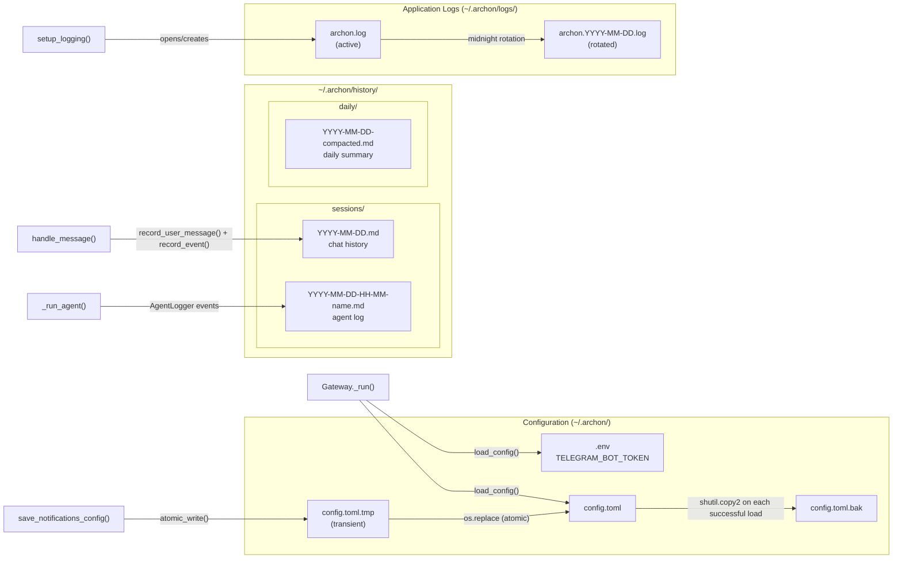
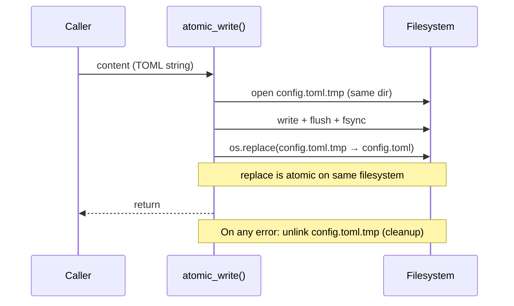

**Purpose**: Documents every persistent data artefact in the Archon system — file paths, formats, write patterns, and retention policy.
**Audience**: Backend engineers and operators maintaining or extending Archon.
**Status**: Stable
**Last reviewed**: 2026-02-26
**Next review**: 2026-05-26

# Data Architecture and Persistence

## Principles

1. **Files, not databases.** All persistence is plain files: TOML config, Markdown logs, and structured log lines. No database engine is required.
2. **Atomic writes prevent corruption.** Config updates go through a write-tmp-then-rename pattern that guarantees the target is never half-written.
3. **Append-only, continuously flushed.** History and agent log files are opened and appended on every event — partial logs are readable even if the process crashes mid-run.
4. **Daily rotation with unlimited retention.** Application logs rotate at midnight; log and history files are never automatically deleted. Manual pruning is the operator's responsibility. File attachments are the sole exception — they support optional TTL-based cleanup via `attachments_cleanup_hours`.
5. **History is opt-out, not opt-in.** `[history].enabled` defaults to `true`; setting it to `false` disables both chat history and agent log files in a single toggle.

---

## Data map overview



---

## Configuration files

### `.env`

| Property | Value |
|---|---|
| Default path | `~/.archon/.env` |
| Format | KEY=VALUE (dotenv) |
| Loaded by | `python-dotenv` `load_dotenv()` |

**Fields:**

| Key | Type | Required | Description |
|---|---|---|---|
| `TELEGRAM_BOT_TOKEN` | string | ✅ | Telegram Bot API token. Missing value raises `ConfigError`. |

`.env` is never written by Archon — the user manages it directly.

---

### `config.toml`

| Property | Value |
|---|---|
| Default path | `~/.archon/config.toml` |
| Format | TOML |
| Parsed by | `tomllib` (stdlib, read-only) on load; `tomlkit` for round-trip writes |

`examples/config.toml.example` (inside the installed app directory) serves as the install template: `install.py` reads it, substitutes `allowed_user_ids` and `working_directory` via regex, and writes the result to `~/.archon/config.toml`. The template file itself is never modified.

#### `[access]`

| Key | Type | Default | Description |
|---|---|---|---|
| `allowed_user_ids` | `list[int]` | required | Telegram user IDs permitted to use the bot. Must be non-empty. |

#### `[session]`

| Key | Type | Default | Description |
|---|---|---|---|
| `working_directory` | `str` | required | Claude's working directory. Must exist on disk at startup. |
| `inactivity_timeout_seconds` | `int` | `1800` | Idle sessions are closed after this many seconds. Must be `> 0`. |
| `attachments_dir` | `str` | `""` | File attachment storage directory. Empty string defaults to `{working_directory}/attachments`. |
| `attachments_cleanup_hours` | `float` | `0` | Delete attachments older than this many hours. `0` disables automatic cleanup. |

#### `[output]`

| Key | Type | Default | Description |
|---|---|---|---|
| `max_message_length` | `int` | `4000` | Maximum Telegram message length in characters. Must be `> 0`. |
| `truncation_strategy` | `str` | `"split"` | Response truncation strategy. Currently only `"split"` is supported. |
| `head_chars` | `int` | `1500` | Characters retained from the head in head-tail truncation. |
| `tail_chars` | `int` | `1500` | Characters retained from the tail in head-tail truncation. |

#### `[logging]`

| Key | Type | Default | Description |
|---|---|---|---|
| `log_file` | `str` | `"~/.archon/logs/archon.log"` | Active log file path. |
| `log_level` | `str` | `"INFO"` | Python logging level (`DEBUG`, `INFO`, `WARNING`, `ERROR`). |

#### `[notifications]`

| Key | Type | Default | Description |
|---|---|---|---|
| `mode` | `str` | `"normal"` | Event verbosity: `"quiet"` \| `"normal"` \| `"verbose"` \| `"debug"`. |
| `interval_minutes` | `int` | `2` | Beacon interval in quiet mode. `0` disables the beacon. |

**`[notifications.agents]`** sub-section:

| Key | Type | Default | Description |
|---|---|---|---|
| `mode` | `str \| null` | `null` | Override notification mode for sub-agent lifecycle events. `null` inherits from `[notifications].mode`. |

#### `[history]`

| Key | Type | Default | Description |
|---|---|---|---|
| `enabled` | `bool` | `true` | Set to `false` to disable all history and agent log file writes. |
| `directory` | `str` | `"~/.archon/history"` | Directory for chat history files and agent log files. |
| `suppressed_tool_results` | `list[str]` | `["Read","Glob","Grep","WebFetch"]` | Tool names whose verbose result content is suppressed in history. |
| `compaction_enabled` | `bool` | `true` | Enable daily history compaction into `-compacted.md` digests. |
| `context_days` | `int` | `2` | Number of recent days of history to inject as context on session startup. |

#### `[models]`

| Key | Type | Default | Description |
|---|---|---|---|
| `available` | `list[str]` | `[]` | Allowed model names for the `/models` command. |
| `default` | `str \| null` | `null` | Model used for all new sessions. `null` uses the SDK default. |

#### `[plugins]`

| Key | Type | Default | Description |
|---|---|---|---|
| `enabled` | `bool` | `true` | Enable or disable plugin loading. |
| `plugins_dir` | `str` | `""` | Custom plugins directory. Empty string uses `~/.claude/plugins/`. |
| `settings_path` | `str` | `""` | Custom settings file. Empty string uses `~/.claude/settings.json`. |

#### `[search]`

| Key | Type | Default | Description |
|---|---|---|---|
| `enabled` | `bool` | `false` | Enable Search MCP integration. Requires the Search server running (`archon search start`). |
| `host` | `str` | `"localhost"` | Search MCP server host. |
| `port` | `int` | `8282` | Search MCP server port. |
| `history_collection` | `str` | `"archon-history"` | Search collection name for `~/.archon/history` files. |

#### `[background_agents]`

| Key | Type | Default | Description |
|---|---|---|---|
| `spawn_rule` | `str` | `"auto"` | Agent spawning policy: `"eager"` \| `"auto"` \| `"manual"`. |
| `max_parallel` | `int` | `5` | Maximum concurrent background agents per user. |
| `host` | `str` | `"localhost"` | Archon MCP server host. |
| `port` | `int` | `18182` | Archon MCP server port (exposes `spawn_background_agent`). |
| `beacon_interval_minutes` | `int` | `2` | How often to send a live progress beacon while an agent runs. `0` disables. |
| `tool_promotion_threshold` | `int` | `10` | Promote to background agent after this many tool calls. `0` disables. Must be `>= 0`. |
| `router_mcp_port` | `int` | `18183` | Port for `ArchonRouterMCPServer`. Must differ from `port`. |

#### `[schedule]`

| Key | Type | Default | Description |
|---|---|---|---|
| `enabled` | `bool` | `true` | Enable the job scheduler. |
| `jobs_dir` | `str` | `"schedules"` | Directory containing per-job `.toml` files, relative to `config.toml`. |

**Per-job `.toml` file** (one file per job in `jobs_dir`, filename stem becomes the job name):

| Key | Type | Default | Description |
|---|---|---|---|
| `cron` | `str` | required | Standard 5-field cron expression. |
| `timeout_seconds` | `float` | `60.0` | Per-step timeout. |
| `enabled` | `bool` | `true` | Set to `false` to skip this job without deleting the file. |
| `timezone` | `str \| null` | `null` | IANA timezone name (e.g. `"Europe/Budapest"`). `null` uses local system time. |

**`[pipeline]` section** (required, TOML table inside the job file):

Each key in the `[pipeline]` table is a step name that must end in `_tool` (shell command) or `_prompt` (Claude prompt). Steps execute in declaration order. Prompt values may reference earlier steps by name using `{step_name}` substitution; prefix with `$` to suppress substitution (e.g. `${literal}`).

```toml
[pipeline]
health_check_tool = "scripts/health_check.sh"
summarize_prompt = "Summarize in one line: {health_check_tool}"
```

#### `[voice]`

| Key | Type | Default | Description |
|---|---|---|---|
| `enabled` | `bool` | `false` | Enable voice note transcription and TTS replies. |

**`[voice.stt]`** sub-section:

| Key | Type | Default | Description |
|---|---|---|---|
| `model` | `str` | `"medium"` | Whisper model size: `tiny`, `base`, `small`, `medium`, `large`. |
| `language` | `str \| null` | `null` | ISO language code (e.g. `"en"`). `null` = auto-detect. |

**`[voice.tts]`** sub-section:

| Key | Type | Default | Description |
|---|---|---|---|
| `provider` | `str` | `"openai"` | TTS provider: `"openai"` or `"edge"` (free fallback). |
| `model` | `str` | `"tts-1"` | OpenAI TTS model: `"tts-1"` or `"tts-1-hd"`. |
| `voice` | `str` | `"nova"` | OpenAI voice: `alloy`, `echo`, `fable`, `onyx`, `nova`, `shimmer`. |
| `auto` | `str` | `"inbound"` | Auto-reply mode: `"always"` \| `"inbound"` \| `"off"`. |
| `max_text_length` | `int` | `3000` | Maximum text length for TTS synthesis. |
| `edge_voice` | `str` | `"en-US-MichelleNeural"` | Voice name for Edge TTS provider. |

#### `[reminder]`

| Key | Type | Default | Description |
|---|---|---|---|
| `enabled` | `bool` | `true` | Enable periodic context reminder injection to prevent context drift. |
| `interval_messages` | `int` | `20` | Inject after this many user+assistant messages. Must be `>= 1`. |
| `interval_tokens` | `int` | `10000` | Inject after this many cumulative tokens. Must be `>= 1`. |

Thresholds use OR logic — whichever limit is reached first triggers the injection.

---

### Backup file: `config.toml.bak`

`load_config()` calls `shutil.copy2(config_path, backup_path)` immediately after every successful parse. The backup reflects the last known-good state of `config.toml`.

**Corruption recovery:** if `tomllib` raises `TOMLDecodeError` on load and `config.toml.bak` exists, `load_config()` restores it via `shutil.copy2(backup_path, config_path)` and retries. If no backup exists, `ConfigError` is raised and the daemon does not start.

---

### Atomic write pattern

`save_notifications_config()` uses `atomic_write()` to persist changes to `config.toml`:



The temporary file lives in the same directory as the target so that `os.replace` is guaranteed to be atomic (single filesystem). The original `config.toml` is never truncated; it is replaced atomically only when the full write succeeds.

---

## Chat history files

### Path

`{history.directory}/sessions/{YYYY-MM-DD}.md`

Default: `~/.archon/history/sessions/2026-02-26.md`

A new file is created on the first message of each day. `HistoryManager._ensure_header()` creates the parent directory with `mkdir(parents=True, exist_ok=True)`.

### Format

```markdown
# 2026-02-26 — Archon Conversations

## 14:30:00 UTC · User 123456789 · /path/to/cwd

User's message text here.

### 💭 Thinking · 14:30:01 UTC

Thinking content from the model.

### 🔧 Tool: Read [abc123] · 14:30:02 UTC

```
/path/to/file.py
```

### 📤 Result [abc123] · 14:30:03 UTC

```
file contents here
```

### ✅ Response · 14:30:05 UTC

> User: "User's message text here..."

Full response from Claude.

---

### ❌ Error · 14:30:05 UTC

Error message text.

---
```

**Structural rules:**
- H1: `# YYYY-MM-DD — Archon Conversations` (written once per day, by `_ensure_header()`)
- H2: `## HH:MM:SS UTC · User {user_id}[ · {cwd}]` — one per incoming user message
- H3 sections: one per event (`ThinkingResult`, `ToolStarted`, `ToolResult`, `Response`, `ErrorEvent`)
- Response section quotes the first 120 chars of the triggering user message as a blockquote
- All timestamps are UTC

### Write mode

Files are opened in append mode (`"a"`) on every write. No buffering — each call to `_append()` opens, writes, and closes the file.

---

## Agent log files

### Path

`{history.directory}/sessions/{YYYY-MM-DD-HH-MM}-{safe-agent-name}.md`

Default example: `~/.archon/history/sessions/2026-02-26-14-30-Nova.md`

The timestamp uses the agent's start time (UTC). Name collisions (two agents with the same name starting in the same minute) are resolved by appending a counter: `-2`, `-3`, etc.

Agent logs share the same `sessions/` subdirectory as chat history files (`{cfg.history.directory}/sessions/`). Both types are written only when `history.enabled = true`.

### Format

```markdown
# Agent: Nova · 2026-02-26 14:30 UTC
**Type:** background
**Started:** 14:30:45 UTC

---

## 📝 User Request · 14:30:45 UTC

Original Telegram message that triggered the spawn.

## 🤖 Agent Task · 14:30:45 UTC

Full prompt sent to the sub-agent (context + task).

---

### 💭 Thinking · 14:30:46 UTC

I need to read the config.

### 🔧 Tool: Read [1] · 14:30:47 UTC

```
/path/to/file
```

### 📤 Result [1] · 14:30:48 UTC

```
file contents
```

### ✅ Response · 14:31:00 UTC

The agent's final response.

---

## Completed · 14:31:00 UTC

**Duration:** 0:00:15

---
```

### Write mode

Continuous append — `record_event()` opens the file, writes the rendered event, and closes it immediately. The `## Completed` footer is written by `finalize()` when `SubagentStopped` is received, regardless of how the agent exits.

---

## Application logs

### Active log file

Default path: `~/.archon/logs/archon.log` (configurable via `[logging].log_file`)

### Format

```
2026-02-26 14:30:45,123 archon INFO Message received from user 123456789 (42 chars)
```

Pattern: `%(asctime)s %(name)s %(levelname)s %(message)s`

### Handlers

Two handlers are attached to the `archon` logger by `setup_logging()`:

| Handler | Destination | Purpose |
|---|---|---|
| `TimedRotatingFileHandler` | `~/.archon/logs/archon.log` | Persists all records to disk |
| `StreamHandler(sys.stdout)` | stdout | Terminal visibility during interactive runs. Only attached when `sys.stdout.isatty()` is true (skipped under launchd/systemd where stdout is already redirected to the log file). |

### Daily rotation

`TimedRotatingFileHandler(when="midnight", backupCount=0)` rotates at midnight.

The custom `_daily_log_namer` renames the rotated file from the Python default (`archon.log.2026-02-22`) to `archon.2026-02-22.log`.

**Startup rotation:** `_rotate_on_startup()` checks the existing `archon.log` at daemon start. If the file's mtime is from a previous day (daemon was stopped or crashed before midnight), it renames it to `archon.{mtime-date}.log` before the handler opens a fresh file.

### stderr redirect

`sys.stderr` is redirected to `_StderrToLogger`, which routes each line to the `archon` logger at `ERROR` level. Python tracebacks and unhandled runtime errors appear in both the log file and stdout with full timestamps.

---

## Background agent runtime data

`AgentRun` dataclass fields:

| Field | Type | Description |
|---|---|---|
| `run_id` | `str` | UUID4 hex string — unique per run |
| `name` | `str` | Human-readable name from the 30-name pool |
| `task` | `str` | Task description as given to `spawn()` |
| `context` | `str` | Context string passed at spawn time |
| `user_id` | `int` | Telegram user ID of the requester |
| `started_at` | `float` | `time.monotonic()` timestamp |
| `user_request` | `str` | Original Telegram message that triggered the spawn |
| `status` | `str` | `"running"` \| `"completed"` \| `"failed"` \| `"cancelled"` |
| `result` | `str \| None` | Final response text on completion |
| `error` | `str \| None` | Exception string on failure |
| `log_path` | `Path \| None` | Path to the agent's Markdown log file (set after `AgentLogger` opens the file) |

`AgentRun` objects live in `BackgroundAgentManager._runs` (in-memory `dict[str, AgentRun]`). They are not persisted to disk. The equivalent on-disk record is the agent log file.

---

## Retention policy

| Artefact | Path | Auto-deleted? |
|---|---|---|
| `.env` | `~/.archon/.env` | Never — operator-managed |
| `config.toml` | `~/.archon/config.toml` | Never |
| `config.toml.bak` | `~/.archon/config.toml.bak` | Overwritten (not deleted) on each successful config load |
| `archon.log` (active) | `~/.archon/logs/archon.log` | Never (rotated, not deleted) |
| `archon.YYYY-MM-DD.log` | `~/.archon/logs/` | Never — `backupCount=0` keeps all rotated logs |
| `YYYY-MM-DD.md` (chat history) | `~/.archon/history/sessions/` | Never |
| `YYYY-MM-DD-HH-MM-name.md` (agent log) | `~/.archon/history/sessions/` | Never |
| Scheduled job `.toml` files | `~/.archon/schedules/` | Never — operator-managed |
| File attachments | `{session.attachments_dir}` | Yes — when `attachments_cleanup_hours > 0`, files older than the TTL are deleted automatically. `0` (default) disables cleanup. |

Most artefacts are never automatically deleted. The exception is file attachments, which support optional TTL-based cleanup. Operators are responsible for pruning old logs and history files. A simple cron job or launchd agent deleting files older than N days is sufficient.

**Disabling history entirely:** set `[history].enabled = false` in `config.toml`. Neither `HistoryManager` nor `AgentLogger` is instantiated — no `~/.archon/history/` files are created.

---

## Related documents

- [120 — Services and Integration Architecture](120_services_and_integration_architecture.md) — MCP server and session wiring that feeds events to history writers
- [140 — Error Handling Strategy](140_error_handling_strategy.md) — how config load failures and history write errors are handled
- [160 — Operational Readiness](160_operational_readiness_monitoring_and_reliability.md) — log-based observability and alerting

---

## Related Decisions

- [ADR-08: tomlkit for Config Write-back](../ADRs/08_tomlkit_config_write_back.md) — why `tomlkit` is used for runtime config saves to preserve comments and formatting
- [ADR-09: Search Integration and History Format](../ADRs/09_search_history_format.md) — why the H2/H3 Markdown structure and Contextual Retrieval blockquote were chosen for history files; Search technology selection rationale
