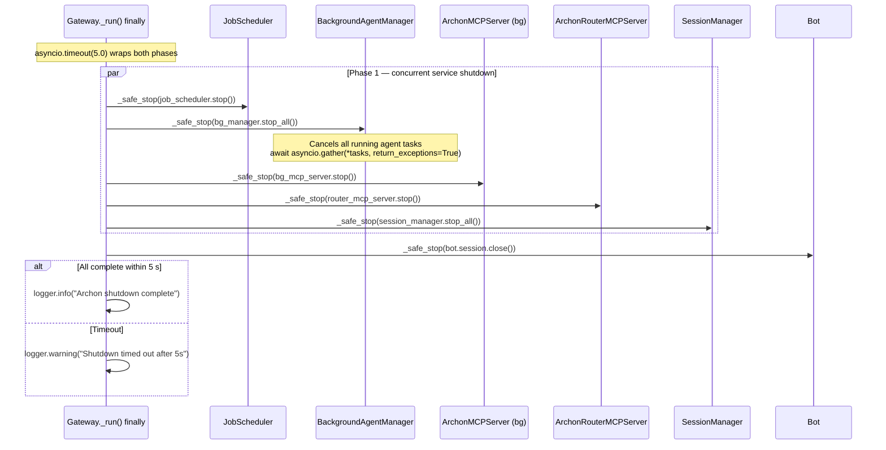

**Purpose**: Documents every error handling pattern in Archon — startup failures, message processing errors, session faults, graceful shutdown, and Telegram network resilience.
**Audience**: Backend engineers debugging or extending Archon.
**Status**: Stable
**Last reviewed**: 2026-03-21
**Next review**: 2026-06-21

# Error Handling Strategy

## Principles

1. **Fail fast at startup.** Missing or invalid configuration raises `ConfigError` immediately, aborting the daemon before any user traffic is processed.
2. **Protect the user loop.** Errors during message processing are caught, reported to the user as `❌ Error: …`, and the handler exits cleanly — the bot stays alive.
3. **Telegram errors never abort AI work.** Network flaps when delivering event messages are logged as warnings and swallowed; Claude's processing continues uninterrupted.
4. **Background agents are isolated.** One agent's failure does not affect other running agents or the main session.
5. **Shutdown completes within 5 s total.** All service stop calls (`job_scheduler.stop()`, `bg_manager.stop_all()`, `bg_mcp_server.stop()`, `router_mcp_server.stop()`, `session_manager.stop_all()`) run concurrently via `asyncio.gather()` under a single shared `asyncio.timeout(_SHUTDOWN_TIMEOUT)` (Phase 1), then `bot.session.close()` runs in Phase 2 under the same timeout. Individual failures are caught by `_safe_stop()` wrappers and logged as warnings without aborting the others.

---

## Error categories

```mermaid
graph TD
    subgraph Startup["Startup errors (fatal)"]
        CE["ConfigError<br/>missing token, bad TOML,<br/>missing required key"]
        TU["Unknown truncation_strategy<br/>(also ConfigError)"]
    end

    subgraph MessageLoop["Message loop errors (non-fatal)"]
        ME["Session error<br/>during send()"]
        TE["Telegram delivery error<br/>per-event send failure"]
        QE["Queued notification error<br/>send_message flap"]
    end

    subgraph ClassificationErrors["Classification errors"]
        CF["Classifier timeout<br/>defaults to task intent"]
        CX["Classifier crash (exception)<br/>yields ErrorEvent, stops processing"]
        CJ["Malformed JSON response<br/>defaults to task intent"]
        CS_["Classifier stop() failure<br/>logged, Decomposer still stopped"]
    end

    subgraph AgentErrors["Background agent errors (isolated)"]
        AF["Agent Exception<br/>status=failed, _notify_failure()"]
        AC["asyncio.CancelledError<br/>status=cancelled, re-raised"]
        AB["Beacon send error<br/>logged, loop continues"]
    end

    subgraph Shutdown["Graceful shutdown"]
        ST["session_manager.stop_all()<br/>timeout=5.0 s"]
        TO["TimeoutError<br/>logged as WARNING, shutdown continues"]
    end

    CE -->|"propagates to asyncio.run()"| ProcessExit["Process exits"]
    TU -->|"propagates to asyncio.run()"| ProcessExit

    CF -->|"logger.warning, default Classification"| DecomposerContinues["Decomposer continues"]
    CX -->|"result.error set, Pipeline yields ErrorEvent"| UserNotified
    CJ -->|"logger.warning, default Classification"| DecomposerContinues
    CS_ -->|"logger.error, Decomposer stopped"| CleanExit2["Shutdown continues"]

    ME -->|"logger.error + answer(❌)"| UserNotified["User notified"]
    TE -->|"logger.warning, continue"| AIWorkContinues["AI work continues"]

    AF -->|"_notify_failure()"| UserNotified
    AC --> CleanExit["Task ends cleanly"]
    AB --> BeaconLoopContinues["Beacon loop continues"]

    ST -->|"5 s exceeded"| TO
```



---

## Startup errors

### Configuration loading

`Gateway._run()` calls `load_config()` as its first operation, before `setup_logging()`. If `load_config()` raises, the exception propagates to `asyncio.run()`, which prints the traceback and exits the process.

**Conditions that raise `ConfigError`:**

| Condition | Error message |
|---|---|
| `TELEGRAM_BOT_TOKEN` absent from environment and `.env` | `"TELEGRAM_BOT_TOKEN is missing from environment or .env file"` |
| `config.toml` does not exist | `"Config file not found: {path}"` |
| `config.toml` is corrupt TOML and no `.bak` exists | `"config.toml is corrupt ({exc}) and no backup exists at {backup_path}"` |
| Required key `access.allowed_user_ids` or `session.working_directory` missing | `"Missing required config key: {key}"` |
| `allowed_user_ids` is an empty list | `"allowed_user_ids must not be empty"` |
| `inactivity_timeout_seconds ≤ 0` | `"inactivity_timeout_seconds must be > 0"` |
| `session.working_directory` does not exist on disk | `"working_directory does not exist: {path}"` |
| `max_message_length ≤ 0` | `"max_message_length must be > 0"` |

**Corruption auto-recovery:** when `tomllib.TOMLDecodeError` is raised and `config.toml.bak` exists, `load_config()` logs a warning, copies the backup back to `config.toml`, and retries parsing. The daemon starts normally. No `ConfigError` is raised in this path.

### Truncation strategy validation

`load_config()` in `loader.py` validates `output.truncation_strategy` against a whitelist of known strategies (currently `("split",)`) and raises `ConfigError` if the value is not recognized. This check runs during config loading, before the gateway starts. A secondary guard exists in `_make_truncation()` in `gateway.py`, which also raises `ConfigError` for unknown strategies during dispatcher setup — this is a defence-in-depth measure that would only fire if a code path bypassed config loading.

### Non-fatal startup conditions

| Condition | Behaviour |
|---|---|
| `search.enabled = true` but Search server not reachable | `logger.warning` — Search disabled for session; daemon starts normally |
| Search server probe fails (HTTP error or timeout) | `logger.warning` — Search disabled; `search_url = None` |
| `ARCHON_RESTART_NOTIFY_CHAT_ID` set but `send_message` fails | `logger.warning` with `exc_info=True`; startup continues |

---

## Message processing errors

### Session error during `send()`

The outer `try/except` in `handle_message` catches any exception raised while streaming events from Claude:

```python
try:
    async for event in session.send(message.text):
        ...
except Exception as exc:
    logger.error("Error processing message for user %d (%s)", user_id, type(exc).__name__)
    try:
        await message.answer(f"❌ Error: {html.escape(str(exc))}")
    except Exception:
        logger.warning(
            "Failed to send error notification to user %d",
            user_id,
            exc_info=True,
        )
```

The error is reported to the user as `❌ Error: {message}`. If that notification also fails (e.g. second Telegram flap), the failure is logged at `WARNING` with a full traceback and silently swallowed. The handler then exits normally.

### Per-event Telegram delivery errors

Each formatted event message is sent inside its own `try/except` with special handling for Telegram rate limits:

```python
try:
    await message.answer(part, parse_mode="HTML")
except TelegramRetryAfter as exc:
    await asyncio.sleep(exc.retry_after + 1)
    try:
        await message.answer(part, parse_mode="HTML")
    except Exception as retry_exc:
        logger.warning(
            "Failed to deliver event reply after retry-after to user %d (%s) — continuing",
            user_id, type(retry_exc).__name__,
        )
except Exception as exc:
    logger.warning(
        "Failed to deliver event reply to user %d (%s) — continuing",
        user_id, type(exc).__name__,
    )
```

When Telegram returns a `TelegramRetryAfter` (HTTP 429), the handler waits the requested time plus 1 second, then retries once. A single failed send does not interrupt the event loop. Claude's remaining events continue to be processed and sent.

### Ancillary notification errors

All secondary Telegram calls in `handle_message` follow the same swallow-and-warn pattern:

| Call | On error |
|---|---|
| Typing indicator (`send_chat_action`) | `logger.warning` — rate-limited internally, silently swallowed |
| "⏳ Working..." acknowledgement (quiet mode) | `logger.warning` — processing continues |
| "⏳ Previous request still processing" notification | `logger.warning` — processing continues |

---

## Session errors (`ClaudeSession`)

### Not-started guard

`ClaudeSession.send()` raises `RuntimeError("Session not started")` if called before `start()`. This propagates to `handle_message`'s outer `try/except` and is reported to the user as an `❌ Error`.

### Concurrency guard

`ClaudeSession` protects against concurrent `send()` calls with `_send_lock: asyncio.Lock`. A second `send()` call while the first is in flight **waits** for the lock rather than raising an error. This ensures messages are processed sequentially without losing the second request. The `is_processing` property reflects the lock state for the queued-message notification in `handle_message`.

### Disconnect errors

`ClaudeSession.stop()` catches `(Exception, asyncio.CancelledError)` from `client.disconnect()` — a broad catch that handles anyio cancel-scope edge cases, `RuntimeError`, `OSError`, `ClosedResourceError`, and any other failure:

```python
try:
    await self._client.disconnect()
except (Exception, asyncio.CancelledError) as exc:
    logger.warning("Session disconnect skipped: %s", exc)
    # Fallback: close transport directly, then SIGKILL as last resort
    transport = getattr(self._client, "_transport", None)
    if transport is not None:
        try:
            await transport.close()
        except (Exception, asyncio.CancelledError):
            # Last resort: os.kill(pid, 9) SIGKILL
            ...
```

On any disconnect failure, `stop()` falls back to closing the transport directly. If that also fails, the subprocess is force-killed via `os.kill(pid, SIGKILL)`. Pending asyncio cancellations left by anyio cancel scopes are cleared via `task.uncancel()` so subsequent awaits in the same task are not affected.

### No automatic reconnect

`ClaudeSession` does not attempt to reconnect after a failed `send()`. If the SDK raises during streaming, the exception propagates to `handle_message`, which reports it to the user. The session object remains connected; the next message from the user creates a new `send()` call using the existing SDK connection.

---

## Classification errors (`Pipeline`)

The `Pipeline` routes each user message through a Classifier (Haiku) before the Decomposer. Two failure modes exist with different outcomes:

- **Timeout or malformed JSON**: graceful degradation — the Pipeline defaults to `Classification(intent="task", confidence=0.0)` and continues processing normally.
- **Classifier crash (exception)**: the Classifier catches the exception internally and sets `result.error`. The Pipeline then yields an `ErrorEvent` and returns — processing stops and the user sees the error.

### Classifier timeout

If the Classifier times out, the Pipeline catches the `TimeoutError`, logs at `WARNING`, and proceeds with the default classification:

```python
try:
    async with asyncio.timeout(_CLASSIFY_TIMEOUT_S):
        result = await self._classifier.classify(prompt)
except TimeoutError:
    logger.warning(
        "Classification timed out after %.0fs — falling back to task intent",
        _CLASSIFY_TIMEOUT_S,
    )
    result = ClassifierResult(
        classification=Classification(intent="task", confidence=0.0),
        duration_s=_CLASSIFY_TIMEOUT_S,
    )
```

### Malformed classification JSON

`parse_classification()` handles all JSON parsing failures:

| Condition | Behaviour |
|---|---|
| Not valid JSON (`JSONDecodeError`, `TypeError`) | `logger.warning`, returns default |
| JSON is not a dict | `logger.warning`, returns default |
| `intent` not in `("chat", "task")` | `logger.warning`, returns default |
| `confidence` is `None` | `logger.warning`, returns default |
| Valid JSON with valid fields | `Classification(intent=..., confidence=...)` with confidence clamped to 0.0–1.0 |

In all failure cases, the default `Classification(intent="task", confidence=0.0)` is returned. The user never sees a classification error — the Decomposer receives the prompt and handles it as a task.

### Pipeline `stop()` resilience

`Pipeline.stop()` wraps the Classifier's `stop()` call in a `try/except` so that a Classifier disconnect failure does not prevent the Decomposer from being stopped:

```python
try:
    await self._classifier.stop()
except Exception:
    logger.error("Classifier stop failed", exc_info=True)
await self._decomposer.stop()
```

---

## Graceful shutdown

`_SHUTDOWN_TIMEOUT = 5.0` seconds (defined at module level in `gateway.py`).

The `Gateway._run()` `finally` block executes this sequence regardless of how `dp.start_polling()` exits:



**Key behaviours:**
- Phase 1 runs all five service stop calls concurrently via `asyncio.gather()`. Phase 2 closes the bot HTTP session last (services may need it during their shutdown).
- Each stop call is wrapped in `_safe_stop()`, which catches all exceptions, logs them as warnings, and swallows them — one service's failure does not block the others.
- `bg_manager.stop_all()` cancels every running agent task and calls `asyncio.gather(..., return_exceptions=True)` — individual agent errors during cancellation do not block shutdown.
- A single `asyncio.timeout(_SHUTDOWN_TIMEOUT)` (5 s) wraps both phases. If it fires, the warning is logged and `"Archon shutdown complete"` is emitted regardless.

---

## Background agent failure handling

Each background agent runs in `BackgroundAgentManager._run_agent()`. Three distinct exit paths exist:

### Success

```python
run.status = "completed"
run.result = result
await self._notify_success(run)
```

The full result is sent to the user. If the combined header + result exceeds 4000 characters, the header is sent first, then the result is split into labelled `[1/N]` chunks.

### Cancellation (`asyncio.CancelledError`)

```python
except asyncio.CancelledError:
    run.status = "cancelled"
    logger.info("Background agent %r cancelled (user=%d)", run.name, run.user_id)
    # cancel beacon task
    raise  # CancelledError must be re-raised
finally:
    self._release_name(run.name)  # always runs, regardless of exit path
    run.done.set()
```

`CancelledError` is always re-raised. No Telegram notification is sent for user-initiated cancellations. `_release_name()` runs in the `finally` block, guaranteeing the name is returned to the pool even on `BaseException` subclasses.

### Failure (`Exception`)

```python
except Exception as exc:
    run.status = "failed"
    run.error = str(exc)
    logger.exception("Background agent %r failed (user=%d)", run.name, run.user_id)
    # cancel beacon task
    await self._notify_failure(run)
finally:
    self._release_name(run.name)  # always runs
    run.done.set()
```

`_notify_failure()` sends `❌ Agent {name} failed\n{error[:400]}` to the user. The 400-character truncation prevents excessively long error messages from hitting Telegram's message limit.

All Telegram calls in `_notify_failure()` go through `_send_notification()`, which catches `Exception`, logs a `WARNING`, and swallows it — a Telegram flap during failure notification does not propagate.

### Beacon errors

The `_agent_beacon_task` loop swallows Telegram errors at each fire:

```python
try:
    await self._bot.send_message(chat_id, text, parse_mode="HTML")
except Exception as exc:
    logger.warning("Agent beacon update failed for %r (user=%d): %s", ...)
```

A single failed beacon send does not cancel the beacon loop. The agent continues running and the next beacon fires after the next interval.

---

## Telegram network errors (polling layer)

aiogram 3.x's `dp.start_polling(bot)` handles reconnection transparently. The polling loop catches network-level exceptions internally and retries with back-off. No custom reconnect logic is needed in Archon.

A clean shutdown signal (SIGINT, SIGTERM) causes `start_polling()` to exit its loop, which triggers the `finally` block in `Gateway._run()`.

---

## Error log levels summary

| Situation | Level | Location |
|---|---|---|
| Session error during message processing | `ERROR` | `handler.py` |
| Failed to notify user of error | `WARNING` | `handler.py` |
| Failed to deliver event reply | `WARNING` | `handler.py` |
| Typing indicator send failure | `WARNING` | `handler.py` |
| Classifier timeout during classification | `WARNING` | `pipeline.py` |
| Classification JSON parse failure | `WARNING` | `classification.py` |
| Classifier `stop()` failure | `ERROR` (with traceback via `exc_info=True`) | `pipeline.py` |
| Session disconnect failure (any exception) | `WARNING` | `claude_session.py` |
| Background agent unhandled exception | `ERROR` (with traceback via `logger.exception`) | `background_agent_manager.py` |
| Background agent cancelled | `INFO` | `background_agent_manager.py` |
| Agent beacon send failure | `WARNING` | `background_agent_manager.py` |
| Notification send failure (spawn/success/failure) | `WARNING` | `background_agent_manager.py` |
| Session cleanup timeout at shutdown | `WARNING` | `gateway.py` |
| Search server unreachable at startup | `WARNING` | `gateway.py` |
| config.toml corruption (backup present) | `WARNING` | `loader.py` |
| config.toml corruption (no backup) | `ConfigError` → fatal | `loader.py` |
| Restart notification failure | `WARNING` | `gateway.py` |

---

## Related documents

- [130 — Data Architecture and Persistence](130_data_architecture_and_persistence.md) — `ConfigError` conditions tied to config file format and backup mechanism
- [120 — Services and Integration Architecture](120_services_and_integration_architecture.md) — session lifecycle and SDK interaction that feeds into session error paths
- [160 — Operational Readiness](160_operational_readiness_monitoring_and_reliability.md) — log-based alerting on `ERROR` and `WARNING` lines
