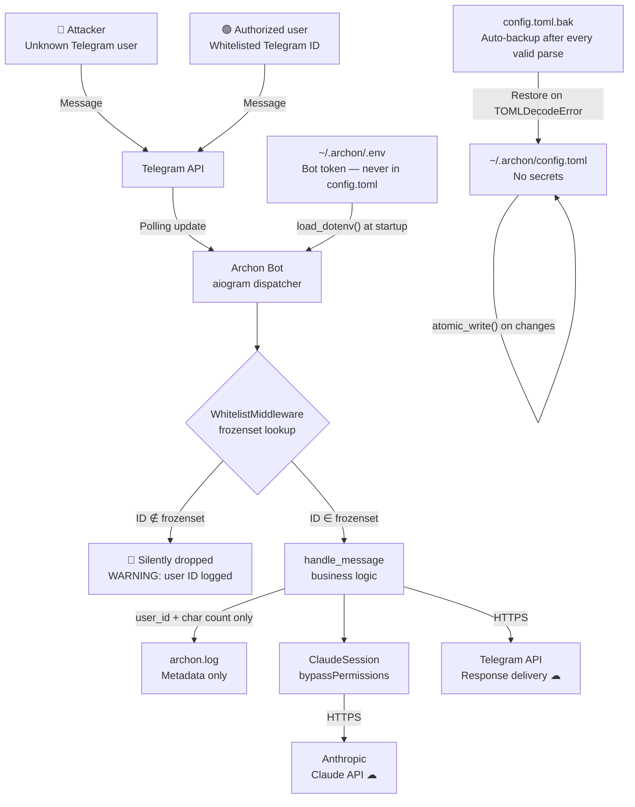

**Purpose**: Documents every security control and privacy measure enforced by Archon, from access gating to secrets management and data residency.
**Audience**: Operators deploying Archon; anyone auditing the security posture.
**Status**: Stable
**Last reviewed**: 2026-02-26
**Next review**: 2026-05-26

# Security and privacy architecture

## Principles

1. **Enforce access at the framework boundary.** `WhitelistMiddleware` sits before every route handler; no unauthorized request ever reaches business logic or the AI layer.
2. **Secrets live in exactly one place.** The Telegram bot token is loaded exclusively from `~/.archon/.env`; it never appears in `config.toml` or any log file.
3. **Log metadata, not content.** Archon records who sent a message and how long it was — never what it said.
4. **Config writes are atomic.** A write-to-temp-then-rename pattern ensures a crash mid-write leaves the original file intact.
5. **Data stays local or goes only to first-party APIs.** No telemetry, analytics, or third-party services receive user data.

---

## Overview

Archon bridges Telegram with Claude Code on the operator's own machine. Its attack surface is narrow: only Telegram users whose numeric IDs appear in the whitelist can interact with the system. Everything else — secrets management, log hygiene, config durability — supports the primary goal of keeping unauthorized principals out and operator data private.

---

## Access control

### Mechanism

`WhitelistMiddleware` (`archon/chat/middleware.py`) is an `aiogram` `BaseMiddleware` registered on both the `message` and `callback_query` routers of the dispatcher. It runs before any handler.

On every incoming event the middleware reads `event.from_user.id` and checks membership in a `frozenset[int]` built from `config.toml [access] allowed_user_ids` at startup. A `frozenset` provides O(1) lookup regardless of whitelist size.

**Authorized** — the handler chain continues normally.

**Unauthorized** — the middleware returns `None`, silently dropping the event. It logs one `WARNING` line:
```
WARNING archon Dropped Message from unauthorized user 987654321
```
No reply is sent to the unauthorized user. This avoids leaking that the bot exists.

### Registration

`gateway.py` calls `register_middleware()` which attaches the same `WhitelistMiddleware` instance to both routers:

```python
def register_middleware(dp: Dispatcher, allowed_user_ids: list[int]) -> None:
    mw = WhitelistMiddleware(allowed_user_ids=allowed_user_ids)
    dp.message.middleware(mw)
    dp.callback_query.middleware(mw)
```

### Config validation

`load_config()` raises `ConfigError` if `allowed_user_ids` is empty:
```python
if not access.allowed_user_ids:
    raise ConfigError("allowed_user_ids must not be empty")
```
The daemon refuses to start without at least one whitelisted user.

---

## Log privacy

`handle_message()` (`archon/chat/handler.py`) logs the user ID and message length — never the message text:

```python
logger.info("Message received from user %d (%d chars)", user_id, len(message.text))
```

Error paths log the user ID and exception *type*, not any exception message that might embed user input:

```python
logger.error("Error processing message for user %d (%s)", user_id, type(exc).__name__)
```

Claude's response content is streamed to Telegram but never written to the log file. Tool names, thinking summaries, and final responses appear in Telegram and in local chat history files (`~/.archon/history/sessions/`) — never in the log file.

---

## Secrets management

### Bot token

The Telegram bot token is the single secret the system requires. `load_config()` (`archon/config/loader.py`) loads it exclusively from the `TELEGRAM_BOT_TOKEN` environment variable, which `python-dotenv` populates from `~/.archon/.env`:

```python
load_dotenv(Path(env_file).expanduser())
token = os.environ.get("TELEGRAM_BOT_TOKEN")
if not token:
    raise ConfigError("TELEGRAM_BOT_TOKEN is missing from environment or .env file")
```

If the token is absent the daemon refuses to start. The token never appears in `config.toml`, never enters any log, and never surfaces in error messages.

### File layout

| File | Contains | Secrets? |
|---|---|---|
| `~/.archon/.env` | `TELEGRAM_BOT_TOKEN=…` | ✅ Yes — restricted permissions |
| `~/.archon/config.toml` | Whitelist IDs, timeouts, log level, etc. | ❌ No |
| `~/.archon/logs/archon.log` | Timestamped operational events | ❌ No |

---

## Atomic config writes

Settings that change at runtime (notification mode) are written back to `config.toml`. The `atomic_write()` function (`archon/config/loader.py`) prevents corruption if the process is killed mid-write:

```python
def atomic_write(path: Path, content: str) -> None:
    tmp = path.with_suffix(".toml.tmp")  # same directory → same filesystem
    try:
        with tmp.open("w", encoding="utf-8") as f:
            f.write(content)
            f.flush()
            os.fsync(f.fileno())  # flush OS buffer to disk
        tmp.rename(path)          # atomic on POSIX (same filesystem)
    except BaseException:
        with _suppress_os_errors():
            tmp.unlink()          # clean up temp on any failure
        raise
```

Key properties:
- The temp file lives in the same directory as `config.toml`, guaranteeing `os.rename` is a same-filesystem move and therefore atomic on POSIX.
- `fsync` flushes the kernel buffer to storage before the rename, so the content survives a power loss.
- On any exception (including `KeyboardInterrupt`) the temp file is deleted; the original `config.toml` is never truncated.

### Backup and self-healing

After every successful parse `load_config()` copies the known-good config to `config.toml.bak`:

```python
shutil.copy2(config_path, backup_path)
```

On the next startup, if `tomllib` raises `TOMLDecodeError` (corruption), `load_config()` automatically restores from the backup before rethreading the parse:

```python
except tomllib.TOMLDecodeError as exc:
    if backup_path.exists():
        logger.warning("config.toml is corrupt (%s); restoring from %s", exc, backup_path)
        shutil.copy2(backup_path, config_path)
        with config_path.open("rb") as f:
            data = tomllib.load(f)
    else:
        raise ConfigError(…) from exc
```

See [Operational Readiness](./160_operational_readiness_monitoring_and_reliability.md) for the full startup self-healing flow.

---

## SDK permission model

`ClaudeSession` (`archon/ai/claude_session.py`) starts the Claude Agent SDK with `permission_mode="bypassPermissions"`:

```python
options = ClaudeAgentOptions(
    permission_mode="bypassPermissions",
    …
)
```

This suppresses the interactive permission prompts that Claude Code normally shows when a tool accesses the filesystem or network. In a headless daemon context there is no terminal to answer those prompts, so bypassing them is required for unattended operation.

The security boundary is the whitelist: only the operator's own Telegram IDs reach Claude. The operator is the same person who owns the machine, so Claude Code's standard permission scope applies. `EnterPlanMode`, `ExitPlanMode`, and `Task` are explicitly disallowed in every session regardless of permission mode.

---

## Data locality

Archon sends data to exactly two external services:

| Service | What is sent | Why |
|---|---|---|
| **Telegram API** | User messages, formatted Claude responses | Core function — routing user ↔ bot |
| **Anthropic Claude API** | User prompts, conversation context | Core function — AI processing |

No other party receives any data. Specifically:
- No telemetry or crash-reporting endpoints are called.
- No analytics libraries are included.
- Chat history is stored locally at `~/.archon/history/sessions/` (Markdown files, never uploaded).
- Log files remain on the operator's machine at `~/.archon/logs/archon.log`.

---

## Threat model



### Threat summary

| Threat | Mitigation |
|---|---|
| Unauthorized Telegram user sends commands | `WhitelistMiddleware` drops silently before any handler runs |
| Bot token leaked via config or logs | Token loaded from `.env` only; never logged, never in `config.toml` |
| Config file corrupted by crash during write | Atomic write via temp-file-then-rename + `fsync` |
| Config file corrupted by external edit or disk error | `config.toml.bak` restored automatically at next startup |
| Claude executes sensitive operations on behalf of an attacker | Attacker cannot reach Claude — whitelist blocks access upstream |
| Claude executes overly-broad operations on behalf of the authorized user | Operator owns the machine; `bypassPermissions` is intentional and documented |

---

## Related documents

- [System Architecture Overview](./100_system_architecture_overview.md) — component placement and trust boundaries
- [Component Catalog](./110_component_catalog_and_layer_breakdown.md) — `WhitelistMiddleware` and `ClaudeSession` component details
- [Operational Readiness](./160_operational_readiness_monitoring_and_reliability.md) — startup self-healing, config backup lifecycle

---

## Related Decisions

- [ADR-05: Whitelist-Based Telegram Access Control](../ADRs/05_whitelist_access_control.md) — why a static `frozenset` whitelist enforced at the middleware layer was chosen over passwords, OAuth, or group-membership checks
