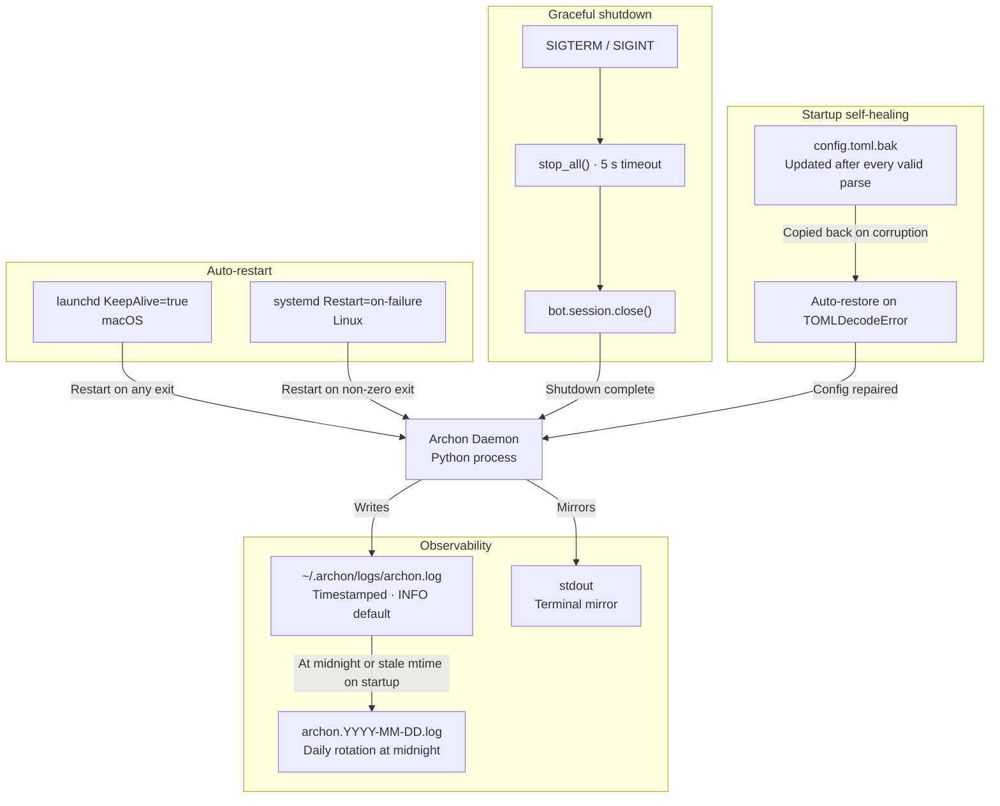

**Purpose**: Documents observability, daemon lifecycle, graceful shutdown, startup self-healing, and the operational runbook for day-to-day Archon administration.
**Audience**: Operators running Archon; on-call engineers diagnosing issues.
**Status**: Stable
**Last reviewed**: 2026-02-26
**Next review**: 2026-05-26

# Operational readiness, monitoring, and reliability

## Principles

1. **Every log line is timestamped and attributed.** The format `asctime name levelname message` makes grep-based triage fast and unambiguous.
2. **The daemon restarts automatically on crash.** launchd `KeepAlive=true` (macOS) and systemd `Restart=on-failure` (Linux) ensure service continuity without operator intervention.
3. **Graceful shutdown completes within 5 seconds.** `session_manager.stop_all()` runs under an `asyncio.wait_for` timeout; a warning is logged if cleanup takes longer.
4. **Config corruption is self-healing.** A `.bak` file is updated on every successful parse so that a corrupted `config.toml` is automatically replaced at next startup.
5. **All operational actions are one `install.py` flag away.** `uv run install.py` handles install, update, and uninstall on both platforms.

---

## Overview

Archon runs as a long-lived daemon. Operational readiness covers four concerns: how the system surfaces its internal state (observability), how it recovers from crashes (auto-restart), how it shuts down cleanly on request (graceful shutdown), and how it recovers from a bad config on disk (self-healing). A health-check script and `install.py` support routine administration without manual service-management commands.

---

## Observability

### Log file location and rotation

`setup_logging()` (`archon/log_setup.py`) configures the `archon` logger with two handlers:

| Handler | Destination | Purpose |
|---|---|---|
| `TimedRotatingFileHandler` | `~/.archon/logs/archon.log` | Persistent record — all log levels |
| `StreamHandler(sys.stdout)` | Terminal stdout | Interactive visibility when run manually |

The file handler rotates at midnight (`when="midnight"`) with `backupCount=0`, meaning rotated files are never deleted automatically. A custom namer transforms the default `archon.log.YYYY-MM-DD` suffix into the cleaner `archon.YYYY-MM-DD.log`:

```python
def _daily_log_namer(default_name: str) -> str:
    p = Path(default_name)
    date_suffix = p.suffix          # e.g. ".2026-02-22"
    base = Path(p.stem).stem        # strips ".log" → "archon"
    return str(p.parent / f"{base}{date_suffix}.log")
```

**Startup rotation** handles the case where the daemon was stopped before midnight: if `archon.log` exists and its modification time is from a previous day, `_rotate_on_startup()` renames it to `archon.YYYY-MM-DD.log` (using the file's mtime date) before the new handler opens a fresh file.

### Log format

```
2026-02-26 14:03:22,418 archon INFO Message received from user 123456789 (42 chars)
```

Format string: `%(asctime)s %(name)s %(levelname)s %(message)s`

### Stderr capture

`setup_logging()` replaces `sys.stderr` with `_StderrToLogger`, which routes Python tracebacks and other runtime error output to the `archon` logger at `ERROR` level. This ensures unhandled exceptions appear in the log file with timestamps rather than disappearing silently when the daemon runs under launchd or systemd.

### Log level configuration

The log level is set via `config.toml`:

```toml
[logging]
log_file  = "~/.archon/logs/archon.log"   # default
log_level = "INFO"                    # INFO | DEBUG | WARNING | ERROR
```

`setup_logging()` applies `getattr(logging, cfg.log_level.upper())` to the `archon` logger, making `DEBUG` available for development without code changes.

### What is logged at each level

| Level | Example messages |
|---|---|
| `INFO` (default) | Daemon start/stop, session created/stopped, message received `(N chars)`, model set, skill queued for next message, QMD endpoint URL |
| `DEBUG` | Context queued for next message |
| `WARNING` | Unauthorized user dropped, typing indicator failed, Telegram delivery failed, session cleanup timed out, `config.toml` restored from backup, QMD not found in PATH |
| `ERROR` | Message processing failure (user ID + exception type), Python tracebacks via stderr capture |

Message *content* is never logged at any level. See [Security and Privacy Architecture](./150_security_and_privacy_architecture.md#log-privacy).

### Session-level observability

`ClaudeSession` accumulates per-turn metadata to expose session health through two operator-facing channels.

#### `/context` command — token usage and cost

A nested `_intercept()` function inside `ClaudeSession.send()` captures `ResultMessage` metadata on every completed turn. The `usage_stats` property surfaces:

| Field | Description |
|---|---|
| Input / output / total tokens | Token counts for the most recent turn and session cumulative |
| Accumulated cost | Estimated USD cost rounded to micro-dollar precision |
| Turn count | Number of completed `send()` turns in this session |
| Last duration | Wall-clock seconds for the most recent turn |

The `/context` command renders these as a Unicode context-window progress bar with per-category token counts and accumulated cost, giving the operator immediate visibility into how much of the model's context window has been consumed and what the session has cost so far.

#### Session diagnostics

`ClaudeSession` tracks `_processing` (whether a `send()` is in flight), `_last_send_at`, `_last_response_at`, `_send_count`, and `_event_log` (a `collections.deque` with `maxlen=200`). Derived properties include `is_processing`, `processing_seconds`, `idle_seconds`, `send_count`, `recent_events()`, and `diagnostics`.

The `/status` command uses these properties to report real-time session state:

```
🔄 Processing for 45s   — send() in flight
💤 Idle for 120s        — no active send
Messages: 12            — turn count this session
```

---

## Daemon auto-restart

### macOS — launchd

The launchd plist (`scripts/com.archon.assistant.plist`) includes:

```xml
<key>KeepAlive</key>
<true/>

<key>RunAtLoad</key>
<true/>
```

`KeepAlive=true` instructs launchd to restart the process whenever it exits for any reason. `RunAtLoad=true` starts the service immediately on login without waiting for an event. Both stdout and stderr are appended to `~/.archon/logs/archon.log`:

```xml
<key>StandardOutPath</key>
<string>~/.archon/logs/archon.log</string>
<key>StandardErrorPath</key>
<string>~/.archon/logs/archon.log</string>
```

### Linux — systemd

The systemd unit file (`scripts/archon.service`) includes:

```ini
[Service]
Type=simple
Restart=on-failure
StandardOutput=append:~/.archon/logs/archon.log
StandardError=append:~/.archon/logs/archon.log
```

`Restart=on-failure` restarts the service when the process exits with a non-zero status code. A clean `SIGTERM` (exit 0) does not trigger a restart.

### Restart behavior comparison

| Platform | Trigger | Condition |
|---|---|---|
| macOS launchd | Any exit | `KeepAlive=true` — restarts on clean exit too |
| Linux systemd | Non-zero exit only | `Restart=on-failure` |

---

## Graceful shutdown

### SLO

Session cleanup completes within **5 seconds** or a warning is emitted. This constant is defined in `gateway.py`:

```python
_SHUTDOWN_TIMEOUT: float = 5.0
```

### Shutdown sequence

When the process receives `SIGTERM` or `SIGINT`, `asyncio.run()` cancels the running coroutine. The `finally` block in `Gateway._run()` executes the following steps in order:

```python
finally:
    logger.info("Archon shutdown initiated")
    await cron_scheduler.stop()
    await bg_manager.stop_all()
    await bg_mcp_server.stop()
    try:
        await asyncio.wait_for(session_manager.stop_all(), timeout=_SHUTDOWN_TIMEOUT)
    except asyncio.TimeoutError:
        logger.warning("Session cleanup timed out after %.0fs", _SHUTDOWN_TIMEOUT)
    await bot.session.close()
    logger.info("Archon shutdown complete")
```

| Step | Action |
|---|---|
| `cron_scheduler.stop()` | Halts scheduled cron jobs |
| `bg_manager.stop_all()` | Cancels running background agents |
| `bg_mcp_server.stop()` | Stops the internal MCP server |
| `session_manager.stop_all()` | Disconnects all active Claude sessions (5 s timeout) |
| `bot.session.close()` | Closes the aiohttp Telegram session |

A `TimeoutError` from `session_manager.stop_all()` does not abort the remaining steps; the bot session is always closed regardless.

---

## Startup self-healing

Every time `load_config()` successfully parses `config.toml`, it writes a backup:

```python
shutil.copy2(config_path, backup_path)   # config.toml → config.toml.bak
```

If `config.toml` is corrupt at the next startup (e.g., truncated by a power loss during a non-atomic write from an external tool), `load_config()` detects the `TOMLDecodeError`, restores from the backup, and re-parses:

```python
except tomllib.TOMLDecodeError as exc:
    if backup_path.exists():
        logger.warning("config.toml is corrupt (%s); restoring from %s", exc, backup_path)
        shutil.copy2(backup_path, config_path)
        with config_path.open("rb") as f:
            data = tomllib.load(f)
    else:
        raise ConfigError(f"config.toml is corrupt ({exc}) and no backup exists at {backup_path}") from exc
```

Archon's own config changes use `_atomic_write()` (write-to-temp-then-rename), so corruption from internal writes is prevented by design. The self-healing path covers corruption from external sources. See [Security and Privacy Architecture](./150_security_and_privacy_architecture.md#atomic-config-writes) for the atomic write implementation details.

---

## Operational runbook

### Check logs

```bash
tail -f ~/.archon/logs/archon.log
```

To view a specific rotated log:
```bash
less ~/.archon/archon.2026-02-25.log
```

To search for errors:
```bash
grep "ERROR\|WARNING" ~/.archon/logs/archon.log | tail -20
```

### Install and start the daemon

```bash
uv run install.py     # macOS + Linux — registers service and starts it
```

### Stop the daemon

```bash
# macOS
launchctl unload ~/Library/LaunchAgents/com.archon.assistant.plist

# Linux
systemctl stop --user archon
```

### Restart the daemon

```bash
# macOS
launchctl unload ~/Library/LaunchAgents/com.archon.assistant.plist
launchctl load  ~/Library/LaunchAgents/com.archon.assistant.plist

# Linux
systemctl restart --user archon
```

### Uninstall the daemon

```bash
uv run install.py --uninstall   # macOS + Linux — stops and removes the service
```

### Update Archon

Re-run the installer (fetches latest `main` and reinstalls the service):

```bash
curl -fsSL https://raw.githubusercontent.com/user538295/archon-assistant/main/install.sh | bash
```

### Run the health check

The `scripts/health_check.sh` script reports process status, QMD daemon status, the last 5 log errors, disk usage, and memory:

```bash
bash ~/.archon/app/scripts/health_check.sh
```

Sample output sections:
```
=== Archon Health Check: 2026-02-26 14:03:22 ===

--- Process ---
Archon: RUNNING (PID(s): 12345)

--- Log Errors ---
Total errors in log: 0
No errors found

--- Disk (home) ---
Used 42G of 500G (9% full)
```

### Edit config without restart

`config.toml` changes take effect on the next Archon restart. For notification mode, use Telegram commands (`/quiet`, `/normal`, `/verbose`, `/debug`) — these write back to `config.toml` atomically without requiring a restart. The `/models` command changes the model for the current daemon session only (in-memory); it does not persist to `config.toml`.

---

## Health indicators diagram



---

## Related documents

- [Security and Privacy Architecture](./150_security_and_privacy_architecture.md) — atomic config writes, log privacy, secrets management
- [System Architecture Overview](./100_system_architecture_overview.md) — gateway orchestration and session lifecycle
- [Component Catalog](./110_component_catalog_and_layer_breakdown.md) — `Gateway`, `SessionManager`, `CronScheduler`, `BackgroundAgentManager` details

---

## Related Decisions

- [ADR-04: Local Daemon Deployment (launchd / systemd)](../ADRs/04_local_daemon_deployment.md) — why Archon runs as a local user-space daemon rather than a cloud service, and how `KeepAlive` / `Restart=on-failure` enable automatic recovery
