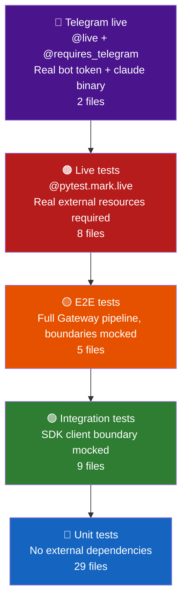

**Purpose**: Defines the test pyramid, markers, coverage targets, and commands for running Archon's test suite.
**Audience**: All developers
**Status**: Stable
**Last reviewed**: 2026-02-26
**Next review**: 2026-05-26

# Testing Strategy

## Principles

1. **Tests before code** — TDD is mandatory; no production code is written without a failing test first.
2. **≥85% coverage enforced** — `pytest` fails the build if coverage drops below 85%; this threshold is non-negotiable.
3. **Live tests are opt-in** — tests that require external resources (the `claude` binary, network, Telegram credentials) are excluded from the default run and must be invoked explicitly.
4. **Mock at boundaries only** — unit and integration tests substitute only the outermost dependency (SDK client, Telegram API); all internal logic runs real code.
5. **All tests must be green** — never merge with a failing test; fix it or delete it, never skip it.

---

## Test pyramid



Every layer builds on the one below it. The bottom three layers run in the default `uv run pytest` invocation; the top two require explicit opt-in.

---

## Test tiers

### Unit tests

Fast, isolated tests covering pure logic with no external dependencies. They test event mapping, message truncation, whitelist filtering, config loading, Telegram message formatting, and bot command parsing.

- **Marker**: none (included in default run)
- **Key files**:
  - `tests/ai/test_event_mapper.py` — `EventMapper` SDK message → event dataclass conversion
  - `tests/ai/test_truncation.py` — `SplitStrategy` chunking logic
  - `tests/ai/test_skill_loader.py`, `tests/ai/test_agent_loader.py`, `tests/ai/test_plugin_loader.py`
  - `tests/ai/test_background_agent_manager.py`, `tests/ai/test_archon_mcp_server.py`
  - `tests/ai/test_agent_logger.py`, `tests/ai/test_history_manager.py`, `tests/ai/test_event_renderer.py`
  - `tests/ai/test_agent_names.py`, `tests/ai/test_qmd_session.py`
  - `tests/chat/test_handler.py`, `tests/chat/test_middleware.py`, `tests/chat/test_commands.py`, `tests/chat/test_md_formatter.py`, `tests/chat/test_bot.py`
  - `tests/config/test_loader.py`, `tests/config/test_qmd_config.py`
  - `tests/cron/test_cron_config.py`, `tests/cron/test_cron_scheduler.py`
  - `tests/gateway/test_gateway.py`, `tests/gateway/test_shutdown.py`, `tests/gateway/test_qmd_daemon.py`
  - `tests/test_smoke.py`, `tests/test_logging.py`, `tests/test_installer.py`, `tests/test_launchd.py`, `tests/test_systemd.py`

### Integration tests

Wire multiple internal modules together, substituting only the outermost SDK client with a scripted fake. They verify event pipelines, session lifecycle, and cross-module contracts without touching external processes.

- **Marker**: none (included in default run)
- **Key files**:
  - `tests/ai/test_sdk_pipeline.py` — full AI pipeline driven by a `FakeClaudeClient`
  - `tests/ai/test_claude_session.py` — `ClaudeSession` with mock `ClaudeSDKClient`
  - `tests/ai/test_session_manager.py` — per-user session registry
  - `tests/ai/test_background_agent_integration.py` — `BackgroundAgentManager` pipeline
  - `tests/chat/test_chat_ai_integration.py` — Dispatcher + middleware + handler + `SessionManager`
  - `tests/cron/test_cron_integration.py`, `tests/ai/test_qmd_integration.py`, `tests/ai/test_subagent_integration.py`
  - `tests/gateway/test_background_agent_gateway_integration.py` — Gateway + `BackgroundAgentManager` wiring

### E2E tests

Drive the full Gateway pipeline from incoming Telegram message to formatted Telegram reply, with both the SDK boundary and the Telegram API mocked. They verify message ordering, content splitting, shutdown timing, and background agent completion notifications.

- **Marker**: none (included in default run)
- **Key files**:
  - `tests/gateway/test_full_flow.py` — ordered event sequence through `Gateway._setup_dp`
  - `tests/gateway/test_shutdown_e2e.py` — SIGINT → `stop_all()` completes within 5 s
  - `tests/ai/test_background_agent_e2e.py` — spawn → complete → result stored + notification sent
  - `tests/ai/test_session_diagnostics_e2e.py` — session diagnostics pipeline
  - `tests/gateway/test_qmd_gateway_e2e.py`

### Live tests

Require real external resources (filesystem, `claude` or `qmd` binary, network). Each live test file either declares a `skipif` condition (e.g. `shutil.which("claude") is None`, `shutil.which("qmd") is None`, or a directory existence check) or relies solely on the `live` marker to exclude it from the default run. The suite covers real SDK sessions, filesystem I/O, subprocess execution, and daemon connectivity.

- **Marker**: `@pytest.mark.live`
- **Definition** (from `pyproject.toml`): *tests that use real external resources (processes, files, network); excluded from default runs*
- **Key files**:
  - `tests/ai/test_claude_session_live.py` — `ClaudeSession` + real SDK → `Response` event
  - `tests/ai/test_background_agent_manager_live.py`, `tests/ai/test_agent_logger_live.py`
  - `tests/ai/test_skill_loader_live.py`, `tests/ai/test_session_diagnostics_live.py`
  - `tests/config/test_loader_live.py`, `tests/cron/test_cron_live.py`, `tests/ai/test_qmd_live.py`
- **Run**: `uv run pytest -m live --no-cov -v`

### Telegram live tests

Require both `@pytest.mark.live` and `@pytest.mark.requires_telegram`. These tests need a valid `TELEGRAM_BOT_TOKEN` and a `TELEGRAM_LIVE_CHAT_ID` in the environment. They verify real bot connectivity and full-stack message delivery.

- **Markers**: `@pytest.mark.live`, `@pytest.mark.requires_telegram`
- **Definition** (from `pyproject.toml`): *live tests that need `TELEGRAM_BOT_TOKEN` and `TELEGRAM_LIVE_CHAT_ID` in env*
- **Key files**:
  - `tests/chat/test_bot_live.py` — bot token validation + message delivery
  - `tests/gateway/test_live_e2e.py` — full Gateway with real bot, real SDK, and real Telegram chat
- **Run**: `uv run pytest -m "live and requires_telegram" --no-cov -v`

---

## Coverage target

Coverage is enforced at **≥85%** by `pyproject.toml`:

```toml
[tool.pytest.ini_options]
addopts = "--cov=archon --cov-report=term-missing --cov-fail-under=85 -m 'not live'"
```

- `--cov=archon` — measures coverage of the `archon/` package only
- `--cov-report=term-missing` — prints uncovered line numbers to the terminal after every run
- `--cov-fail-under=85` — exits non-zero if coverage is below 85%
- `-m 'not live'` — excludes all `@pytest.mark.live` tests from the default run

---

## Test markers

Markers are declared in `pyproject.toml`:

```toml
[tool.pytest.ini_options]
markers = [
    "live: tests that use real external resources (processes, files, network); excluded from default runs",
    "requires_telegram: live tests that need TELEGRAM_BOT_TOKEN and TELEGRAM_LIVE_CHAT_ID in env",
]
```

| Marker | Meaning | Excluded from default run? |
|---|---|---|
| *(none)* | Unit, integration, or E2E test — no external dependencies | No |
| `live` | Requires real filesystem, `claude` binary, or network | Yes |
| `requires_telegram` | Requires `TELEGRAM_BOT_TOKEN` and `TELEGRAM_LIVE_CHAT_ID` | Yes (combined with `live`) |

---

## Running tests

`pyproject.toml` sets `testpaths = ["tests"]` and `asyncio_mode = "auto"`. All async test functions run automatically without additional decorators.

```bash
# Run all non-live tests (default — enforces ≥85% coverage)
uv run pytest

# Run a single test file
uv run pytest tests/ai/test_event_mapper.py

# Run a single test by name pattern
uv run pytest -k "test_split_strategy_labels"

# Run live tests (require real external resources; opt-in only)
uv run pytest -m live --no-cov -v

# Run Telegram live tests (require TELEGRAM_BOT_TOKEN + TELEGRAM_LIVE_CHAT_ID)
uv run pytest -m "live and requires_telegram" --no-cov -v
```

> **Note**: All test commands use `uv run pytest` directly. Service installation is handled by `install.py`; doc linting via `markdownlint-cli2 "**/*.md" "#node_modules" "#.venv"`.

---

## Test file naming conventions

| Suffix pattern | Tier | Example |
|---|---|---|
| `test_<module>.py` | Unit or integration | `test_event_mapper.py`, `test_session_manager.py` |
| `test_<feature>_integration.py` | Integration | `test_background_agent_integration.py`, `test_cron_integration.py` |
| `test_<feature>_e2e.py` | E2E | `test_shutdown_e2e.py`, `test_background_agent_e2e.py` |
| `test_<module>_live.py` | Live (real external resources) | `test_claude_session_live.py`, `test_skill_loader_live.py` |

Live test files mark themselves with `@pytest.mark.live` — either via a module-level `pytestmark` list or via per-test `@pytest.mark.live` decorators. Telegram live files additionally include `pytest.mark.requires_telegram`.

---

## Test directory structure

```
tests/
├── ai/          # AI layer — ClaudeSession, EventMapper, truncation, agents, MCP, QMD
├── chat/        # Telegram bot — handlers, middleware, commands, formatting
├── config/      # Config loading and validation
├── cron/        # CronScheduler — config, scheduling, live execution
├── gateway/     # Full-stack flows — message routing, shutdown, E2E
├── test_smoke.py
├── test_logging.py
├── test_installer.py
├── test_launchd.py
└── test_systemd.py
```

---

## Related documents

- [`500_development_workflows_and_conventions.md`](500_development_workflows_and_conventions.md) — TDD mandate, coding conventions, and Definition of Done
- [`contributing.md`](/contributing.md) — step-by-step workflow for running tests and opening PRs
- [`010_engineering_principles_and_constraints.md`](010_engineering_principles_and_constraints.md) — technical constraints that testing enforces
