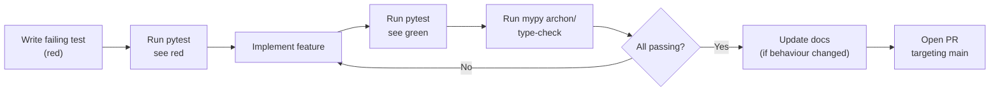
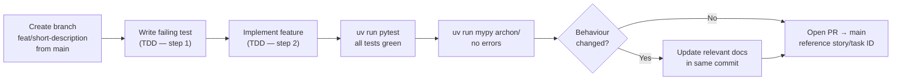

**Purpose**: Documents Archon's coding standards, development workflow, type-checking configuration, and Definition of Done.
**Audience**: All developers
**Status**: Stable
**Last reviewed**: 2026-02-26
**Next review**: 2026-05-26

# Development Workflows and Conventions

## Principles

1. **TDD is mandatory** — write the failing test before writing any production code; no exceptions.
2. **KISS first** — apply the simplest solution that satisfies the requirement; increase complexity only when simplicity is genuinely insufficient.
3. **Never guess** — all statements, documentation, and code assumptions must be based on verified facts from the source.
4. **Clean Code inside KISS** — meaningful names, short functions, no magic numbers; never let Clean Code practices add complexity that KISS prohibits.
5. **All tests must be green** — never merge with a failing test; fix it or delete it.

---

## TDD mandate

TDD is not optional. The constraint appears in `CLAUDE.md`:

> *"TDD is mandatory — write tests before implementation. Maintain ≥85% coverage."*

`contributing.md` reinforces the same requirements: *"write the failing test before writing any production code; no exceptions"* and *"Coverage is enforced at ≥ 85 %"*.

The development loop is:



Write the smallest test that fails for the right reason. Implement only enough code to make it pass. Refactor under the green bar.

---

## KISS principle

KISS applies to code implementation, not to required functionality. From `CLAUDE.md`:

> *"Always use KISS as the first principle (apply to code implementation, not to required functionality)"*
> *"Increase complexity step-by-step; use best practices when they simplify rather than complicate"*

In practice:
- Prefer a flat function over a class when a class adds no value.
- Prefer a class over a framework when a framework adds no value.
- Add abstractions when they genuinely simplify — not by default.
- Never introduce a pattern solely because it is "best practice" if the simpler alternative is correct.

---

## Logging — no `print()`

Every module uses `logging.getLogger("archon")`. Calling `print()` anywhere in production code is forbidden. From `CLAUDE.md`:

> *"All modules use `logging.getLogger('archon')` — no `print()`."*

Additionally, log only metadata — never log message content. Logging message content leaks user data (security requirement).

```python
# correct
import logging
logger = logging.getLogger("archon")
logger.info("Received message (%d chars)", len(text))

# wrong — print() is forbidden
print(text)

# wrong — leaks message content
logger.info("Received message: %s", text)
```

---

## Type safety — mypy strict

The full `mypy` configuration from `pyproject.toml`:

```toml
[tool.mypy]
python_version = "3.12"
strict = true
```

`strict = true` enables all optional mypy checks, including:
- `--disallow-untyped-defs` — all functions must have type annotations
- `--disallow-any-generics` — no unparameterised generic types (e.g., `list` must be `list[str]`)
- `--warn-return-any` — warn when returning `Any`
- `--no-implicit-optional` — `Optional[X]` must be explicit

All new code must pass `uv run mypy archon/` without errors or inline suppressions.

---

## Linting and formatting

The project declares no additional linting or formatting tools beyond `mypy` in `pyproject.toml`. The `[dependency-groups] dev` section contains only:

```toml
[dependency-groups]
dev = [
    "pytest>=8.0",
    "pytest-asyncio>=0.23",
    "pytest-cov>=5.0",
    "mypy>=1.10",
]
```

Code style is enforced through mypy strict type checking, TDD discipline, and code review.

---

## Error handling conventions

From `contributing.md`:

- **Fail fast in config loading** — raise `ConfigError` on missing required fields; never silently default.
- **Propagate context in async handlers** — include enough context in exceptions to understand the failure site.
- **Centralise recovery in the Gateway** — the Gateway owns top-level error recovery and graceful shutdown.

See [`140_error_handling_strategy.md`](140_error_handling_strategy.md) for the full error-handling patterns.

---

## Architectural conventions

### Whitelist enforcement
The whitelist check lives exclusively in `WhitelistMiddleware`. Never place whitelist logic inside command handlers or the message handler.

### New truncation strategies
Add a subclass of `TruncationStrategy` in `archon/ai/truncation.py`. No changes to Gateway or Chat are required. Activate the strategy by name in `config.toml [output] truncation_strategy`.

### Shutdown budget
`stop_all()` must complete within 5 seconds. From `CLAUDE.md`:

> *"`stop_all()` must complete within 5 seconds."*

---

## Branch and PR workflow



Steps in detail (from `contributing.md`):

1. Create a feature branch from `main`: `git checkout -b feat/short-description`
2. Write the failing test first (TDD).
3. Implement the feature until the test passes.
4. Run the full test suite: `uv run pytest`
5. Run the type checker: `uv run mypy archon/`
6. Update documentation if the change is user-visible or alters system behaviour.
7. Open a PR targeting `main`; the description must reference the story or task ID from `Documentation/tasks.md`.

---

## Commit message convention

Use the imperative mood. From `contributing.md`:

> *"Commit messages use the imperative mood: `Add context compaction summary`, not `Added…`."*

The repository follows the Conventional Commits convention — prefix the imperative summary with a type tag:

Examples:
- `feat: add CronScheduler integration test`
- `fix: WhitelistMiddleware to drop CallbackQuery events`
- `refactor: SessionManager to evict on inactivity timeout`
- `docs(arch): fact-check and correct 110_component_catalog_and_layer_breakdown`

---

## Documentation update requirements

Every PR that changes observable behaviour must update the relevant documentation in the same commit. From `contributing.md`:

| Change type | Required doc update |
|---|---|
| New bot command | `README.md` command table + `Documentation/quick_start.md` if it affects onboarding |
| New config key | `README.md` configuration section + `examples/config.toml.example` |
| New architecture component | `CLAUDE.md` architecture section + relevant `Documentation/Architecture/` file |
| New feature | `README.md` Features list |
| Roadmap item completed | Mark as done in `Documentation/roadmap.md` |
| New pending task | Add to `Documentation/roadmap.md` |

---

## Definition of Done

A PR is ready to merge when all of the following are true:

- [ ] Failing test was written before the implementation (TDD)
- [ ] `uv run pytest` passes — all tests green, coverage ≥85%
- [ ] `uv run mypy archon/` passes — no errors, no suppressions
- [ ] No `print()` calls in production code — logging only
- [ ] No untyped functions or unparameterised generics
- [ ] Observable behaviour changes are documented in the same commit
- [ ] PR description references the story or task ID
- [ ] Branch targets `main`

---

## Development commands reference

```bash
# Install dependencies
uv sync

# Run all non-live tests (default — enforces ≥85% coverage)
uv run pytest

# Run a single test file
uv run pytest tests/ai/test_event_mapper.py

# Run a single test by name pattern
uv run pytest -k "test_split_strategy_labels"

# Run live tests (require real external resources: processes, files, or network)
uv run pytest -m live --no-cov -v

# Type check
uv run mypy archon/

# Run the daemon
uv run python main.py

# Install as launchd service (macOS) / systemd (Linux)
uv run install.py

# Uninstall service
uv run install.py --uninstall

# Tail logs
tail -f ~/.archon/logs/archon.log
```

---

## Related documents

- [`200_testing_strategy.md`](200_testing_strategy.md) — test pyramid, markers, and coverage details
- [`contributing.md`](/contributing.md) — step-by-step contribution guide with examples
- [`010_engineering_principles_and_constraints.md`](010_engineering_principles_and_constraints.md) — technical constraints underpinning these conventions
- [`140_error_handling_strategy.md`](140_error_handling_strategy.md) — error handling patterns referenced above
