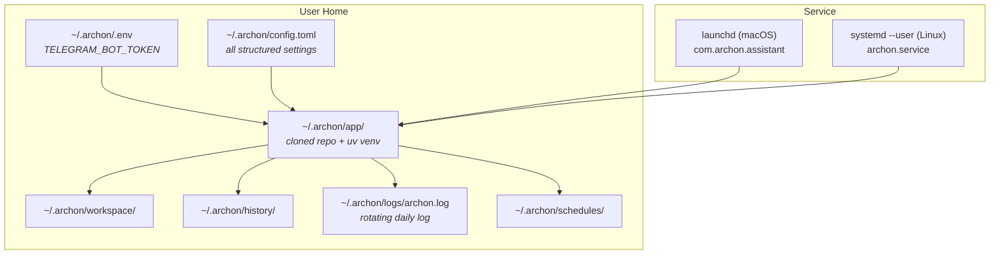
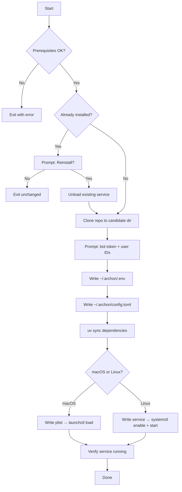

**Purpose**: Documents how Archon is configured, installed, versioned, and run as a system daemon on macOS and Linux.
**Audience**: Developers and system administrators deploying or maintaining Archon.
**Status**: Stable
**Last reviewed**: 2026-03-21
**Next review**: 2026-06-21

# Release and Environment Strategy

## Principles

1. **Config lives in `~/.archon/`** — all runtime state (secrets, structured config, logs, history, workspace) is kept under a single user-owned directory so the installation footprint is predictable and easy to remove.
2. **Secrets stay in `.env`, structure goes in `config.toml`** — `TELEGRAM_BOT_TOKEN` is the only secret; every other tunable lives in the human-readable TOML file.
3. **One-command install** — `uv run install.py` handles prerequisites, cloning, dependency installation, config generation, and service registration end-to-end on both macOS and Linux.
4. **Daemon is crash-resilient** — `KeepAlive true` (launchd) and `Restart=on-failure` (systemd) restart the process automatically without operator intervention.

---

## Environment Layout

All runtime artefacts are rooted at `~/.archon/`.

```
~/.archon/
├── .env                    # secrets (TELEGRAM_BOT_TOKEN)
├── config.toml             # structured configuration
├── config.toml.bak         # auto-created backup of last known-good config
├── app/                    # cloned repository (installed by install.py)
├── workspace/              # Claude Code working directory
├── history/                # chat history root
│   ├── sessions/           # verbose logs: YYYY-MM-DD.md + agent YYYY-MM-DD-HH-MM-name.md
│   └── daily/              # compacted summaries: YYYY-MM-DD-compacted.md / -partial.md
├── logs/                   # log files
│   ├── archon.log          # active rotating daily log
│   └── archon.YYYY-MM-DD.log  # rotated logs
├── schedules/              # per-job scheduled TOML files (*.toml)
└── scripts/                # user-provided scripts referenced by scheduled jobs
```

### Environment diagram



---

## Versioning

### Static version (`pyproject.toml`)

A static placeholder lives in `pyproject.toml` (`version = "0.1.0"`); it satisfies PEP 621 but is not used at runtime.

### Runtime version (`archon/version.py`)

`get_version()` computes the version dynamically using a three-step resolution:

1. **Exact git tag** — `git describe --tags --exact-match HEAD`. Works with the shallow clones used in production.
2. **Git commit count** — `git rev-list --count HEAD` formatted as `YY.M.<count>` (e.g., `26.3.383`). Works in development checkouts with full history.
3. **Fallback** — `YY.M.0` when git is unavailable (Docker, CI).

The result is cached via `@lru_cache` so the subprocess runs at most once per process.

### Installer versioning

`install.py` uses git tags to select which release to install. Both fresh installs and updates perform a **sparse clone** of the target tag into a candidate directory, then atomically swap it into `~/.archon/app` (blue-green deployment with rollback support):

```bash
# Fresh install and update — both use the same pattern:
git clone --depth 1 --filter=blob:none --no-checkout --branch v{tag} \
    https://github.com/user538295/archon-assistant.git ~/.archon/app.candidate
git -C ~/.archon/app.candidate sparse-checkout set archon scripts schedules ...
git -C ~/.archon/app.candidate checkout
# Then: app.candidate → app (atomic rename), old app → app.previous
```

Running `uv run install.py --update` (or `archon update`) clones the latest release tag, activates the candidate, and restarts the service. The previous version is kept at `~/.archon/app.previous` for automatic rollback if activation fails.

---

## Configuration

### `.env` — secrets

The loader reads `~/.archon/.env` via `python-dotenv`. Only one key is required:

| Variable | Required | Description |
|---|---|---|
| `TELEGRAM_BOT_TOKEN` | ✅ | Bot token from Telegram's @BotFather |

A missing or empty `TELEGRAM_BOT_TOKEN` raises `ConfigError` at startup.

### `config.toml` — structured settings

`load_config()` in `archon/config/loader.py` reads `~/.archon/config.toml`. Required sections are `[access]` and `[session]`; every other section is optional with documented defaults.

#### `[access]`

| Key | Type | Required | Description |
|---|---|---|---|
| `allowed_user_ids` | `list[int]` | ✅ | Whitelisted Telegram user IDs; must be non-empty |

#### `[session]`

| Key | Type | Default | Description |
|---|---|---|---|
| `working_directory` | `str` | — (required) | Claude Code working directory; must exist on disk |
| `inactivity_timeout_seconds` | `int` | `1800` | Seconds of silence before a session is evicted |

#### `[output]`

| Key | Type | Default | Description |
|---|---|---|---|
| `max_message_length` | `int` | `4000` | Maximum Telegram message length before truncation |
| `truncation_strategy` | `str` | `"split"` | `"split"` or `"headtail"` |
| `head_chars` | `int` | `1500` | Characters kept at the start (headtail strategy) |
| `tail_chars` | `int` | `1500` | Characters kept at the end (headtail strategy) |

#### `[notifications]`

| Key | Type | Default | Description |
|---|---|---|---|
| `mode` | `str` | `"normal"` | `"quiet"` \| `"normal"` \| `"verbose"` \| `"debug"` |
| `interval_minutes` | `int` | `2` | Beacon interval in quiet mode; `0` disables the beacon |

#### `[notifications.agents]`

| Key | Type | Default | Description |
|---|---|---|---|
| `mode` | `str \| null` | `null` | Per-agent notification level; `null` inherits from `[notifications].mode` |

#### `[history]`

| Key | Type | Default | Description |
|---|---|---|---|
| `enabled` | `bool` | `true` | Enable/disable chat history persistence |
| `directory` | `str` | `"~/.archon/history"` | Directory for daily Markdown history files |
| `suppressed_tool_results` | `list[str]` | `["Read", "Glob", "Grep", "WebFetch"]` | Tool names whose result content is omitted from history logs |
| `compaction_enabled` | `bool` | `true` | Enable daily history compaction via Haiku |
| `context_days` | `int` | `2` | Number of recent days to include as session context |

#### `[logging]`

| Key | Type | Default | Description |
|---|---|---|---|
| `log_file` | `str` | `"~/.archon/logs/archon.log"` | Rotating daily log file path |
| `log_level` | `str` | `"INFO"` | Python logging level |

#### `[models]`

| Key | Type | Default | Description |
|---|---|---|---|
| `available` | `list[str]` | `[]` | Model names available via the `/models` command |
| `default` | `str \| null` | `null` | Default model applied at gateway startup |

#### `[plugins]`

| Key | Type | Default | Description |
|---|---|---|---|
| `enabled` | `bool` | `true` | Load Claude Code plugins at startup |
| `plugins_dir` | `str` | `""` | Override plugins directory; empty uses `~/.claude/plugins/` |
| `settings_path` | `str` | `""` | Override settings file; empty uses `~/.claude/settings.json` |

#### `[rag]`

| Key | Type | Default | Description |
|---|---|---|---|
| `enabled` | `bool` | `false` | Enable RAG semantic search (requires `archon rag install`) |
| `host` | `str` | `"localhost"` | RAG MCP server host |
| `port` | `int` | `8282` | RAG MCP server port |
| `history_collection` | `str` | `"archon-history"` | RAG collection name for history files |

#### `[schedule]`

| Key | Type | Default | Description |
|---|---|---|---|
| `enabled` | `bool` | `true` | Enable the job scheduler |
| `jobs_dir` | `str` | `"schedules"` | Directory with per-job TOML files, relative to config.toml |

#### `[background_agents]`

| Key | Type | Default | Description |
|---|---|---|---|
| `spawn_rule` | `str` | `"auto"` | `"eager"` \| `"auto"` \| `"manual"` |
| `max_parallel` | `int` | `5` | Maximum concurrent background agents per user |
| `host` | `str` | `"localhost"` | Local MCP server host |
| `port` | `int` | `18182` | Local MCP server port |
| `beacon_interval_minutes` | `int` | `2` | How often to edit the agent spawn message; `0` disables |
| `tool_promotion_threshold` | `int` | `10` | Promote to background agent after this many tool calls; `0` = disabled |
| `router_mcp_port` | `int` | `18183` | Port for the router-level MCP server |

### Config resilience

On every successful load, `load_config()` writes a backup to `~/.archon/config.toml.bak`. If the TOML file is corrupt on the next start, the loader restores from the backup automatically and continues loading. If no backup exists, it raises a `ConfigError`.

---

## Installation

### Prerequisites

The installer checks for these tools in order and fails fast if any are missing:

| Tool | Minimum version | Reason |
|---|---|---|
| `git` | any | Clone and update the repo |
| `uv` | any | Python dependency management and virtual-environment creation |
| Python | 3.12+ | Runtime requirement declared in `pyproject.toml` |
| `claude` CLI | any | Required for the Claude Agent SDK to spawn the `claude` process |

### `uv run install.py` step-by-step



**Step 1 — Prerequisites**: Validates `git`, `uv`, Python ≥ 3.12, and `claude` in `PATH`.

**Step 2 — Existing installation check**: Detects the launchd plist (macOS) or systemd unit file (Linux). If found, prompts the user before unloading and reinstalling.

**Step 3 — Prepare candidate**: Sparse-clones `https://github.com/user538295/archon-assistant.git` (tag `v{tag}`, depth 1) into `~/.archon/app.candidate/`. When `--local` is used, clones from the current directory instead. After all subsequent steps succeed, the candidate is atomically swapped into `~/.archon/app/` (previous version moved to `~/.archon/app.previous/` for rollback).

**Step 4 — Collect configuration**: Prompts for `TELEGRAM_BOT_TOKEN` and one or more Telegram user IDs (comma-separated). Normalises IDs to a TOML array literal.

**Step 5 — Write `~/.archon/.env`**: Writes `TELEGRAM_BOT_TOKEN=<token>` to `~/.archon/.env`.

**Step 6 — Write `~/.archon/config.toml`**: Writes the full default config on first install. On reinstall, patches only `allowed_user_ids` and `working_directory` with `sed` to preserve all other user customisations.

**Step 7 — Install dependencies**: Runs `uv sync` inside the candidate directory to create a virtual environment and install all pinned dependencies.

**Step 8 — Register and start service**: Generates the platform-specific service file from a template (substituting `__ARCHON_DIR__`, `__UV_PATH__`, `__LOG_FILE__`) and registers it with the service manager.

**Step 9 — Verify**: Waits 2 seconds, then queries the service manager to confirm the process is active.

---

## macOS daemon (launchd)

The installer generates `~/Library/LaunchAgents/com.archon.assistant.plist` from the template `scripts/com.archon.assistant.plist`.

| Property | Value |
|---|---|
| Label | `com.archon.assistant` |
| ProgramArguments | `["__UV_PATH__", "run", "python", "main.py"]` (array of strings) |
| WorkingDirectory | `~/.archon/app/` |
| KeepAlive | `true` (auto-restart on crash) |
| RunAtLoad | `true` (starts on login) |
| StandardOutPath | `~/.archon/logs/archon.log` |
| StandardErrorPath | `~/.archon/logs/archon.log` |

**Manual service control:**

```bash
# Unload (stop + disable)
launchctl unload ~/Library/LaunchAgents/com.archon.assistant.plist

# Load (enable + start)
launchctl load ~/Library/LaunchAgents/com.archon.assistant.plist
```

### macOS TCC permissions (future consideration)

The current configuration runs `uv run python main.py` directly. macOS **TCC** (Transparency, Consent & Control) attributes permission grants — Screen Recording, Accessibility, Full Disk Access — to the **responsible process's code signature**, not to `argv[0]`. This means that if Archon ever requests a TCC-gated permission, System Settings → Privacy will display **uv** or **python**, not `archon_server`.

The recommended fix is a thin `.app` bundle: a compiled Swift/C launcher binary that `exec()`s into `uv run`, carrying the bundle's `CFBundleIdentifier` through to the Python process via the same PID. The launchd plist then points to the bundle binary instead of `uv` directly. The Python source is edited freely; only the launcher binary (compiled once) changes.

See [`Documentation/Backlog/02_macos_tcc_native_app_wrapper.md`](../Backlog/02_macos_tcc_native_app_wrapper.md) for a full options analysis (four approaches, comparison table, code examples, and code-signing instructions).

---

## Linux daemon (systemd)

The installer generates `~/.config/systemd/user/archon.service` from the template `scripts/archon.service`.

| Property | Value |
|---|---|
| Description | `Archon Assistant — Telegram/Claude Code bridge` |
| After | `network-online.target` |
| Wants | `network-online.target` |
| Type | `simple` |
| WorkingDirectory | `~/.archon/app/` |
| ExecStart | `uv run python main.py` |
| StandardOutput | `append:~/.archon/logs/archon.log` |
| StandardError | `append:~/.archon/logs/archon.log` |
| Restart | `on-failure` |
| RestartSec | `5` |
| TimeoutStopSec | `10` |
| WantedBy | `default.target` |

**Manual service control:**

```bash
systemctl --user start archon
systemctl --user stop archon
systemctl --user status archon
```

---

## install.py — the canonical installer

`install.py` is a PEP 723 inline-metadata Python script runnable with `uv run install.py`. It handles the full install lifecycle on both macOS (launchd) and Linux (systemd user service).

| Command | What it does |
|---|---|
| `uv run install.py` | Fresh install or reinstall — prompts for bot token + user IDs, writes config, registers service |
| `uv run install.py --update` | Clone latest release into candidate, swap, restart; preserves existing config |
| `uv run install.py --uninstall` | Stop and remove the system service + `~/.archon/app` |
| `uv run install.py --dry-run` | Print every action without executing |
| `uv run install.py --non-interactive` | Read `ARCHON_BOT_TOKEN` + `ARCHON_USER_IDS` from env |
| `uv run install.py --local` | Install from the current directory (default when `--tag` is omitted) |

> **Note**: On both macOS and Linux, the service starts immediately after installation. On macOS, `launchctl load` with `RunAtLoad true` triggers an immediate start. On Linux, the installer runs both `systemctl enable` and `systemctl start`, and enables `loginctl enable-linger` so the user service survives logout.

---

## Related documents

- [`100_system_architecture_overview.md`](100_system_architecture_overview.md) — overall component and deployment topology
- [`530_technical_debt_refactoring_roadmap.md`](530_technical_debt_refactoring_roadmap.md) — S16.1 installer replacement and other pending work
