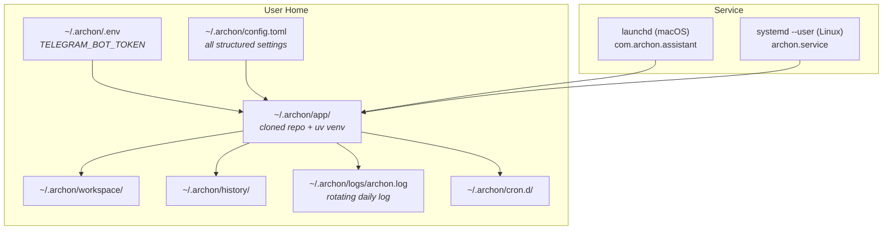
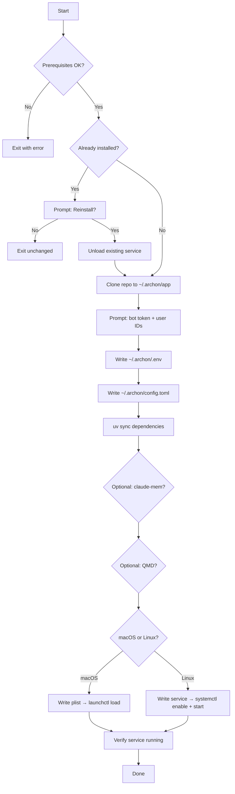

**Purpose**: Documents how Archon is configured, installed, versioned, and run as a system daemon on macOS and Linux.
**Audience**: Developers and system administrators deploying or maintaining Archon.
**Status**: Stable
**Last reviewed**: 2026-02-26
**Next review**: 2026-05-26

# Release and Environment Strategy

## Principles

1. **Config lives in `~/.archon/`** — all runtime state (secrets, structured config, logs, history, workspace) is kept under a single user-owned directory so the installation footprint is predictable and easy to remove.
2. **Secrets stay in `.env`, structure goes in `config.toml`** — `TELEGRAM_BOT_TOKEN` is the only secret; every other tunable lives in the human-readable TOML file.
3. **One-command install** — `bash install.sh` handles prerequisites, cloning, dependency installation, config generation, and service registration end-to-end.
4. **Daemon is crash-resilient** — `KeepAlive true` (launchd) and `Restart=on-failure` (systemd) restart the process automatically without operator intervention.
5. **Makefile supplements, not replaces, the installer** — `make install` is a developer shortcut for in-place wiring; `install.sh` is the canonical end-user path.

---

## Environment Layout

All runtime artefacts are rooted at `~/.archon/`.

```
~/.archon/
├── .env                    # secrets (TELEGRAM_BOT_TOKEN)
├── config.toml             # structured configuration
├── config.toml.bak         # auto-created backup of last known-good config
├── app/                    # cloned repository (installed by install.sh)
├── workspace/              # Claude Code working directory
├── history/                # chat history root
│   ├── sessions/           # verbose logs: YYYY-MM-DD.md + agent YYYY-MM-DD-HH-MM-name.md
│   └── daily/              # compacted summaries: YYYY-MM-DD-compacted.md / -partial.md
├── logs/                   # log files
│   ├── archon.log          # active rotating daily log
│   └── archon.YYYY-MM-DD.log  # rotated logs
├── cron.d/                 # per-job cron TOML files (*.toml)
└── scripts/                # user-provided scripts referenced by cron jobs
```

### Environment diagram



---

## Versioning

The project version is declared in `pyproject.toml`:

```toml
[project]
name = "archon"
version = "0.1.0"
requires-python = ">=3.12"
```

There is currently no formal release process, changelog, or git tagging workflow. The `install.sh` installer always clones or hard-resets to the `main` branch tip:

```bash
git clone --depth 1 --branch main https://github.com/user538295/archon-assistant.git ~/.archon/app
# or, on update:
git -C ~/.archon/app fetch origin main
git -C ~/.archon/app reset --hard origin/main
```

Running `bash install.sh` again is therefore the update mechanism. See [S16.1 — Python installer](#s161-python-installer-pending) for the planned replacement.

---

## Configuration

### `.env` — secrets

The loader reads `~/.archon/.env` via `python-dotenv`. Only one key is required:

| Variable | Required | Description |
|---|---|---|
| `TELEGRAM_BOT_TOKEN` | ✅ | Bot token from Telegram's @BotFather |

A missing or empty `TELEGRAM_BOT_TOKEN` raises `ConfigError` at startup.

### `config.toml` — structured settings

`load_config()` in `archon/config/loader.py` reads `~/.archon/config.toml`. Required sections are `[access]` and `[session]`; every other section is optional with documented defaults.

#### `[access]`

| Key | Type | Required | Description |
|---|---|---|---|
| `allowed_user_ids` | `list[int]` | ✅ | Whitelisted Telegram user IDs; must be non-empty |

#### `[session]`

| Key | Type | Default | Description |
|---|---|---|---|
| `working_directory` | `str` | — (required) | Claude Code working directory; must exist on disk |
| `inactivity_timeout_seconds` | `int` | `1800` | Seconds of silence before a session is evicted |

#### `[output]`

| Key | Type | Default | Description |
|---|---|---|---|
| `max_message_length` | `int` | `4000` | Maximum Telegram message length before truncation |
| `truncation_strategy` | `str` | `"split"` | `"split"` or `"headtail"` |
| `head_chars` | `int` | `1500` | Characters kept at the start (headtail strategy) |
| `tail_chars` | `int` | `1500` | Characters kept at the end (headtail strategy) |

#### `[notifications]`

| Key | Type | Default | Description |
|---|---|---|---|
| `mode` | `str` | `"normal"` | `"quiet"` \| `"normal"` \| `"verbose"` \| `"debug"` |
| `interval_minutes` | `int` | `2` | Beacon interval in quiet mode; `0` disables the beacon |

#### `[notifications.agents]`

| Key | Type | Default | Description |
|---|---|---|---|
| `mode` | `str \| null` | `null` | Per-agent notification level; `null` inherits from `[notifications].mode` |

#### `[history]`

| Key | Type | Default | Description |
|---|---|---|---|
| `enabled` | `bool` | `true` | Enable/disable chat history persistence |
| `directory` | `str` | `"~/.archon/history"` | Directory for daily Markdown history files |
| `suppressed_tool_results` | `list[str]` | `["Read", "Glob", "Grep", "WebFetch"]` | Tool names whose result content is omitted from history logs |

#### `[logging]`

| Key | Type | Default | Description |
|---|---|---|---|
| `log_file` | `str` | `"~/.archon/logs/archon.log"` | Rotating daily log file path |
| `log_level` | `str` | `"INFO"` | Python logging level |

#### `[models]`

| Key | Type | Default | Description |
|---|---|---|---|
| `available` | `list[str]` | `[]` | Model names available via the `/models` command |
| `default` | `str \| null` | `null` | Default model applied at gateway startup |

#### `[plugins]`

| Key | Type | Default | Description |
|---|---|---|---|
| `enabled` | `bool` | `true` | Load Claude Code plugins at startup |
| `plugins_dir` | `str` | `""` | Override plugins directory; empty uses `~/.claude/plugins/` |
| `settings_path` | `str` | `""` | Override settings file; empty uses `~/.claude/settings.json` |

#### `[qmd]`

| Key | Type | Default | Description |
|---|---|---|---|
| `enabled` | `bool` | `false` | Enable QMD semantic search (requires separate install) |
| `host` | `str` | `"localhost"` | QMD MCP daemon host |
| `port` | `int` | `8181` | QMD MCP daemon port |
| `history_collection` | `str` | `"archon-history"` | QMD collection name |

#### `[cron]`

| Key | Type | Default | Description |
|---|---|---|---|
| `enabled` | `bool` | `false` | Enable the cron scheduler |
| `jobs_dir` | `str` | `"cron.d"` | Directory with per-job TOML files, relative to config.toml |

#### `[background_agents]`

| Key | Type | Default | Description |
|---|---|---|---|
| `spawn_rule` | `str` | `"auto"` | `"eager"` \| `"auto"` \| `"manual"` |
| `max_parallel` | `int` | `5` | Maximum concurrent background agents per user |
| `host` | `str` | `"localhost"` | Local MCP server host |
| `port` | `int` | `18182` | Local MCP server port |
| `beacon_interval_minutes` | `int` | `2` | How often to edit the agent spawn message; `0` disables |

### Config resilience

On every successful load, `load_config()` writes a backup to `~/.archon/config.toml.bak`. If the TOML file is corrupt on the next start, the loader restores from the backup automatically and continues loading. If no backup exists, it raises a `ConfigError`.

---

## Installation

### Prerequisites

The installer checks for these tools in order and fails fast if any are missing:

| Tool | Minimum version | Reason |
|---|---|---|
| `git` | any | Clone and update the repo |
| `uv` | any | Python dependency management and virtual-environment creation |
| Python | 3.12+ | Runtime requirement declared in `pyproject.toml` |
| `claude` CLI | any | Required for the Claude Agent SDK to spawn the `claude` process |

### `bash install.sh` step-by-step



**Step 1 — Prerequisites**: Validates `git`, `uv`, Python ≥ 3.12, and `claude` in `PATH`.

**Step 2 — Existing installation check**: Detects the launchd plist (macOS) or systemd unit file (Linux). If found, prompts the user before unloading and reinstalling.

**Step 3 — Fetch / update app**: Clones `https://github.com/user538295/archon-assistant.git` (branch `main`, depth 1) into `~/.archon/app/`. On reinstall, does a `reset --hard origin/main` instead.

**Step 4 — Collect configuration**: Prompts for `TELEGRAM_BOT_TOKEN` and one or more Telegram user IDs (comma-separated). Normalises IDs to a TOML array literal.

**Step 5 — Write `~/.archon/.env`**: Writes `TELEGRAM_BOT_TOKEN=<token>` to `~/.archon/.env`.

**Step 6 — Write `~/.archon/config.toml`**: Writes the full default config on first install. On reinstall, patches only `allowed_user_ids` and `working_directory` with `sed` to preserve all other user customisations.

**Step 7 — Install dependencies**: Runs `uv sync` inside `~/.archon/app/` to create a virtual environment and install all pinned dependencies.

**Step 7.1 — Optional: claude-mem**: Offers installation of the `claude-mem@thedotmack` plugin at project scope or user scope. Skips on failure with a warning.

**Step 7.5 — Optional: QMD**: Runs `scripts/qmd_installer.sh --non-interactive` if the user opts in. On success, patches `[qmd] enabled = true` in `config.toml` via `tomlkit`.

**Step 8 — Register and start service**: Generates the platform-specific service file from a template (substituting `__ARCHON_DIR__`, `__UV_PATH__`, `__LOG_FILE__`) and registers it with the service manager.

**Step 9 — Verify**: Waits 2 seconds, then queries the service manager to confirm the process is active.

---

## macOS daemon (launchd)

The installer generates `~/Library/LaunchAgents/com.archon.assistant.plist` from the template `scripts/com.archon.assistant.plist`.

| Property | Value |
|---|---|
| Label | `com.archon.assistant` |
| ProgramArguments | `uv run python main.py` |
| WorkingDirectory | `~/.archon/app/` |
| KeepAlive | `true` (auto-restart on crash) |
| RunAtLoad | `true` (starts on login) |
| StandardOutPath | `~/.archon/logs/archon.log` |
| StandardErrorPath | `~/.archon/logs/archon.log` |

**Manual service control:**

```bash
# Unload (stop + disable)
launchctl unload ~/Library/LaunchAgents/com.archon.assistant.plist

# Load (enable + start)
launchctl load ~/Library/LaunchAgents/com.archon.assistant.plist
```

### macOS TCC permissions (future consideration)

The current configuration runs `uv run python main.py` directly. macOS **TCC** (Transparency, Consent & Control) attributes permission grants — Screen Recording, Accessibility, Full Disk Access — to the **responsible process's code signature**, not to `argv[0]`. This means that if Archon ever requests a TCC-gated permission, System Settings → Privacy will display **uv** or **python**, not `archon_server`.

The recommended fix is a thin `.app` bundle: a compiled Swift/C launcher binary that `exec()`s into `uv run`, carrying the bundle's `CFBundleIdentifier` through to the Python process via the same PID. The launchd plist then points to the bundle binary instead of `uv` directly. The Python source is edited freely; only the launcher binary (compiled once) changes.

See [`Documentation/Backlog/02_macos_tcc_native_app_wrapper.md`](../Backlog/02_macos_tcc_native_app_wrapper.md) for a full options analysis (four approaches, comparison table, code examples, and code-signing instructions).

---

## Linux daemon (systemd)

The installer generates `~/.config/systemd/user/archon.service` from the template `scripts/archon.service`.

| Property | Value |
|---|---|
| Description | `Archon Assistant — Telegram/Claude Code bridge` |
| After | `network.target` |
| Type | `simple` |
| WorkingDirectory | `~/.archon/app/` |
| ExecStart | `uv run python main.py` |
| StandardOutput | `append:~/.archon/logs/archon.log` |
| StandardError | `append:~/.archon/logs/archon.log` |
| Restart | `on-failure` |
| WantedBy | `default.target` |

**Manual service control:**

```bash
systemctl --user start archon
systemctl --user stop archon
systemctl --user status archon
```

---

## Makefile targets

The `Makefile` provides developer shortcuts. It does **not** prompt for configuration and assumes the repository is the intended working directory (uses `$(PWD)` as `__ARCHON_DIR__`).

| Target | Platform | What it does |
|---|---|---|
| `make install` | macOS | Generates the launchd plist from template and loads it via `launchctl load` |
| `make uninstall` | macOS | Unloads the plist and removes the file from `~/Library/LaunchAgents/` |
| `make logs` | both | Runs `tail -f ~/.archon/logs/archon.log` |
| `make install-linux` | Linux | Generates the systemd unit file and enables it via `systemctl --user enable` |
| `make uninstall-linux` | Linux | Disables the service and removes the unit file |

> **Note**: `make install` (macOS) starts the service immediately because `launchctl load` honours the `RunAtLoad true` flag in the plist. `make install-linux` only enables the service for the next login — use `systemctl --user start archon` to start it right away.

---

## S16.1 — Python installer (pending)

`install.sh` is planned to be replaced by `install.py`, a PEP 723 inline-metadata Python script runnable with `uv run install.py`. The pending story (S16.1 in `Documentation/tasks.md`) specifies:

- `rich` terminal output
- `--dry-run`, `--uninstall`, `--update`, and `--non-interactive` flags
- Pure functions per install step (no subprocess stubs needed in tests)
- Standard `pytest` unit tests

Additionally, a known bug exists in the current `install.sh`: installed files are not all placed under `~/.archon/`. This will be corrected as part of S16.1.

---

## Related documents

- [`100_system_architecture_overview.md`](100_system_architecture_overview.md) — overall component and deployment topology
- [`530_technical_debt_refactoring_roadmap.md`](530_technical_debt_refactoring_roadmap.md) — S16.1 installer replacement and other pending work
