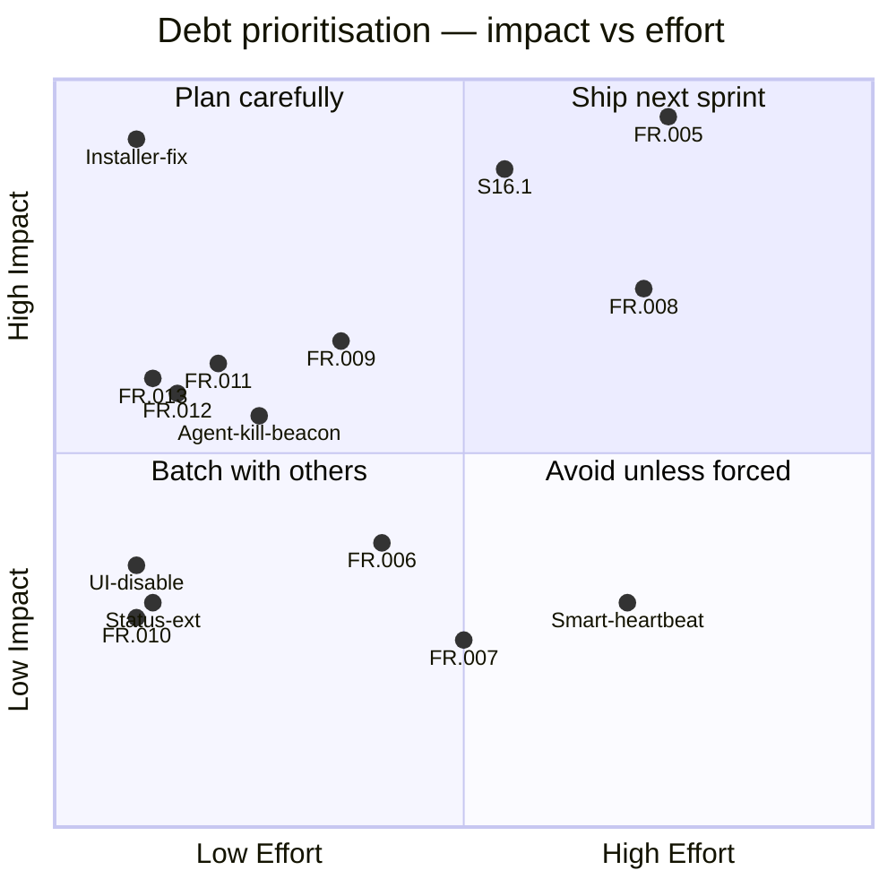

**Purpose**: Registers all known technical debt, pending feature gaps, and test coverage deficiencies, with prioritisation guidance for planning.
**Audience**: All developers contributing to Archon.
**Status**: Stable
**Last reviewed**: 2026-02-27
**Next review**: 2026-05-27

# Technical debt and refactoring roadmap

## Principles

1. **Register debt before fixing it** — every known gap lives here so nothing is silently deferred or forgotten.
2. **Impact over age** — we prioritise items by the damage they cause today, not how long they have existed.
3. **Test debt is product debt** — an untested code path is an undiscovered bug; test gaps carry the same priority scale as feature gaps.
4. **Small items compound** — low-effort, low-priority items are scheduled in batches to prevent accumulation.
5. **Debt resolves through stories** — each item must have a corresponding story or task entry before work begins.

## Overview

The register currently tracks **15 open items**: 3 high-priority (installer and context compaction), 6 medium-priority (UX, cron, observability, docs, beacon), and 6 low-priority (maintenance and exploratory). Test coverage debt is nearly resolved — task H4 closed all Critical, all High, and 7 of 8 Medium gaps, leaving one remaining item.

## Debt register

This table draws items directly from `Documentation/tasks.md`.

**Category legend** — each label maps to an [architectural layer](110_component_catalog_and_layer_breakdown.md):

| Category   | Scope                                                    |
|------------|----------------------------------------------------------|
| AI         | `archon/ai/` — session, event mapper, agents, compaction |
| Chat       | `archon/chat/` — Telegram bot, handlers, commands        |
| Config     | `archon/config/` — TOML/env loading, cron config         |
| Distribution | Installer, packaging, deployment                       |
| Docs       | Documentation gaps                                       |
| Logging    | `archon/log_setup.py`, history manager                   |
| Research   | Exploratory investigation (no code change)               |

**Effort legend** — XS: < 1 day, S: 1–2 days, M: 3–5 days, L: 1–2 weeks.

| ID               | Category     | Description                                                                                                                                                                                                                                | Impact                                                              | Effort | Priority    |
|------------------|--------------|--------------------------------------------------------------------------------------------------------------------------------------------------------------------------------------------------------------------------------------------|---------------------------------------------------------------------|--------|-------------|
| S16.1            | Distribution | Replace `install.sh` with a PEP 723 Python installer (`install.py`) supporting `--dry-run`, `--uninstall`, `--update`, `--non-interactive` flags and `pytest` unit tests                                                                  | High — `install.sh` has a broken install path and is hard to test   | M      | 🔴 High    |
| Installer-fix    | Distribution | All installed files must land under `~/.archon/`; current `install.sh` puts some files in the wrong location                                                                                                                              | High — broken installations for new users                           | S      | 🔴 High    |
| FR.005           | AI           | Context compaction: watch context window after each response, generate a summary before compaction, `/clear` the session, reload the summary, and resume — full TDD suite required                                                         | High — without compaction, long sessions silently lose context      | L      | 🔴 High    |
| FR.011           | AI           | Count compaction events in the session and expose the count in the `/context` command — TDD required                                                                                                                                       | Medium — visibility gap for users debugging context loss            | S      | 🟠 Medium  |
| FR.012           | Chat         | When an agent starts, include a brief of its task in the spawn notification (e.g., "Agent Nova started: Summarise xyz.txt")                                                                                                                | Medium — users cannot tell what a background agent is doing         | XS     | 🟠 Medium  |
| FR.013           | Chat         | In Normal notification mode, show a short thought brief (trim after two sentences or before the first `\n`), consistent with existing tool-result trimming                                                                                 | Medium — Normal mode is the default; users miss reasoning context   | XS     | 🟠 Medium  |
| FR.009           | Config       | Cron pipeline format mismatch: current TOML uses `[[pipeline]]` array-of-tables; spec requires `pipeline = [{"tool": "..."}, {"prompt": "..."}]` inline array — TDD required. See [CronScheduler](110_component_catalog_and_layer_breakdown.md). | Medium — cron job files written to spec silently fail to parse  | M      | 🟠 Medium  |
| FR.010           | Logging      | UTC timestamp ambiguity: every log and history entry carries a time value but the UTC label appears only at the start; each timestamp should carry its timezone label                                                                       | Low — confusion when reviewing historical logs                      | XS     | 🟢 Low    |
| FR.006           | Distribution | Installer: add an interactive option to install additional plugins, agents, and skills (claude-mem and QMD already handled; remaining ecosystem components not yet covered)                                                                 | Low — manual post-install steps required                            | S      | 🟢 Low    |
| UI-disable       | Chat         | The Telegram question-UI (interactive prompts from Claude Code) does not work via the Agent SDK; add the feature to the disallowed tools list                                                                                              | Low — affects only Claude tools that present choice prompts         | XS     | 🟢 Low    |
| Status-ext       | Chat         | The `/status` command does not report the state of optional third-party components (e.g., QMD running/stopped); extend the output to include these                                                                                         | Low — minor observability gap                                       | XS     | 🟢 Low    |
| FR.007           | Research     | Investigate whether the Claude browser plugin is accessible from Archon and document how it could be used — requires reading official documentation                                                                                        | Unknown — exploratory                                               | M      | 🟢 Low    |
| FR.008           | Docs         | Missing end-user documentation: installation through configuration and use of third-party components (QMD, etc.) — needs a world-class user guide                                                                                          | High for new users                                                  | L      | 🟠 Medium  |
| Agent-kill-beacon | Chat/AI     | After a background agent is cancelled via SIGTERM (exit code -15), the per-agent beacon task continues sending updates — it should stop immediately on cancel. The cancel flow should prefer graceful asyncio task cancellation before escalating to OS signals. | Medium — confusing UX; stale beacon messages after cancellation | S | 🟠 Medium |
| Smart-heartbeat  | AI/Config    | Add a smart heartbeat mechanism: a list of cron-job-like definitions that Claude can read and update at runtime. Distinct from the existing [CronScheduler](110_component_catalog_and_layer_breakdown.md) (static TOML config) — this heartbeat list is AI-editable at runtime. | Low — exploratory feature; depends on stable cron infrastructure | L | 🟢 Low |

## Test coverage debt

Task **H4** (test coverage gap closure) resolved all Critical, all High, and almost all Medium gaps from the original `docs/test_gap_report.md` (generated 2026-02-24, since removed). One item remains open.

### Resolved — all Critical and High gaps closed by H4

H4 fixed and verified all three Critical gaps, all eight High gaps, and seven of eight Medium gaps with dedicated tests. No action required.

### Medium — remaining open item

| Module                      | Gap                                                   |
|-----------------------------|-------------------------------------------------------|
| `archon/chat/handler.py`    | `message.bot is None` assertion path never triggered  |

## Prioritisation matrix

The diagram maps every open item across two axes: business/user impact (vertical) and implementation effort (horizontal). Items in the top-left quadrant ship first.

## Planned refactoring approach

Based on the prioritisation matrix and dependency relationships, the recommended implementation order and approach for each item:

1. **Installer-fix** — patch the file-placement logic in `install.sh` so all files land under `~/.archon/`. Unblocks clean new installations; low effort, high blast radius.
2. **S16.1** — rewrite the installer as `install.py` (PEP 723 single-file script). Migrate all `install.sh` logic, add flag support (`--dry-run`, `--uninstall`, `--update`, `--non-interactive`), and write a `pytest` suite. Supersedes Installer-fix permanently.
3. **FR.013 + FR.012** — two small UX patches in `archon/ai/event_mapper.py` and `archon/chat/handler.py`. FR.013 trims thinking content to two sentences in Normal mode; FR.012 adds a task brief to agent-spawn notifications. Ship together in a single PR.
4. **FR.009** — update `archon/ai/cron_scheduler.py` to parse the inline-array `pipeline` format instead of `[[pipeline]]` array-of-tables. Add migration logic or a clear error if the old format is detected. TDD required.
5. **FR.011** — add a `compaction_count` field to `ClaudeSession` and expose it in the `/context` command output. Enables FR.005 observability.
6. **FR.005** — implement context compaction in `ClaudeSession`: monitor token usage after each response, generate a summary prompt, `/clear`, reload the summary, and resume. Largest AI feature; depends on FR.011 for visibility. Full TDD suite.
7. **Agent-kill-beacon** — wire the beacon task in `BackgroundAgentManager` to check the agent's cancellation state and stop sending updates immediately on cancel. Prefer graceful `asyncio.Task.cancel()` over SIGTERM.
8. **Test debt** — trigger the `message.bot is None` assertion path in `archon/chat/handler.py` with a dedicated test. One remaining medium gap.
9. **FR.008** — write an end-to-end user guide covering installation, configuration, and third-party components (QMD, plugins). Schedule as a documentation sprint after FR.005 stabilises.
10. **FR.010, Status-ext, UI-disable, FR.006, FR.007** — low-priority maintenance batch. FR.010 appends timezone labels to timestamps; Status-ext adds component health to `/status`; UI-disable blocks the question-UI tool; FR.006 adds plugin install prompts; FR.007 is research-only.
11. **Smart-heartbeat** — design an AI-editable job list that the heartbeat polls at runtime. Exploratory; depends on stable cron infrastructure (FR.009) first.

## Related documents

- [`510_release_and_environment_strategy.md`](510_release_and_environment_strategy.md) — S16.1 installer detail, environment layout
- [`200_testing_strategy.md`](200_testing_strategy.md) — test pyramid and coverage policy
- [`160_operational_readiness_monitoring_and_reliability.md`](160_operational_readiness_monitoring_and_reliability.md) — logging and observability
- [`110_component_catalog_and_layer_breakdown.md`](110_component_catalog_and_layer_breakdown.md) — component inventory referenced by category legend
