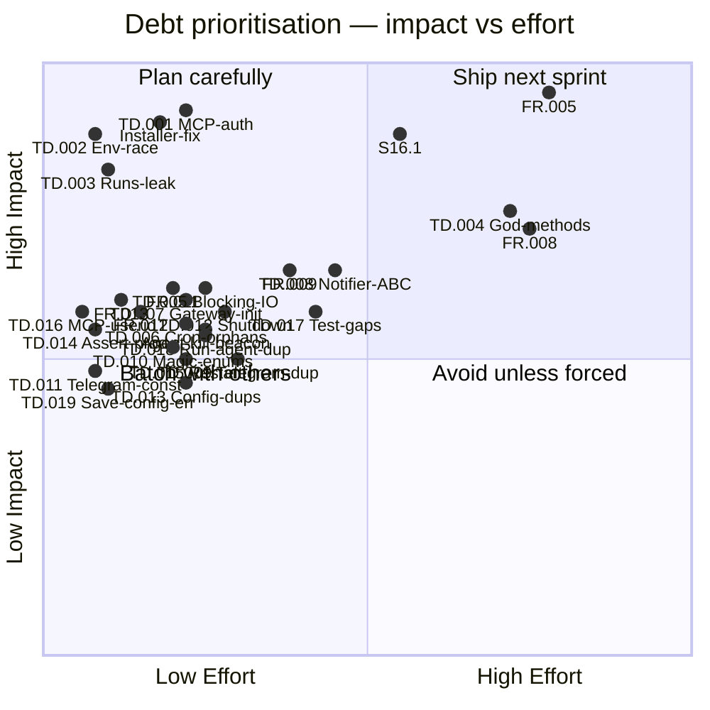

**Purpose**: Registers all known technical debt, pending feature gaps, and test coverage deficiencies, with prioritisation guidance for planning.
**Audience**: All developers contributing to Archon.
**Status**: Stable
**Last reviewed**: 2026-02-27
**Next review**: 2026-05-27

# Technical debt and refactoring roadmap

## Principles

1. **Register debt before fixing it** — every known gap lives here so nothing is silently deferred or forgotten.
2. **Impact over age** — we prioritise items by the damage they cause today, not how long they have existed.
3. **Test debt is product debt** — an untested code path is an undiscovered bug; test gaps carry the same priority scale as feature gaps.
4. **Small items compound** — low-effort, low-priority items are scheduled in batches to prevent accumulation.
5. **Debt resolves through stories** — each item must have a corresponding story or task entry before work begins.

## Overview

The register currently tracks **49 open items** across two origins: 15 items from the original task-driven backlog and 34 items from the deep source-code audit of 2026-02-27. The audit read every source and test file (26 production modules, 42 test modules, 96% coverage baseline) and identified security gaps, async-correctness issues, architectural debt, cross-module duplication, type-safety holes, and test coverage gaps.

**By priority**: 6 high (security, correctness, data loss), 22 medium (architecture, reliability, consistency), 21 low (maintenance, quality, exploratory). **By origin**: `FR.*` / `S16.*` / named items are feature-driven; `TD.*` items are audit-discovered technical debt.

## Debt register

**Category legend** — each label maps to an [architectural layer](110_component_catalog_and_layer_breakdown.md):

| Category      | Scope                                                         |
|---------------|---------------------------------------------------------------|
| Security      | Authentication, authorization, input validation, data exposure |
| AI            | `archon/ai/` — session, event mapper, agents, compaction      |
| Chat          | `archon/chat/` — Telegram bot, handlers, commands             |
| Config        | `archon/config/` — TOML/env loading, validation               |
| Gateway       | `archon/gateway/` — orchestration, wiring, shutdown           |
| Distribution  | Installer, packaging, deployment                              |
| Cross-cutting | Patterns spanning multiple modules                            |
| Docs          | Documentation gaps                                            |
| Logging       | `archon/log_setup.py`, history manager                        |
| Research      | Exploratory investigation (no code change)                    |
| Test          | Test suite quality, coverage gaps, flaky risks                |

**Effort legend** — XS: < 1 day, S: 1–2 days, M: 3–5 days, L: 1–2 weeks.

### High priority

| ID | Category | Description | Impact | Effort | Files |
|----|----------|-------------|--------|--------|-------|
| TD.001 | Security | **MCP server has no authentication.** `ArchonMCPServer` listens on HTTP (default port 18182) with zero auth. Any local process can POST to `/mcp/{user_id}` to spawn agents with `bypassPermissions`, gaining full filesystem access via arbitrary prompts. The `user_id` is taken from the URL and trusted at face value. | Critical — arbitrary code execution by any local process | S | `archon_mcp_server.py:108-162` |
| TD.002 | AI | **`os.environ` race condition in `ClaudeSession.start()`.** The method pops `CLAUDECODE` from `os.environ`, awaits `connect()`, then restores it. Two concurrent `start()` calls (e.g., background agents) race on this global state — one coroutine can pop a value already popped by another, permanently losing the variable. No lock protects the manipulation. | High — corrupted environment state in multi-session scenarios | XS | `claude_session.py:166-171` |
| TD.003 | AI | **`_runs` dict grows without bound.** `BackgroundAgentManager._runs` accumulates every `AgentRun` (including completed, failed, and cancelled runs) for the lifetime of the process. Each entry holds result text, context, and task strings. Over weeks of daemon uptime this is an unbounded memory leak. | High — slow memory leak in long-running daemon | XS | `background_agent_manager.py:155` |
| S16.1 | Distribution | Replace `install.sh` with a PEP 723 Python installer (`install.py`) supporting `--dry-run`, `--uninstall`, `--update`, `--non-interactive` flags and `pytest` unit tests. | High — `install.sh` has a broken install path and is hard to test | M | `install.sh` |
| Installer-fix | Distribution | All installed files must land under `~/.archon/`; current `install.sh` puts some files in the wrong location. | High — broken installations for new users | S | `install.sh` |
| FR.005 | AI | Context compaction: watch context window after each response, generate a summary before compaction, `/clear` the session, reload the summary, and resume — full TDD suite required. | High — without compaction, long sessions silently lose context | L | `claude_session.py` |

### Medium priority

| ID | Category | Description | Impact | Effort | Files |
|----|----------|-------------|--------|--------|-------|
| TD.004 | Gateway/Config/Chat | **Three god methods need decomposition.** `Gateway._run()` (120 lines, 15+ local vars, touches every module), `load_config()` (175 lines, builds 12 config objects inline), and `handle_message()` (140 lines, 8 params, mixes formatting/routing/lifecycle/error-handling). All three are the root cause of test complexity (10+ patches per test) and make the code fragile. | High — maintainability bottleneck; every change touches these | L | `gateway.py:198-316`, `loader.py:206-381`, `handler.py:197-337` |
| TD.005 | AI/Logging | **Synchronous file I/O in async event loop.** `HistoryManager._append()`, `AgentLogWriter._append()`, and `save_notifications_config()` perform blocking `open()`/`write()`/`fsync()` calls from async handlers. On slow filesystems this blocks the event loop, causing Telegram API timeouts. | Medium — event-loop blocking on every message event | S | `history_manager.py:38-42`, `agent_logger.py:167-171`, `loader.py:416-447` |
| TD.006 | AI | **Cron job tasks are fire-and-forget.** `CronScheduler._loop()` creates tasks via `asyncio.create_task()` but never stores references. Unhandled exceptions produce "Task exception was never retrieved" warnings. `stop()` only cancels the loop task, not in-flight jobs — orphaned `ClaudeSession` subprocesses survive shutdown. | Medium — resource leak on shutdown; silent exception loss | S | `cron_scheduler.py:175-177` |
| TD.007 | Gateway | **Circular dependency via private attribute patching.** Gateway creates `ArchonMCPServer(manager=None)` then patches `bg_mcp_server._manager = bg_manager`. This breaks encapsulation, bypasses the type system (`# type: ignore`), and creates a window where the MCP server has a `None` manager. | Medium — fragile initialization order; type-safety hole | S | `gateway.py:246,283` |
| TD.008 | Cross-cutting | **Missing notification abstraction; AI layer imports from Chat.** `BackgroundAgentManager` imports `md_to_html` from `archon.chat.md_formatter` (ai→chat layer violation) and both `BackgroundAgentManager` and `CronScheduler` take a concrete aiogram `Bot` for sending messages. No `NotificationSink` protocol exists. | Medium — layer violation; AI layer untestable without mocking Bot | M | `background_agent_manager.py:52,145`, `cron_scheduler.py:55` |
| TD.009 | Cross-cutting | **Telegram notification and chunking logic duplicated across modules.** The pattern `try: await bot.send_message(...); except Exception: logger.warning(...)` is repeated 5+ times. `_send_long_message` in BAM reimplements `SplitStrategy` with different label format. Inconsistent error logging (some log `type(exc).__name__` only, others log full `exc`). | Medium — inconsistent behaviour; maintenance burden | S | `background_agent_manager.py:434-501`, `cron_scheduler.py:314-330`, `handler.py:315-322` |
| TD.010 | Cross-cutting | **Notification mode, spawn rule, and log level are unvalidated magic strings.** `mode = "banana"` in config.toml loads without error. No `StrEnum` exists; string comparisons like `if mode == "quiet"` are scattered across handler.py and commands.py. Same issue for `spawn_rule` ("eager"/"auto"/"manual") and `log_level`. | Medium — silent misconfiguration; typo-prone | S | `loader.py:287-318`, `handler.py:149-173`, `claude_session.py:36-56` |
| TD.011 | Cross-cutting | **Telegram max message length defined in 4 places with 3 names.** `_TELEGRAM_MAX_LEN = 4000` (BAM), `DEFAULT_MAX_LEN = 4000` (handler), `max_message_length = 4000` (config), and an implicit `3800` (cron_scheduler). No shared constant. | Medium — divergence risk; cron already uses a different value | XS | `background_agent_manager.py:63`, `handler.py:33`, `loader.py:32`, `cron_scheduler.py:324` |
| TD.012 | Gateway | **Shutdown sequence not resilient to partial failures; sessions stopped sequentially.** If `cron_scheduler.stop()` raises, remaining cleanup (bg_manager, MCP, session_manager, bot) is skipped. `session_manager.stop_all()` stops sessions sequentially — N sessions × 2-3s each may exceed the 5s timeout, orphaning SDK subprocesses. | Medium — incomplete cleanup on shutdown; orphaned processes | S | `gateway.py:306-316`, `session_manager.py:149-158` |
| TD.013 | Config | **Duplicated defaults between dataclasses and load_config() .get() calls.** Every config field default appears twice: once in the dataclass definition and once in the `data.get("key", default)` call. If one changes without the other, they silently diverge. Affects OutputConfig, LoggingConfig, HistoryConfig, PluginsConfig, QmdConfig, BackgroundAgentsConfig, CronConfig. | Medium — silent default divergence | S | `loader.py:206-381` |
| TD.014 | Chat | **`assert` used for runtime checks; `callback.message` null dereference.** `handler.py:247` uses `assert message.bot is not None` which is stripped by `python -O`. `commands.py:292,528` call `callback.message.edit_reply_markup()` without checking if `callback.message` is `None` (it can be for old/deleted messages). | Medium — crashes in optimized mode or with stale callbacks | XS | `handler.py:247`, `commands.py:292,528` |
| TD.015 | Chat | **`/restart` uses `os.execv` without full gateway shutdown.** Only `session_manager.stop_all()` is awaited; MCP server, cron scheduler, background agents, and bot session are not stopped. Active asyncio tasks are killed mid-flight. The Telegram reply may not reach the server before `execv` replaces the process. | Medium — incomplete cleanup; potential data loss on restart | S | `commands.py:119-127` |
| TD.016 | Security | **Invalid MCP `user_id` silently defaults to 0.** When `/mcp/GARBAGE` is requested, the `user_id` falls back to `0`. User 0 has no running agents, so `max_parallel` checks always pass, allowing unlimited agent spawning. No error response is returned to the client. | Medium — per-user limit bypass; silent misconfiguration | XS | `archon_mcp_server.py:135-139` |
| TD.017 | Test | **Untested critical paths.** (a) `load_config()` backup-recovery mechanism (corrupt TOML → restore from `.bak`): zero test coverage. (b) `_atomic_write()` failure cleanup path: untested. (c) `_build_system_prompt()` assembly logic (3 branches): untested. (d) `_send_long_message()` multi-chunk boundary: untested. (e) `handle_message` resilience when `message.answer()` raises mid-stream: untested. | Medium — critical safety mechanisms are unverified | M | `loader.py:224-243,384-403`, `claude_session.py:59-80`, `background_agent_manager.py:480-491`, `handler.py:315-322` |
| TD.018 | AI | **`_run_agent` god method with triplicated cleanup.** The method is 130+ lines handling session lifecycle, event streaming, beacon management, agent logging, and notifications. The same 4-line beacon-cancel block and `session.stop()` wrapped in bare `except Exception: pass` appear three times (success/CancelledError/Exception paths). | Medium — maintainability; swallowed exceptions hide bugs | S | `background_agent_manager.py:270-401` |
| TD.019 | Config | **`save_notifications_config()` no error handling on corrupt file read.** The function calls `tomlkit.load(f)` without handling `TOMLDecodeError`. A corrupt config.toml crashes the notification-mode command. Compare to `load_config()` which does handle this with backup recovery. Also, the read-modify-write cycle has no lock — concurrent mode changes can lose updates. | Medium — user-facing crash; lost updates under concurrency | XS | `loader.py:416-447` |
| FR.011 | AI | Count compaction events in the session and expose the count in the `/context` command — TDD required. | Medium — visibility gap for users debugging context loss | S | `claude_session.py`, `commands.py` |
| FR.012 | Chat | When an agent starts, include a brief of its task in the spawn notification. | Medium — users cannot tell what a background agent is doing | XS | `handler.py`, `event_mapper.py` |
| FR.013 | Chat | In Normal notification mode, show a short thought brief (trim after two sentences), consistent with existing tool-result trimming. | Medium — default mode users miss reasoning context | XS | `handler.py` |
| FR.009 | Config | Cron pipeline format mismatch: current TOML uses `[[pipeline]]` array-of-tables; spec requires inline array — TDD required. See [CronScheduler](110_component_catalog_and_layer_breakdown.md). | Medium — cron job files written to spec silently fail to parse | M | `cron_scheduler.py` |
| FR.008 | Docs | Missing end-user documentation: installation through configuration and use of third-party components (QMD, etc.). | High for new users | L | `Documentation/UserManual/` |
| Agent-kill-beacon | Chat/AI | After a background agent is cancelled, the beacon task continues sending updates — it should stop immediately. The cancel flow should prefer graceful `asyncio.Task.cancel()` over OS signals. | Medium — confusing UX; stale beacon messages after cancellation | S | `background_agent_manager.py` |

### Low priority

| ID | Category | Description | Impact | Effort | Files |
|----|----------|-------------|--------|--------|-------|
| TD.020 | AI | **Private symbol imports across module boundaries.** `agent_loader.py` imports `_FRONTMATTER_RE` and `_parse_frontmatter` from `skill_loader.py`; `plugin_loader.py` calls `SkillLoader._load_skill()`. Underscore-prefixed names signal "private" but are relied upon externally. | Low — encapsulation violation; refactoring hazard | XS | `agent_loader.py:18`, `plugin_loader.py:215` |
| TD.021 | AI | **Event types share `source` field but have no common base class.** `Event` is a bare type-alias union of 7 dataclasses. The `source` field is duplicated in all 7. No shared behaviour or dispatch mechanism. | Low — duplication; adding events requires updating the union + every isinstance chain | S | `event_mapper.py:82-90` |
| TD.022 | Chat | **`format_event` uses 7-branch isinstance chain.** Violates open/closed principle. Adding a new event type requires modifying this function and the quiet-mode counting logic in `handle_message` which independently checks types. | Low — change amplification; coupled to event internals | S | `handler.py:128-194,273-312` |
| TD.023 | AI | **Loader boilerplate duplicated across Skill/Agent/Plugin loaders.** All three follow the same `__init__` → `_cache: list[T] | None` → `load_all()` with cache check → `get(name)` with linear scan pattern. ~80 lines of structural repetition. | Low — maintenance burden; no functional impact | S | `skill_loader.py`, `agent_loader.py`, `plugin_loader.py` |
| TD.024 | Chat | **Mode-switch commands (quiet/normal/verbose/debug) are copy-pasted.** Four near-identical functions; only the mode string and emoji differ. ~40 lines of duplicated logic. | Low — maintenance burden | XS | `commands.py:309-348` |
| TD.025 | Gateway | **Untyped string-keyed dispatcher dependency injection.** All 15 dependencies injected via `dp["string_key"]` with no TypedDict or dataclass. A typo in a key name silently produces `None` or `KeyError` at runtime. | Low — type-safety gap; hard to catch bugs statically | S | `gateway.py:121-149` |
| TD.026 | Security | **Exception messages with internal paths sent to users.** `handler.py:326` sends `html.escape(str(exc))` to Telegram; `archon_mcp_server.py:160` returns `str(exc)` in JSON-RPC errors. SDK/filesystem exceptions can reveal absolute paths and hostnames. | Low — information disclosure to whitelisted users | XS | `handler.py:326`, `archon_mcp_server.py:160` |
| TD.027 | Test | **`asyncio.sleep` timing in tests creates flaky risk.** Multiple tests use sub-100ms real sleep durations with narrow margins (e.g., 0.05s timeout + 0.15s sleep = 0.1s margin). Currently passing (1190/1190) but a well-known source of CI flakiness under load. | Low — CI reliability risk | M | `test_handler.py`, `test_session_manager.py`, `test_background_agent_manager.py` |
| TD.028 | Chat | **Dead code: `_resolve_agent_mode` defined but never called in production.** The function exists "as an informational utility" for a hypothetical future feature. Also: two empty `# concurrency -- H2` test section headers in `test_session_manager.py`. | Low — maintenance burden; confusing to readers | XS | `handler.py:104-125`, `test_session_manager.py:245-293` |
| TD.029 | Chat | **`_CONTEXT_WINDOW_TOKENS = 200_000` hardcoded for all models.** The `/model` command supports switching models, but the context percentage display always assumes 200K tokens. Will be wrong for models with different context windows. | Low — incorrect display for non-200K models | XS | `commands.py:145` |
| TD.030 | AI | **Beacon word lists duplicated between handler and BackgroundAgentManager.** `_BEACON_WORDS` (handler.py) and `_AGENT_BEACON_WORDS` (BAM) overlap ~80%. Both use the same `random.choice()` pattern. | Low — cosmetic duplication | XS | `handler.py:35-51`, `background_agent_manager.py:67-78` |
| TD.031 | Config | **`load_cron_jobs()` has no error handling for malformed job files.** A missing `schedule` key in any job TOML raises `KeyError` that crashes the entire config load. No validation of cron expression syntax. | Low — single bad job file blocks daemon startup | XS | `loader.py:161-203` |
| TD.032 | AI | **No context manager for `ClaudeSession` lifecycle.** `start()`/`stop()` must be paired manually. Every caller uses `try/finally` with duplicated cleanup. `BackgroundAgentManager._run_agent` has three copies of `session.stop()` in different exception paths. | Low — ergonomic; reduces risk of leaked sessions | S | `claude_session.py` |
| TD.033 | Logging | **`_StderrToLogger` does not implement full `TextIO` protocol.** Missing `encoding`, `name`, `close()`, `read()` etc. Any library accessing `sys.stderr.encoding` gets `AttributeError`. | Low — compatibility risk with third-party libraries | XS | `log_setup.py:13-46` |
| TD.034 | Config | **Config singleton lazy init is not thread-safe.** `config/__init__.py` uses `__getattr__` without a lock. Safe in asyncio single-loop but fragile if `asyncio.to_thread()` is ever used (which TD.005 recommends). | Low — latent threading bug if I/O offloading is adopted | XS | `config/__init__.py:10-16` |
| FR.010 | Logging | UTC timestamp ambiguity: each timestamp should carry its timezone label. | Low — confusion when reviewing historical logs | XS | `log_setup.py`, `history_manager.py` |
| FR.006 | Distribution | Installer: add an interactive option to install additional plugins, agents, and skills. | Low — manual post-install steps required | S | `install.sh` |
| UI-disable | Chat | The Telegram question-UI does not work via the Agent SDK; add it to the disallowed tools list. | Low — affects only Claude tools that present choice prompts | XS | `claude_session.py:152` |
| Status-ext | Chat | `/status` does not report the state of optional third-party components (QMD, etc.). | Low — minor observability gap | XS | `commands.py` |
| FR.007 | Research | Investigate whether the Claude browser plugin is accessible from Archon. | Unknown — exploratory | M | — |
| Smart-heartbeat | AI/Config | Add a smart heartbeat mechanism: AI-editable runtime job list. Depends on stable cron infrastructure (FR.009). | Low — exploratory feature | L | — |

## Test coverage debt

Task **H4** resolved all Critical, all High, and 7 of 8 Medium gaps from the original test gap report. The deep audit of 2026-02-27 identified 8 additional test gaps.

### Previously tracked — remaining open

| Module | Gap |
|--------|-----|
| `archon/chat/handler.py` | `message.bot is None` assertion path never triggered (see also TD.014) |

### Audit-discovered gaps (2026-02-27)

| Module | Gap | Severity |
|--------|-----|----------|
| `archon/config/loader.py` | `load_config()` backup-recovery path (corrupt TOML → `.bak` restore) has zero test coverage | Medium |
| `archon/config/loader.py` | `_atomic_write()` failure cleanup path and `_suppress_os_errors` are untested | Medium |
| `archon/ai/claude_session.py` | `_build_system_prompt()` has 3 branches (skills-only, spawn-rule-only, both) — none tested in isolation | Medium |
| `archon/ai/background_agent_manager.py` | `_send_long_message()` multi-chunk boundary conditions untested (exact 4000, one-over, empty) | Medium |
| `archon/chat/handler.py` | No test for `message.answer()` raising mid-stream (resilience behaviour) | Medium |
| `archon/ai/claude_session.py` | `stop()` `RuntimeError` suppression from `disconnect()` — untested that `_connected` is still set to `False` | Low |
| `archon/ai/session_manager.py` | `_evict_after()` when eviction-triggered `stop()` raises — exception propagation untested | Low |
| `archon/ai/claude_session.py` | Concurrent `send()` calls — the `_send_lock` serialisation has no dedicated test | Low |

## Prioritisation matrix

The diagram maps high and medium items across two axes. Low-priority items are batched and not shown individually.

## Planned refactoring approach

Based on the full audit, items are grouped into waves ordered by risk reduction. Each wave is independently shippable.

### Wave 1 — Security and correctness (fix first)

1. **TD.001 + TD.016** — Add a shared secret (random token generated at startup) to the MCP server, required in an `Authorization` header. Return `400` for non-integer `user_id`. Two changes in `archon_mcp_server.py`, one in `gateway.py` (token generation), one in `claude_session.py` (pass token to SDK).
2. **TD.002** — Replace `os.environ.pop()/restore` in `ClaudeSession.start()` with a class-level `asyncio.Lock` around the manipulation, or pass a filtered `env` dict to the subprocess.
3. **TD.003** — Implement TTL-based eviction in `BackgroundAgentManager`: prune completed/failed/cancelled runs older than 1 hour after each new spawn, or cap `_runs` at N entries via `OrderedDict`.
4. **TD.014** — Replace `assert message.bot is not None` with `if message.bot is None: return`. Add `if callback.message:` guards in `notify_callback` and `model_callback`.

### Wave 2 — Async correctness

5. **TD.005** — Wrap `HistoryManager._append()` and `AgentLogWriter._append()` in `asyncio.to_thread()`. Wrap `save_notifications_config()` similarly or add an asyncio lock for the read-modify-write cycle.
6. **TD.006** — Track cron job tasks in a `set[asyncio.Task]` on `CronScheduler`. Cancel and gather all in `stop()`. Add a done-callback to log exceptions.
7. **TD.012** — Wrap each shutdown step in `try/except` (log + continue). Switch `session_manager.stop_all()` to `asyncio.gather(*(s.stop() for s in sessions), return_exceptions=True)` for concurrent stops.
8. **TD.015** — Call the full `Gateway` shutdown sequence before `os.execv` in `/restart`, or signal the event loop to exit and let the `finally` block handle cleanup.

### Wave 3 — Architectural cleanup

9. **TD.008** — Introduce a `NotificationSink` protocol in `archon/ai/` with a single `async send(chat_id, text, parse_mode)` method. Implement `TelegramNotifier` in `archon/chat/`. Inject the protocol into `BackgroundAgentManager` and `CronScheduler` instead of `Bot`. Remove the `md_to_html` import from `archon/ai/`.
10. **TD.007** — Create `BackgroundAgentManager` first (it does not depend on `ArchonMCPServer`), then pass it to `ArchonMCPServer.__init__()`. Remove the `_manager = None` + patch pattern.
11. **TD.009** — Extract a shared `safe_send(sink, chat_id, text)` helper. Have `BackgroundAgentManager._send_long_message` delegate to `SplitStrategy` from `truncation.py` instead of reimplementing chunking.
12. **TD.018** — Extract `_cancel_beacon_task()` helper. Move `session.stop()` into a single `finally` block. Reduce `_run_agent` from 130 to ~60 lines.

### Wave 4 — Type safety and consistency

13. **TD.010** — Create `NotificationMode(StrEnum)` and `SpawnRule(StrEnum)` in `config/loader.py`. Validate at load time, raising `ConfigError` for unknown values. Replace string comparisons across handler and commands.
14. **TD.011** — Define `TELEGRAM_MAX_MESSAGE_LENGTH = 4000` in a shared `archon/constants.py` and import everywhere. Fix cron scheduler's implicit `3800` to use the constant.
15. **TD.013** — For each config section, construct the dataclass via `**filtered_dict` unpacking, letting dataclass defaults handle missing keys. Remove all redundant `.get("key", default)` calls.
16. **TD.020** — Move `_FRONTMATTER_RE` and `_parse_frontmatter` to `archon/ai/frontmatter.py` as public symbols. Update imports in `skill_loader.py`, `agent_loader.py`, and `plugin_loader.py`.

### Wave 5 — Feature debt (existing backlog)

17. **Installer-fix** → **S16.1** — patch file placement, then rewrite as `install.py`.
18. **FR.013 + FR.012** — two XS UX patches shipped together.
19. **FR.009** — cron pipeline format fix with migration logic.
20. **FR.011** → **FR.005** — compaction visibility, then full compaction implementation.
21. **Agent-kill-beacon** — wire beacon cancellation on agent cancel.
22. **FR.008** — end-to-end user guide (documentation sprint).

### Wave 6 — Test debt closure

23. **TD.017** — Add dedicated tests for: backup-recovery path, `_atomic_write` failure cleanup, `_build_system_prompt` branches, `_send_long_message` boundary conditions, `message.answer()` mid-stream failure resilience.
24. **TD.019** — Add `try/except TOMLDecodeError` to `save_notifications_config()` with backup-recovery or `ConfigError`.
25. **TD.027** — Increase timing margins in sleep-based tests or mock `asyncio.sleep` for deterministic beacon/inactivity testing.
26. **Remaining H4 item** — trigger the `message.bot is None` path in `handler.py` (already covered by TD.014 fix making it a guard instead of assert).

### Wave 7 — Low-priority batch

27. **TD.021 + TD.022** — Create a `BaseEvent` dataclass with `source` field; have all events inherit. Consider a dispatch dict in `format_event`.
28. **TD.023** — Extract a generic `CachingFileLoader[T]` base class for Skill/Agent/Plugin loaders.
29. **TD.024 + TD.030** — Extract `_switch_mode()` helper for notification commands; consolidate beacon word lists.
30. **TD.025** — Replace `dp["string_key"]` pattern with a typed `Dependencies` dataclass.
31. **TD.026** — Log full exceptions internally; send generic error messages to users unless in debug mode.
32. **TD.028** — Remove `_resolve_agent_mode` dead code and empty test section headers.
33. **TD.029** — Make `_CONTEXT_WINDOW_TOKENS` configurable per model or derive from active model.
34. **FR.010, Status-ext, UI-disable, FR.006, FR.007, Smart-heartbeat** — remaining low-priority items from original backlog.

## Related documents

- [`510_release_and_environment_strategy.md`](510_release_and_environment_strategy.md) — S16.1 installer detail, environment layout
- [`200_testing_strategy.md`](200_testing_strategy.md) — test pyramid and coverage policy
- [`160_operational_readiness_monitoring_and_reliability.md`](160_operational_readiness_monitoring_and_reliability.md) — logging and observability
- [`110_component_catalog_and_layer_breakdown.md`](110_component_catalog_and_layer_breakdown.md) — component inventory referenced by category legend
- [`150_security_and_privacy_architecture.md`](150_security_and_privacy_architecture.md) — security architecture (TD.001 relates to this)
