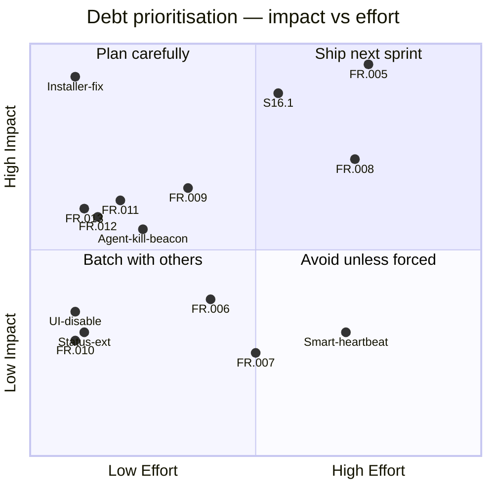

**Purpose**: Registers all known technical debt, pending feature gaps, and test coverage deficiencies, with prioritisation guidance for planning.
**Audience**: All developers contributing to Archon.
**Status**: Stable
**Last reviewed**: 2026-02-26
**Next review**: 2026-05-26

# Technical Debt and Refactoring Roadmap

## Principles

1. **Register debt before fixing it** — every known gap lives here so nothing is silently deferred or forgotten.
2. **Impact over age** — items are prioritised by the damage they cause today, not how long they have existed.
3. **Test debt is product debt** — an untested code path is an undiscovered bug; test gaps carry the same priority scale as feature gaps.
4. **Small items compound** — low-effort, low-priority items are scheduled in batches to prevent accumulation.
5. **Debt resolves through stories** — each item must have a corresponding story or task entry before work begins.

---

## Debt register

The table below lists every open item from `Documentation/tasks.md` and `docs/test_gap_report.md`. Items are drawn directly from those source files; no items are inferred or invented.

| ID | Category | Description | Impact | Effort | Priority |
|---|---|---|---|---|---|
| S16.1 | Distribution | Replace `install.sh` with a PEP 723 Python installer (`install.py`) supporting `--dry-run`, `--uninstall`, `--update`, `--non-interactive` flags and `pytest` unit tests | High — `install.sh` has a broken install path and is hard to test | M | 🔴 High |
| Installer-fix | Distribution | All installed files must land under `~/.archon/`; current `install.sh` puts some files in the wrong location | High — broken installations for new users | S | 🔴 High |
| FR.005 | AI | Context compaction: watch context window after each response, generate a summary before compaction, `/clear` the session, reload the summary, and resume — full TDD suite required | High — without compaction, long sessions silently lose context | L | 🔴 High |
| FR.011 | AI | Count compaction events in the session and expose the count in the `/context` command — TDD required | Medium — visibility gap for users debugging context loss | S | 🟠 Medium |
| FR.012 | Chat | When an agent starts, include a brief of its task in the spawn notification (e.g., "Agent Nova started: Summarise xyz.txt") | Medium — users cannot tell what a background agent is doing | XS | 🟠 Medium |
| FR.013 | Chat | In Normal notification mode, show a short thought brief (trim after two sentences or before the first `\n`), consistent with existing tool-result trimming | Medium — Normal mode is the default; users miss reasoning context | XS | 🟠 Medium |
| FR.009 | Config | Cron pipeline format mismatch: current TOML uses `[[pipeline]]` array-of-tables; spec requires `pipeline = [{"tool": "..."}, {"prompt": "..."}]` inline array — TDD required | Medium — cron job files written to spec will silently fail to parse | M | 🟠 Medium |
| FR.010 | Logging | UTC timestamp ambiguity: every log and history entry carries a time value but the UTC label appears only at the start; each timestamp should carry its timezone label | Low — confusion when reviewing historical logs | XS | 🟢 Low |
| FR.006 | Distribution | Installer: add an interactive option to install additional plugins, agents, and skills (claude-mem and QMD already handled; remaining ecosystem components not yet covered) | Low — manual post-install steps required | S | 🟢 Low |
| UI-disable | Chat | The Telegram question-UI (interactive prompts from Claude Code) does not work via the Agent SDK; the feature must be added to the disallowed tools list | Low — affects only Claude tools that present choice prompts | XS | 🟢 Low |
| Status-ext | Chat | The `/status` command does not report the state of optional third-party components (e.g., QMD running/stopped); extend the output to include these | Low — minor observability gap | XS | 🟢 Low |
| FR.007 | Research | Investigate whether the Claude browser plugin is accessible from Archon and document how it could be used — requires reading official documentation | Unknown — exploratory | M | 🟢 Low |
| FR.008 | Docs | Missing end-user documentation: installation through configuration and use of third-party components (QMD, etc.) — needs a world-class user guide | High for new users | L | 🟠 Medium |
| Agent-kill-beacon | Chat/AI | After a background agent is cancelled via SIGTERM (exit code -15), the per-agent beacon task continues sending `🤖 Agent is working…` updates — it should stop immediately on cancel. Additionally, hard-killing agents should be the last resort; the cancel flow should prefer graceful asyncio task cancellation before escalating to OS signals. | Medium — confusing UX; stale beacon messages after cancellation | S | 🟠 Medium |
| Smart-heartbeat | AI/Config | Add a smart heartbeat mechanism: a list of cron-job-like definitions that Claude can read and update at runtime. When the heartbeat fires, Claude processes the job list, executes triggered items, and removes completed ones. When the list is empty the heartbeat sleeps until a new job is added. Distinct from the existing `CronScheduler` (which uses static TOML config) — this heartbeat list is AI-editable at runtime. | Low — exploratory feature; depends on stable cron infrastructure | L | 🟢 Low |

---

## Test coverage debt

The items below come from `docs/test_gap_report.md` (generated 2026-02-24). They are grouped by severity.

### Critical — real feature bugs can hide here

| Module | Gap | Suggested location |
|---|---|---|
| `archon/chat/middleware.py` | `WhitelistMiddleware` never tested with `CallbackQuery`; inline-keyboard taps effectively bypass the whitelist in the test suite | `tests/chat/test_middleware.py` |
| `archon/config/loader.py` | `PluginsConfig` loading completely untested — `enabled`, `plugins_dir`, `settings_path` all have zero assertions | `tests/config/test_loader.py` |
| `archon/ai/session_manager.py` | `get_model()` and `set_model()` have zero tests despite being central to the `/model` command | `tests/ai/test_session_manager.py` |

### High — significant blind spots

| Module | Gap | Suggested location |
|---|---|---|
| `archon/ai/session_manager.py` | Default session factory (with real `skill_loader` + `plugin_loader` integration) is never exercised | `tests/ai/test_session_manager.py` |
| `archon/chat/commands.py` | `skills_command` plugin-skills rendering path untested (no test passes a `plugin_loader` with real plugins) | `tests/chat/test_commands.py` |
| `archon/chat/bot.py` | 12 of 15 commands not asserted in `create_dispatcher`; `notify_callback` and `model_callback` registrations never verified | `tests/chat/test_bot.py` |
| `archon/gateway/gateway.py` | `_make_truncation` with unknown strategy (the `ConfigError` path) has no test | `tests/gateway/test_gateway.py` |
| `archon/gateway/gateway.py` | `_run()` with `cfg.models.default` set (calls `session_manager.set_model`) never exercised | `tests/gateway/test_gateway.py` |
| `archon/ai/plugin_loader.py` | Corrupt JSON in `installed_plugins.json` and `settings.json` recovery paths untested | `tests/ai/test_plugin_loader.py` |
| `archon/ai/history_manager.py` | `Response` event for a user who has no prior recorded question (`q == ""` path) never triggered | `tests/ai/test_history_manager.py` |
| `archon/ai/claude_session.py` | `plugins` parameter passed to `ClaudeAgentOptions` never verified in any assertion | `tests/ai/test_claude_session.py` |

### Medium — edge cases that matter at runtime

| Module | Gap |
|---|---|
| `archon/chat/middleware.py` | Non-`Message`/`CallbackQuery` pass-through never tested |
| `archon/chat/commands.py` | `_fmt_context` duration ≥ 60 s (minutes branch) never exercised |
| `archon/chat/commands.py` | `notify_callback` with unrecognised mode data (silent no-op) untested |
| `archon/ai/plugin_loader.py` | Missing/malformed `plugin.json` manifest fallback untested |
| `archon/ai/plugin_loader.py` | Unrecognised `installed_plugins.json` format (neither dict nor list) branch untested |
| `archon/gateway/gateway.py` | `_run()` with `plugins.enabled = false` (`plugin_loader = None`) never exercised |
| `archon/ai/truncation.py` | Empty string input to `SplitStrategy.apply()` never asserted |
| `archon/chat/handler.py` | `message.bot is None` assertion path never triggered |

---

## Prioritisation matrix

The diagram maps every open item across two axes: business/user impact (vertical) and implementation effort (horizontal). Items in the top-left quadrant ship first.

---

## Implementation order (recommendation)

Based on the matrix above and dependency relationships:

1. **Installer-fix** — unblocks clean new installations; low effort, high blast radius.
2. **S16.1** — replaces `install.sh` with a testable Python installer; fixes the installer-fix permanently.
3. **FR.013 + FR.012** — tiny UX improvements; ship together in a single PR.
4. **FR.009** — cron pipeline format correctness; medium effort, needed before any cron expansion.
5. **FR.011** — compaction counter in `/context`; enables FR.005 observability.
6. **FR.005** — context compaction; largest AI feature; depends on FR.011 for visibility.
7. **Test debt (critical + high)** — can be addressed in parallel with any of the above; target is closing all critical and high gaps before the next quarterly review.
8. **FR.008** — user guide; schedule as a documentation sprint after FR.005 stabilises.
9. **FR.010, Status-ext, UI-disable, FR.006, FR.007** — low-priority; batch into a maintenance sprint.
10. **Agent-kill-beacon** — medium-priority UX fix; address after the installer and core feature work is stable.
11. **Smart-heartbeat** — exploratory, low-priority; requires stable cron infrastructure first.

---

## Related documents

- [`510_release_and_environment_strategy.md`](510_release_and_environment_strategy.md) — S16.1 installer detail, environment layout
- [`200_testing_strategy.md`](200_testing_strategy.md) — test pyramid and coverage policy
- [`160_operational_readiness_monitoring_and_reliability.md`](160_operational_readiness_monitoring_and_reliability.md) — logging and observability
