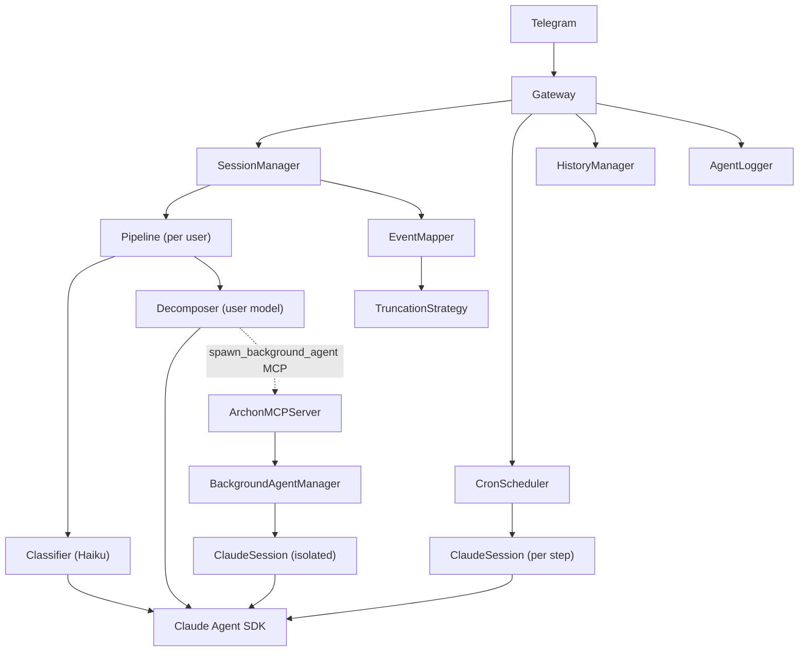

# Archon Assistant

**Purpose**: Project overview and reference for users and contributors
**Audience**: All
**Status**: Stable
**Last reviewed**: 2026-02-28
**Next review**: 2026-05-28

A local daemon that bridges **Telegram** with **Claude Code** via the Claude Agent SDK — streaming every state transition (thinking, tool calls, responses) as real-time Telegram notifications.

Send a message from your phone. Watch Claude work. Get every step delivered as it happens.


---

## Features

- **Intent classification** — a fast Classifier (Haiku) categorizes each message as `chat` or `task` before routing to the Decomposer (user-selected model), adapting response style automatically
- **Real-time streaming** — every Claude state change arrives as a Telegram message the moment it happens
- **Typing indicator** — live "typing…" indicator in Telegram while Claude is working
- **Per-user sessions** — one persistent Claude session per whitelisted Telegram user, with full conversation context
- **Native command menu** — all commands registered with Telegram via `setMyCommands`; type `/` or tap the 📋 menu button to browse and select any command
- **Notification modes** — quiet / normal / verbose / debug with optional beacon in quiet mode
- **Cron scheduler** — run automated jobs on a schedule; chain bash scripts and Claude prompts; get results via Telegram notification; per-job timezone support
- **Per-job TOML files** — each cron job lives in `cron.d/<name>.toml`; filename becomes the job name
- **Background agent execution** — Claude can spawn isolated sub-agents via `spawn_background_agent` MCP tool while the main conversation stays fully interactive; results are delivered via Telegram notification on completion
- **Per-agent working beacon** — spawn notification is periodically edited in-place showing live tool/thinking counts while a background agent runs
- **Pluggable truncation** — long outputs chunked as `[1/N]` pages (extensible via ABC)
- **Skills & plugins** — inject skill prompts from `~/.claude/skills/` or load plugin bundles from `~/.claude/plugins/` into every session
- **Agent loader** — reads agent definitions from `~/.claude/agents/*.md`; agents with the `-archon` suffix are injected into every Claude session
- **Chat history** — all conversation turns persisted to daily Markdown files in `~/.archon/history/` (QMD-compatible)
- **Agent logs** — per-agent Markdown logs written to `~/.archon/history/YYYY-MM-DD-HH-MM-{agent-name}.md`
- **QMD semantic search** — optional integration with [QMD](https://github.com/tobi/qmd); indexes conversation history and makes it searchable by Claude via MCP
- **Context window tracking** — `/context` shows token usage, cost, turn count, and a progress bar
- **Session diagnostics** — `/status` shows processing state, idle time, message count
- **Model switching** — `/model` inline keyboard to switch Claude models without restart
- **Whitelist access control** — only listed Telegram user IDs can interact; all others are silently ignored
- **Graceful shutdown** — SIGTERM/SIGINT stops all sessions cleanly within 5 seconds
- **Hot-reload** — `/restart` replaces the daemon process without losing config
- **Daemon-ready** — ships with a launchd plist (macOS) and systemd unit (Linux) for auto-start on login
- **Daily log rotation** — log file rotates at midnight to `archon.YYYY-MM-DD.log`; startup rotation handles crash/stop-before-midnight edge case

---

## Requirements

| Dependency | Version | Notes |
|---|---|---|
| Python | 3.12+ | |
| [uv](https://docs.astral.sh/uv/) | any | package manager & runner |
| [Claude Code CLI](https://docs.anthropic.com/en/docs/claude-code) | latest | `claude` must be in `PATH` and authenticated |
| Telegram bot token | — | create via [@BotFather](https://t.me/BotFather) |

---

## Quick Start

```bash
git clone https://github.com/user538295/archon-assistant.git
cd archon-assistant
bash install.sh
```

The installer will:
1. Verify prerequisites (`uv`, Python 3.12+, `claude` CLI)
2. Prompt for your bot token, Telegram user ID, and working directory
3. Write `.env` and `config.toml`
4. Install dependencies via `uv sync`
5. Register and start the daemon (launchd on macOS, systemd on Linux)

**Prerequisites:** [uv](https://docs.astral.sh/uv/), Python 3.12+, [Claude Code CLI](https://docs.anthropic.com/en/docs/claude-code) authenticated and in `PATH`, a Telegram bot token from [@BotFather](https://t.me/BotFather).

> **Note:** `install.sh` is the current installer. A Python-based installer (`install.py`) is planned for a future release — see S16.1 in `Documentation/tasks.md`.

---

## Configuration

### `.env`

| Variable | Required | Description |
|---|---|---|
| `TELEGRAM_BOT_TOKEN` | ✅ | Bot token from @BotFather |

### `config.toml`

Copy `examples/config.toml.example` as your starting point.

#### `[access]`

```toml
[access]
# Telegram user IDs allowed to send messages to the bot.
# Find yours by messaging @userinfobot on Telegram.
allowed_user_ids = [123456789]
```

#### `[session]`

```toml
[session]
# Directory Claude Code will use as its working directory.
working_directory = "~/.archon/workspace"
# Seconds of inactivity before a session is automatically closed (must be > 0).
inactivity_timeout_seconds = 1800
```

#### `[output]`

```toml
[output]
# Maximum characters per Telegram message (Telegram hard limit: 4096).
max_message_length = 4000
# "split" — send all chunks as [1/N], [2/N], ...
truncation_strategy = "split"
# For "head_tail" truncation: characters to keep from the start and end of content.
head_chars = 1500
tail_chars = 1500
```

#### `[logging]`

```toml
[logging]
log_file = "~/.archon/archon.log"
log_level = "INFO"   # DEBUG for verbose output
```

#### `[notifications]`

```toml
[notifications]
# quiet | normal | verbose | debug
mode = "normal"
# Minutes between beacon messages in quiet mode (0 = no beacon)
interval_minutes = 2

[notifications.agents]
# Sub-agent lifecycle notification level. Omit to inherit from mode above.
# mode = "quiet"   # hide agent start/stop events
```

**Notification mode visibility matrix:**

| Event | quiet | normal | verbose | debug |
|---|---|---|---|---|
| ✅ Response | ✅ | ✅ | ✅ | ✅ |
| ❌ Error | ✅ | ✅ | ✅ | ✅ |
| 🤖 SubagentStarted/Stopped | ✅ | ✅ | ✅ | ✅ |
| 🏷 ClassificationEvent | ❌ | ❌ | ✅ | ✅ |
| 🔧 ToolStarted (name only) | ❌ | ✅ | ✅ | ✅ |
| 📤 ToolResult (brief) | ❌ | ✅ | ✅ | ❌ |
| 💭 ThinkingResult | ❌ | ❌ | ✅ | ✅ |
| 🔧 ToolStarted (name + args) | ❌ | ❌ | ✅ | ✅ |
| 📤 ToolResult (full) | ❌ | ❌ | ❌ | ✅ |

#### `[history]`

```toml
[history]
# Persist conversation turns to daily Markdown files for QMD indexing.
enabled = true
directory = "~/.archon/history"
```

#### `[models]`

```toml
[models]
# Pre-configured model list shown as an inline keyboard via /model.
# Leave empty to fall back to free-text model entry.
available = [
    "claude-opus-4-5",
    "claude-sonnet-4-5",
    "claude-haiku-4-5",
]
# Model activated at daemon startup; comment out to use the SDK default.
# default = "claude-sonnet-4-5"
```

#### `[plugins]`

```toml
[plugins]
# Load Claude Code plugins from ~/.claude/plugins/.
enabled = true
# Override plugin directory (empty = use ~/.claude/plugins/).
plugins_dir = ""
# Override settings path (empty = use ~/.claude/settings.json).
settings_path = ""
```

#### `[qmd]`

```toml
[qmd]
# QMD semantic search — indexes ~/.archon/history for Claude to query via MCP.
# Prerequisites: run `bash scripts/qmd_installer.sh` once.
enabled = false
host = "localhost"
port = 8181
history_collection = "archon-history"
```

#### `[cron]`

```toml
[cron]
# Enable the cron scheduler.
enabled = false
# Directory containing per-job TOML files (relative to config.toml).
jobs_dir = "cron.d"
```

#### `[background_agents]`

```toml
[background_agents]
# Spawn rule — controls how Claude uses background agents:
#   "eager"  — proactively spawns for multi-step/parallel tasks
#   "auto"   — Claude decides based on the task (default)
#   "manual" — only spawns when user explicitly asks
spawn_rule = "auto"
# Maximum concurrent background agents per user.
max_parallel = 5
# MCP server host and port (must not conflict with QMD's port 8181).
host = "localhost"
port = 18182
# How often (minutes) to edit the spawn notification with live agent progress.
# 0 = disable the per-agent working beacon.
beacon_interval_minutes = 2
```

> **Note:** There is no `enabled` flag — the MCP server always starts unconditionally. The `Task` tool is always disabled in the orchestrator so sub-agents never block the main conversation.

### Cron jobs

Place one `.toml` file per job inside `cron.d/` (relative to `config.toml`). The filename stem becomes the job name.

```toml
# cron.d/daily-summary.toml
schedule = "0 8 * * *"          # daily at 08:00
notify_user_id = 123456789      # Telegram user ID to notify
timeout_seconds = 60
# timezone = "Europe/Budapest"  # IANA timezone; omit for local time

[[pipeline]]
tool = "scripts/health_check.sh"

[[pipeline]]
prompt = "Summarise these results in 2-3 bullet points: {input}"
```

Steps chain automatically — the stdout of each `tool` step feeds `{input}` in the next `prompt` step. See `cron.d/echo-test.toml` for a minimal example.

---

## Output Events

Every Claude state change produces an immediate notification. Content-bearing events are truncated and split if needed.

| Event | Telegram message |
|---|---|
| Classification | `🏷 task (95%)` (visible in verbose/debug mode only) |
| Thinking | `💭 Thinking:` + content |
| Tool call started | `🔧 Tool [N]: <name>` + input summary (`[N]` id tag only appears when tool id is non-zero) |
| Tool result | `📤 [N]:` + brief summary |
| Final response | `✅ Response:` + content |
| Error | `❌ Error: <message>` |
| Message queued | `⏳ Previous request still processing — your message is queued` |
| Background agent spawned | `🤖 Agent <b>Name</b> spawned.` |
| Background agent completed | `✅ 🤖 Agent <b>Name</b> completed` |

### Background agent notifications

Background-agent messages follow a two-phase pattern:

1. **Spawn notification** — sent immediately when Claude calls `spawn_background_agent`:
   ```
   🤖 Agent <b>Atlas</b> spawned.
   ```

2. **Beacon messages** — sent as new messages at regular intervals (configured via `beacon_interval_minutes`) while the agent is running. The beacon verb rotates after the first update:
   ```
   🤖 Agent <b>Atlas</b> is working...
   🤖 Agent <b>Atlas</b> is working... (3 tools)
   🤖 Agent <b>Atlas</b> is pondering... (3 tools, 1 thinking)
   ```

   Beacon messages are independent messages, not edits to the spawn notification.

> **Note on SDK sub-agent events:** The `format_event` handler contains `SubagentStarted`/`SubagentStopped` code paths for SDK-native Task sub-agents. These paths can **never fire** in Archon because the `Task` tool is unconditionally in `disallowed_tools` on every `ClaudeSession` (see `archon/ai/claude_session.py`). All background-agent Telegram messages come directly from `BackgroundAgentManager`, not from the event mapper. The `Task` tool is disabled permanently to prevent the orchestrator's `send()` turn from blocking while a sub-agent runs — background agents are always spawned asynchronously via the `spawn_background_agent` MCP tool instead.

---

## Bot Commands

All commands are registered with Telegram's native command menu — type `/` or tap the 📋 button to browse them interactively.

| Command | Description |
|---|---|
| `/start` | Confirm the bot is running |
| `/status` | Show active session info, uptime, and processing state |
| `/context` | Show context window usage (tokens, cost, turns) |
| `/stop` | Terminate the current Claude session |
| `/clear` | Stop current session and immediately start a fresh one |
| `/restart` | Gracefully stop all sessions and hot-reload the daemon |
| `/model` | Show or switch the Claude model (inline keyboard) |
| `/skills` | List available Claude Code skills |
| `/skill <name>` | Activate a skill for the next message |
| `/agents` | List all available agent types (Archon + TUI-only) |
| `/jobs` | List cron jobs and their last-run status |
| `/running_agents` | List running background agents with cancel buttons |
| `/quiet [N]` | Switch to quiet mode; optional beacon every N minutes |
| `/normal` | Switch to normal mode |
| `/verbose` | Switch to verbose mode |
| `/debug` | Switch to debug mode |
| `/notify` | Tap-to-switch notification panel |
| `/settings` | Same as `/notify` |

---

## Service Installation

### macOS (launchd — auto-starts on login)

```bash
make install      # install and load the launchd service
make uninstall    # unload and remove
make logs         # tail ~/.archon/archon.log
```

The plist is installed to `~/Library/LaunchAgents/com.archon.assistant.plist`. The service will restart automatically if it crashes (`KeepAlive = true`).

### Linux (systemd user service)

```bash
make install-linux    # copy unit file + systemctl enable --user archon
make uninstall-linux  # systemctl disable --user + remove unit file
```

The unit file is installed to `~/.config/systemd/user/archon.service`. Restarts on failure (`Restart=on-failure`).

---

## Skills

Skills are Markdown files at `~/.claude/skills/<name>/SKILL.md` with YAML frontmatter:

```markdown
---
name: my-skill
description: One-line description shown in /skills
---

Your skill instructions here…
```

Use `/skills` to list all loaded skills. Use `/skill <name>` to activate one for your next message — the skill body is prepended to your prompt as a context block (one-shot, not persistent).

---

## Agents

Archon reads agent definitions from `~/.claude/agents/*.md`. Agents whose `name` frontmatter field ends with `-archon` are *Archon agents* — they are injected into every Claude session via the SDK `agents` dict. Other agents are displayed in `/agents` for reference but not injected.

Agent file format:

```markdown
---
name: researcher-archon
description: Web research specialist
model: haiku
tools: WebSearch, Read
---

You are a research specialist…
```

---

## Background Agents

When Claude needs to run long tasks in parallel, it can call the built-in `spawn_background_agent` MCP tool. Background agents run as isolated Claude sessions in separate asyncio tasks:

- Main conversation stays fully interactive while agents work
- Agent events (tool calls, thinking) are written to per-agent log files, not sent to Telegram
- On completion: Telegram `✅` notification with the full agent result sent to the user (result is not injected into the main session)
- Use `/running_agents` to monitor and cancel active agents
- `spawn_rule` in config controls how eagerly Claude uses them

---

## QMD Semantic Search

[QMD](https://github.com/tobi/qmd) indexes `~/.archon/history/` and exposes `qmd_deep_search` and `qmd_vector_search` tools to Claude via MCP. Once enabled, Claude can search its own past conversations.

```bash
# One-time setup
bash scripts/qmd_installer.sh
```

Then set `[qmd] enabled = true` in `config.toml`.

---

## Development

```bash
# Run all tests (live tests excluded)
uv run pytest

# Run a specific test file
uv run pytest tests/ai/test_event_mapper.py

# Run a specific test
uv run pytest -k "test_split_strategy_labels"

# Type check (mypy strict)
uv run mypy archon/

# Live tests — require real credentials (TELEGRAM_BOT_TOKEN, claude binary)
uv run pytest -m live --no-cov -v
```

### Test markers

| Marker | Meaning |
|---|---|
| *(no marker)* | Pure unit / integration tests, no external dependencies, run by default |
| `@pytest.mark.live` | Requires real external resources (filesystem, claude binary, Telegram API) |
| `@pytest.mark.requires_telegram` | Requires `TELEGRAM_BOT_TOKEN` and `TELEGRAM_LIVE_CHAT_ID` in env |

### Project structure

```
archon/
├── ai/
│   ├── agent_loader.py          # AgentLoader — reads ~/.claude/agents/*.md
│   ├── agent_logger.py          # AgentLogger — per-agent Markdown log files
│   ├── archon_mcp_server.py     # ArchonMCPServer — HTTP MCP server for spawn_background_agent
│   ├── background_agent_manager.py  # BackgroundAgentManager — fire-and-forget agent tasks
│   ├── classification.py        # Classification schema + parse_classification()
│   ├── claude_session.py        # ClaudeSession — wraps ClaudeSDKClient
│   ├── cron_scheduler.py        # CronScheduler — asyncio cron loop
│   ├── event_mapper.py          # EventMapper + event dataclasses (8 types)
│   ├── event_renderer.py        # EventRenderer — Markdown rendering for log files
│   ├── history_manager.py       # HistoryManager — daily Markdown conversation log
│   ├── pipeline.py              # Pipeline — Classifier (Haiku) → Decomposer (user model)
│   ├── plugin_loader.py         # PluginLoader — Claude Code plugin registry
│   ├── prompts/                 # System prompts for the multi-agent pipeline
│   │   ├── __init__.py          # load_prompt() — reads prompt .md files
│   │   ├── classifier.md        # Classifier system prompt (strict JSON output)
│   │   └── decomposer.md       # Decomposer system prompt (classification-aware)
│   ├── session_manager.py       # SessionManager — per-user Pipeline registry
│   ├── skill_loader.py          # SkillLoader — reads ~/.claude/skills/*/SKILL.md
│   └── truncation.py            # TruncationStrategy ABC + SplitStrategy
├── chat/
│   ├── bot.py                   # Bot factory, BOT_COMMANDS, create_dispatcher()
│   ├── commands.py              # All command handlers
│   ├── handler.py               # handle_message, format_event
│   ├── md_formatter.py          # Markdown-to-HTML converter
│   └── middleware.py            # WhitelistMiddleware
├── config/
│   └── loader.py                # load_config() → typed Config dataclasses
├── gateway/
│   └── gateway.py               # Gateway orchestrator
└── log_setup.py                 # Daily-rotating file handler + stderr capture

cron.d/                          # Per-job cron TOML files (filename = job name)
├── echo-test.toml               # Minimal example (disabled by default)
└── health-summary.toml          # Script + Claude prompt pipeline example

docs/
├── high_level_concept.md        # Architecture & design decisions
├── prd.md                       # Product requirements document
├── stories.md                   # User stories with acceptance criteria
└── user_manual.md               # End-user guide

Documentation/
└── tasks.md                     # Implementation task checklist

examples/
└── config.toml.example          # Fully commented config template

scripts/
├── com.archon.assistant.plist   # macOS launchd template
├── archon.service               # Linux systemd template
├── qmd_installer.sh             # QMD one-time setup script
└── health_check.sh              # Example cron script
```

### Architecture



- **`Pipeline`** — multi-agent routing: Classifier (Haiku) classifies each message as `chat` or `task`, then the Decomposer (user-selected model, configurable via `/model`) handles it with the classification prepended. Duck-types as `ClaudeSession`. Gracefully degrades to `task` intent if the Classifier fails.
- **`ClaudeSession`** — wraps `ClaudeSDKClient`; `send(prompt)` is an async generator yielding typed event dataclasses; always disables the `Task` tool to prevent blocking sub-agents
- **`EventMapper`** — translates raw SDK messages into `ThinkingResult`, `ToolStarted`, `ToolResult`, `Response`, `ErrorEvent`, `ClassificationEvent`, `SubagentStarted`, `SubagentStopped`
- **`SessionManager`** — per-user Pipeline registry with inactivity eviction, model switching, and diagnostics
- **`BackgroundAgentManager`** — spawns fire-and-forget agent tasks; tracks status, enforces `max_parallel`, delivers results
- **`ArchonMCPServer`** — aiohttp HTTP server implementing MCP JSON-RPC 2.0 for the `spawn_background_agent` tool
- **`CronScheduler`** — asyncio-based cron loop using `croniter`; supports timezone-aware cron expressions
- **`TruncationStrategy`** — ABC; add a new class in `archon/ai/` to get a new strategy — no gateway or chat changes needed
- **`Gateway`** — single asyncio event loop; `stop_all()` completes within 5 seconds

---

## License

MIT
