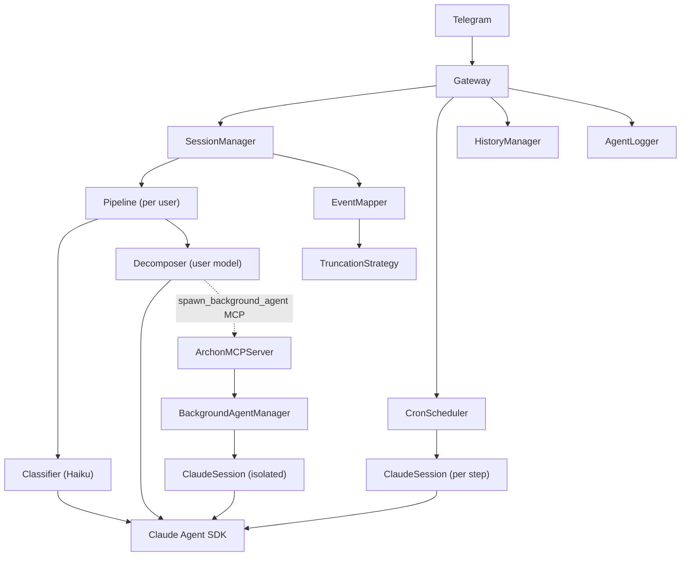

# Archon

> **Claude Code in your pocket.** Send a message from Telegram. Watch your AI agent think, call tools, and deliver results — live, as it happens.

Archon is a local daemon that bridges **Telegram** with **Claude Code** via the Claude Agent SDK. Every state transition — thinking, tool calls, responses — streams to your phone in real time.

```
You (Telegram) → Archon → Claude Agent SDK → back to you, step by step
```

No web UI. No polling. No waiting for a final answer. Just a persistent agent running on your machine, reachable from anywhere.

---

## Why it's different

Most Claude integrations give you a chat box. Archon gives you a **running agent**.

- Watch Claude **think** before it acts — every `<thinking>` block shows up in Telegram
- See every **tool call** fire as it happens: `🔧 Tool: bash` → `📤 Result: ...`
- Spawn **background agents** that work in parallel while you keep chatting
- Schedule **cron jobs** that chain shell scripts with Claude prompts and notify you on completion
- Switch models, manage sessions, cancel agents — all from Telegram commands

---

## Features

**Real-time streaming**
Every Claude state change is a Telegram message. Thinking, tool calls, results — nothing is batched or hidden.

**Multi-agent pipeline**
A fast Classifier (Haiku) routes each message as `chat` or `task`. The Decomposer (your chosen model) handles it with context. Intent-aware from the first token.

**Background agents**
Claude calls `spawn_background_agent` via MCP. Your main session stays interactive. Background agents run in isolated asyncio tasks and notify you on completion. `/tasks` shows live status with cancel buttons.

**Cron scheduler**
Per-job TOML files in `cron.d/`. Chain shell scripts and Claude prompts. Timezone-aware. Results delivered via Telegram.

**Skills & agents**
Drop Markdown files into `~/.claude/skills/` or `~/.claude/agents/`. Skills activate per-message via `/skill <name>`. Agents with `-archon` suffix inject automatically into every session.

**Notification modes**
`quiet` / `normal` / `verbose` / `debug` — switch live from Telegram. Verbose shows thinking. Debug shows full tool I/O.

**Context window tracking**
`/context` shows tokens, cost, turn count, and a progress bar. `/status` shows session health.

**Daemon-ready**
Ships with launchd (macOS) and systemd (Linux) service files. Auto-starts on login, restarts on crash.

---

## Quick Start

```bash
git clone https://github.com/user538295/archon-assistant.git
cd archon-assistant
uv run install.py
```

The installer checks prerequisites, prompts for your bot token + Telegram user ID, writes config, and registers the daemon. Done.

**Prerequisites:**
- Python 3.12+
- [uv](https://docs.astral.sh/uv/)
- [Claude Code CLI](https://docs.anthropic.com/en/docs/claude-code) — authenticated, in `PATH`
- A Telegram bot token from [@BotFather](https://t.me/BotFather)

---

## Configuration

Two files: `.env` for secrets, `config.toml` for everything else. Start from `examples/config.toml.example`.

**`.env`**
```env
TELEGRAM_BOT_TOKEN=your_token_here
```

**`config.toml` essentials**
```toml
[access]
allowed_user_ids = [123456789]   # your Telegram user ID (@userinfobot)

[session]
working_directory = "~/.archon/workspace"
inactivity_timeout_seconds = 1800

[notifications]
mode = "normal"   # quiet | normal | verbose | debug

[models]
available = ["claude-opus-4-5", "claude-sonnet-4-5", "claude-haiku-4-5"]
default = "claude-sonnet-4-5"

[background_agents]
spawn_rule = "auto"   # eager | auto | manual
max_parallel = 5
```

### Cron jobs

```toml
# cron.d/daily-summary.toml
schedule = "0 8 * * *"
notify_user_id = 123456789
timeout_seconds = 60

[[pipeline]]
tool = "scripts/health_check.sh"

[[pipeline]]
prompt = "Summarise these results in 2-3 bullet points: {input}"
```

Each `tool` step's stdout feeds `{input}` in the next `prompt` step.

---

## Notification visibility

| Event | quiet | normal | verbose | debug |
|---|:---:|:---:|:---:|:---:|
| ✅ Response | ✅ | ✅ | ✅ | ✅ |
| ❌ Error | ✅ | ✅ | ✅ | ✅ |
| 🤖 Agent started/stopped | ✅ | ✅ | ✅ | ✅ |
| 🔧 Tool name | ❌ | ✅ | ✅ | ✅ |
| 📤 Tool result (brief) | ❌ | ✅ | ✅ | ❌ |
| 💭 Thinking | ❌ | ❌ | ✅ | ✅ |
| 🔧 Tool name + args | ❌ | ❌ | ✅ | ✅ |
| 📤 Tool result (full) | ❌ | ❌ | ❌ | ✅ |
| 🏷 Classification | ❌ | ❌ | ✅ | ✅ |

---

## Bot commands

```
/status     — session info, uptime, processing state
/context    — token usage, cost, turn count, progress bar
/models     — switch model (inline keyboard)
/clear      — fresh session
/restart    — hot-reload daemon without losing config
/skills     — list loaded skills
/skill <n>  — activate skill for next message
/tasks      — live background agent status + cancel buttons
/scheduled  — cron job list + last-run status
/notify     — tap-to-switch notification mode panel
/agents     — list available agents
/quiet [N]  — quiet mode, optional beacon every N minutes
/verbose    — verbose mode
/debug      — debug mode
```

---

## Architecture



Three layers wired by a single asyncio event loop:

| Component | Role |
|---|---|
| `Pipeline` | Classifier (Haiku) → Decomposer routing; duck-types as `ClaudeSession` |
| `ClaudeSession` | Wraps `ClaudeSDKClient`; async generator of typed event dataclasses |
| `EventMapper` | SDK messages → typed event dataclasses (thinking, tools, responses, classification, agent lifecycle, plan events) |
| `SessionManager` | Per-user pipeline registry; inactivity eviction, model switching, diagnostics |
| `BackgroundAgentManager` | Fire-and-forget agent tasks; enforces `max_parallel`; delivers results |
| `ArchonMCPServer` | aiohttp MCP JSON-RPC 2.0 server for `spawn_background_agent` |
| `CronScheduler` | asyncio cron loop with `croniter`; timezone-aware |
| `Gateway` | Single event loop; `stop_all()` in ≤5 seconds |

---

## Service management

```bash
# Install / uninstall (macOS launchd + Linux systemd)
uv run install.py             # install + start
uv run install.py --uninstall # stop + remove

# Tail logs
tail -f ~/.archon/logs/archon.log
```

---

## Development

```bash
uv run pytest                                    # all tests
uv run pytest tests/ai/test_event_mapper.py      # single file
uv run pytest -k "test_split_strategy_labels"    # single test
uv run mypy archon/                              # type check
uv run pytest -m live --no-cov -v               # live tests (needs real credentials)
```

Tests are TDD with ≥85% coverage. No external dependencies required for the default test suite.

```
archon/
├── ai/          # Pipeline, sessions, event mapping, agents, cron, skills
├── chat/        # aiogram bot, command handlers, whitelist middleware
├── config/      # Typed config loader (toml + .env)
└── gateway/     # Orchestrator, event routing, graceful shutdown
```

---

## License

MIT
